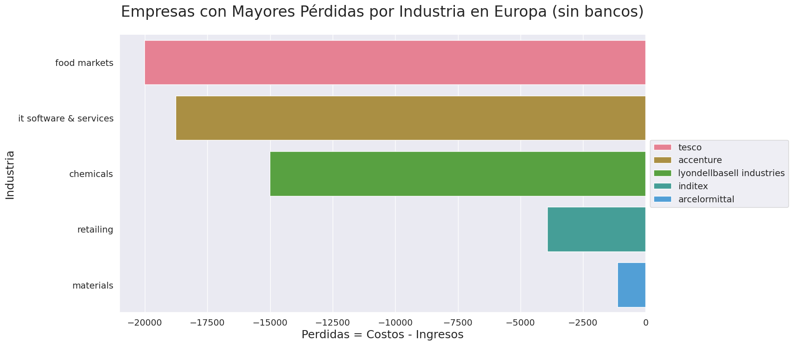

**1. Configuración del Ambiente**

Para desarrollar este desafío te recomendamos trabajar directamente desde la plataforma **Google Colab**. (Recuerda que debes tener una cuenta en gmail, si aún no la tienes, debes crearla).

- Accede a la siguiente URL: [Google Colaboratory](http://colab.research.google.com/)
- Debes crear un nuevo Notebook, y asignarle el nombre que desees: Ej. `Desafio Data Insider`
- Tras seguir los pasos anteriores, debes conectar tu notebook con tu cuenta de **Google Drive**. Para ello, en una nueva celda de código digita y ejecuta:

```
from google.colab import drive
drive.mount('/content/drive')
```

```python
from google.colab import drive
drive.mount('/content/drive')
```

    Mounted at /content/drive

- Accede a las siguientes URLs para descargar los datasets que estaremos utilizando:

1.  [Forbes Global 2000 2008-2022 (mil $ unit)](https://data.world/aroissues/forbes-global-2000-2008-2019)
2.  [Fortune Global 500](https://caelum-online-public.s3.amazonaws.com/challenge_data_insider/fortune_global_500.zip)
3.  [Continentes y países](https://caelum-online-public.s3.amazonaws.com/challenge_data_insider/continentes_y_paises.zip)

- Después de descargar los datasets, crea un directorio en tu cuenta de Drive y haz el upload de todos ellos.
- Ya estás listo para avanzar a la siguiente etapa. ¡Te deseo muchos Éxitos!

```python
import pandas as pd

# Leer el archivo CSV desde tu unidad de Google Drive y almacenarlo en un DataFrame
ano_2000_2008 = pd.read_csv('/content/drive/MyDrive/BootCamp/CHALLENGE/Spring_2/aroissues-forbes-global-2000-2008-2019/data/forbes_global_2000_2008_unified_industry.csv')
ano_2000_2009 = pd.read_csv('/content/drive/MyDrive/BootCamp/CHALLENGE/Spring_2/aroissues-forbes-global-2000-2008-2019/data/forbes_global_2000_2009_unified_industry.csv')
ano_2000_2010 = pd.read_csv('/content/drive/MyDrive/BootCamp/CHALLENGE/Spring_2/aroissues-forbes-global-2000-2008-2019/data/forbes_global_2000_2010_unified_industry.csv')
ano_2000_2011 = pd.read_csv('/content/drive/MyDrive/BootCamp/CHALLENGE/Spring_2/aroissues-forbes-global-2000-2008-2019/data/forbes_global_2000_2011_unified_industry.csv')
ano_2000_2012 = pd.read_csv('/content/drive/MyDrive/BootCamp/CHALLENGE/Spring_2/aroissues-forbes-global-2000-2008-2019/data/forbes_global_2000_2012_unified_industry.csv')
ano_2000_2013 = pd.read_csv('/content/drive/MyDrive/BootCamp/CHALLENGE/Spring_2/aroissues-forbes-global-2000-2008-2019/data/forbes_global_2000_2013_unified_industry.csv')
ano_2000_2014 = pd.read_csv('/content/drive/MyDrive/BootCamp/CHALLENGE/Spring_2/aroissues-forbes-global-2000-2008-2019/data/forbes_global_2000_2014_unified_industry.csv')
ano_2000_2015 = pd.read_csv('/content/drive/MyDrive/BootCamp/CHALLENGE/Spring_2/aroissues-forbes-global-2000-2008-2019/data/forbes_global_2000_2015_unified_industry.csv')
ano_2000_2016 = pd.read_csv('/content/drive/MyDrive/BootCamp/CHALLENGE/Spring_2/aroissues-forbes-global-2000-2008-2019/data/forbes_global_2000_2016_unified_industry.csv')
ano_2000_2017 = pd.read_csv('/content/drive/MyDrive/BootCamp/CHALLENGE/Spring_2/aroissues-forbes-global-2000-2008-2019/data/forbes_global_2000_2017_unified_industry.csv')
ano_2000_2018 = pd.read_csv('/content/drive/MyDrive/BootCamp/CHALLENGE/Spring_2/aroissues-forbes-global-2000-2008-2019/data/forbes_global_2000_2018_unified_industry.csv')
ano_2000_2019 = pd.read_csv('/content/drive/MyDrive/BootCamp/CHALLENGE/Spring_2/aroissues-forbes-global-2000-2008-2019/data/forbes_global_2000_2019_unified_industry.csv')
ano_2000_2020 = pd.read_csv('/content/drive/MyDrive/BootCamp/CHALLENGE/Spring_2/aroissues-forbes-global-2000-2008-2019/data/forbes_global_2000_2020_unified_industry.csv')
ano_2000_2021 = pd.read_csv('/content/drive/MyDrive/BootCamp/CHALLENGE/Spring_2/aroissues-forbes-global-2000-2008-2019/data/forbes_global_2000_2021_unified_industry.csv')
ano_2000_2022 = pd.read_csv('/content/drive/MyDrive/BootCamp/CHALLENGE/Spring_2/aroissues-forbes-global-2000-2008-2019/data/forbes_global_2000_2022_unified_industry.csv')
```

```python
# import os

# # Obtener la lista de archivos HTML en la carpeta
# ruta_carpeta = '/content/drive/MyDrive/BootCamp/CHALLENGE/Spring_2/fortune_global_500'
# archivos_html = [f for f in os.listdir(ruta_carpeta) if f.endswith('.html')]
```

```python
# import pandas as pd

# # Recorrer la lista de archivos HTML y convertirlos a CSV
# for archivo_html in archivos_html:
#     # Leer el archivo HTML y convertirlo en un dataframe de pandas
#     ruta_archivo_html = f'{ruta_carpeta}/{archivo_html}'
#     df = pd.read_html(ruta_archivo_html)[0]

#     # Exportar el dataframe a un archivo CSV
#     ruta_archivo_csv = f'{ruta_carpeta}/{archivo_html[:-5]}.csv'
#     df.to_csv(ruta_archivo_csv, index=False)
```

```python
import pandas as pd

# Leer el archivo CSV desde tu unidad de Google Drive y almacenarlo en un DataFrame
continente = pd.read_csv('/content/drive/MyDrive/BootCamp/CHALLENGE/Spring_2/continentes_y_paises/continente.csv')
country = pd.read_csv('/content/drive/MyDrive/BootCamp/CHALLENGE/Spring_2/continentes_y_paises/country_code.csv')
```

**2. Obtención de los datos**

1. Para que puedas cargar en tu notebook los archivos que almacenaste previamente en tu cuenta de Drive, debes utilizar la biblioteca [pandas](https://pandas.pydata.org/docs/user_guide/index.html).

   **_Recomendación:_** Utiliza nombres de variables que faciliten tu análisis, pues son varios los datasets que estarás consultando.

2. Adicionalmente, vas a utilizar una API para obtener datos históricos de las acciones de las empresas que entrarán en el análisis:

El enlace de la API es el siguiente: [polygon.io](https://polygon.io/)

debes seguir los pasos para obtener una API Key y también debes consultar su [documentación](https://polygon.io/docs/stocks/getting-started) para que puedas utilizarla de manera correcta.

3. Vas a obtener los datos históricos de las acciones de 5 empresas de una misma industria (Ejemplos de Industrias: Automotriz, Tecnología, Bancos, entre otras): entre el 1 de enero y el 31 de diciembre de 2022 y los vas a almacenar en 5 datasets diferentes. (Las variables que necesitas almacenar en el dataset son: El Símbolo, la Fecha, y los Precios de Apertura, Cierre, Máximo y Mínimo de las acciones)

4. Vas a exportar estos 5 datasets en formato `.csv` y los guardarás en el directorio donde están los demás datasets.

¡Ahora sí puedes avanzar a la siguiente fase! :)

```python
# import os
# from dotenv import load_dotenv
# import requests
# import pandas as pd

# # Cargar las variables de entorno desde el archivo .env
# load_dotenv('/content/drive/MyDrive/BootCamp/CHALLENGE/Spring_2/config/.env')

# # Configurar las variables de la consulta a la API
# simbolos = ['AAPL', 'GOOG', 'MSFT', 'TSLA', 'AMZN']  # Símbolos de las empresas
# fecha_inicio = '2022-01-01'  # Fecha de inicio de la consulta
# fecha_fin = '2022-12-31'  # Fecha de fin de la consulta
# api_key = os.getenv('POLYGON_API_KEY')  # API Key de Polygon.io

# # Realizar la consulta y guardar los datos en archivos CSV por separado
# for simbolo in simbolos:
#     # Realizar la consulta a la API
#     url = f'https://api.polygon.io/v2/aggs/ticker/{simbolo}/range/1/day/{fecha_inicio}/{fecha_fin}?apiKey={api_key}'
#     response = requests.get(url)

#     # Convertir la respuesta en un dataframe de pandas
#     datos = response.json()['results']
#     df = pd.DataFrame(datos)

#     # Exportar los datos a un archivo CSV
#     ruta_archivo = f'/content/drive/MyDrive/BootCamp/CHALLENGE/Spring_2/EmpresasValores/{simbolo}.csv'
#     df.to_csv(ruta_archivo, index=False)
```

**3. Data Wrangling**

Data Wrangling (o "manipulación de datos") es el proceso de transformación y preparación de datos en bruto a un formato más adecuado para su análisis y toma de decisiones. Esta etapa es esencial en cualquier proyecto de análisis de datos, ya que los datos en bruto suelen estar incompletos, inconsistentes o tener formatos diferentes que necesitan ser estandarizados antes de poder ser analizados con precisión.

El Data Wrangling incluye varias tareas, como la eliminación de datos duplicados o irrelevantes, el llenado de datos faltantes, la estandarización de formatos de datos, la fusión de conjuntos de datos diferentes y la creación de variables o métricas adicionales para ayudar en el análisis. En general, el objetivo es transformar los datos en bruto en datos limpios, coherentes y listos para ser analizados mediante las técnicas de visualización de datos que estaremos desarrollando.

---

**A. En esta fase vas a explorar mejor cada uno de tus datasets de **Forbes Global 2000**, cambiar los nombres de las columnas (**Empresa, Industria, Pais, Ingresos, Ganancias, Activos y Valor de Mercado**), y crear las siguientes variables (para los datasets de Forbes 2000):**

-**Margen de Rentabilidad:** Ganancias/Ingresos

-**Rentabilidad de los Activos (ROA):** Ganancias/Activos

-**Año:** Según el nombre de cada dataset

```python
import pandas as pd

ano_2000_2008 = ano_2000_2008.rename(columns={'company': 'Empresa', 'industry': 'Industria', 'country': 'Pais', 'sales': 'Ingresos',
                        'profits': 'Ganancias', 'assets': 'Activos', 'market_value': 'Valor de Mercado'})
ano_2000_2009 = ano_2000_2009.rename(columns={'company': 'Empresa', 'industry': 'Industria', 'country': 'Pais', 'sales': 'Ingresos',
                        'profits': 'Ganancias', 'assets': 'Activos', 'market_value': 'Valor de Mercado'})
ano_2000_2010 = ano_2000_2010.rename(columns={'company': 'Empresa', 'industry': 'Industria', 'country': 'Pais', 'sales': 'Ingresos',
                        'profits': 'Ganancias', 'assets': 'Activos', 'market_value': 'Valor de Mercado'})
ano_2000_2011 = ano_2000_2011.rename(columns={'company': 'Empresa', 'industry': 'Industria', 'country': 'Pais', 'sales': 'Ingresos',
                        'profits': 'Ganancias', 'assets': 'Activos', 'market_value': 'Valor de Mercado'})
ano_2000_2012 = ano_2000_2012.rename(columns={'company': 'Empresa', 'industry': 'Industria', 'country': 'Pais', 'sales': 'Ingresos',
                        'profits': 'Ganancias', 'assets': 'Activos', 'market_value': 'Valor de Mercado'})
ano_2000_2013 = ano_2000_2013.rename(columns={'company': 'Empresa', 'industry': 'Industria', 'country': 'Pais', 'sales': 'Ingresos',
                        'profits': 'Ganancias', 'assets': 'Activos', 'market_value': 'Valor de Mercado'})
ano_2000_2014 = ano_2000_2014.rename(columns={'company': 'Empresa', 'industry': 'Industria', 'country': 'Pais', 'sales': 'Ingresos',
                        'profits': 'Ganancias', 'assets': 'Activos', 'market_value': 'Valor de Mercado'})
ano_2000_2015 = ano_2000_2015.rename(columns={'company': 'Empresa', 'industry': 'Industria', 'country': 'Pais', 'sales': 'Ingresos',
                        'profits': 'Ganancias', 'assets': 'Activos', 'market_value': 'Valor de Mercado'})
ano_2000_2016 = ano_2000_2016.rename(columns={'company': 'Empresa', 'industry': 'Industria', 'country': 'Pais', 'sales': 'Ingresos',
                        'profits': 'Ganancias', 'assets': 'Activos', 'market_value': 'Valor de Mercado'})
ano_2000_2017 = ano_2000_2017.rename(columns={'company': 'Empresa', 'industry': 'Industria', 'country': 'Pais', 'sales': 'Ingresos',
                        'profits': 'Ganancias', 'assets': 'Activos', 'market_value': 'Valor de Mercado'})
ano_2000_2018 = ano_2000_2018.rename(columns={'company': 'Empresa', 'industry': 'Industria', 'country': 'Pais', 'sales': 'Ingresos',
                        'profits': 'Ganancias', 'assets': 'Activos', 'market_value': 'Valor de Mercado'})
ano_2000_2019 = ano_2000_2019.rename(columns={'company': 'Empresa', 'industry': 'Industria', 'country': 'Pais', 'sales': 'Ingresos',
                        'profits': 'Ganancias', 'assets': 'Activos', 'market_value': 'Valor de Mercado'})
ano_2000_2020 = ano_2000_2020.rename(columns={'company': 'Empresa', 'industry': 'Industria', 'country': 'Pais', 'sales': 'Ingresos',
                        'profits': 'Ganancias', 'assets': 'Activos', 'market_value': 'Valor de Mercado'})
ano_2000_2021 = ano_2000_2021.rename(columns={'company': 'Empresa', 'industry': 'Industria', 'country': 'Pais', 'sales': 'Ingresos',
                        'profits': 'Ganancias', 'assets': 'Activos', 'market_value': 'Valor de Mercado'})
ano_2000_2022 = ano_2000_2022.rename(columns={'company': 'Empresa', 'industry': 'Industria', 'country': 'Pais', 'sales': 'Ingresos',
                        'profits': 'Ganancias', 'assets': 'Activos', 'market_value': 'Valor de Mercado'})

ano_2000_2020.loc[ano_2000_2020['rank_nr'] == 402, 'Activos'] = 41000.0

# Crear las variables adicionales
ano_2000_2008['Margen de Rentabilidad'] = ano_2000_2008['Ganancias'] / ano_2000_2008['Ingresos']
ano_2000_2008['Rentabilidad de los Activos (ROA)'] = ano_2000_2008['Ganancias'] / ano_2000_2008['Activos']
ano_2000_2008['Año'] = '2008'

ano_2000_2009['Margen de Rentabilidad'] = ano_2000_2009['Ganancias'] / ano_2000_2009['Ingresos']
ano_2000_2009['Rentabilidad de los Activos (ROA)'] = ano_2000_2009['Ganancias'] / ano_2000_2009['Activos']
ano_2000_2009['Año'] = '2009'

ano_2000_2010['Margen de Rentabilidad'] = ano_2000_2010['Ganancias'] / ano_2000_2010['Ingresos']
ano_2000_2010['Rentabilidad de los Activos (ROA)'] = ano_2000_2010['Ganancias'] / ano_2000_2010['Activos']
ano_2000_2010['Año'] = '2010'

ano_2000_2011['Margen de Rentabilidad'] = ano_2000_2011['Ganancias'] / ano_2000_2011['Ingresos']
ano_2000_2011['Rentabilidad de los Activos (ROA)'] = ano_2000_2011['Ganancias'] / ano_2000_2011['Activos']
ano_2000_2011['Año'] = '2011'

ano_2000_2012['Margen de Rentabilidad'] = ano_2000_2012['Ganancias'] / ano_2000_2012['Ingresos']
ano_2000_2012['Rentabilidad de los Activos (ROA)'] = ano_2000_2012['Ganancias'] / ano_2000_2012['Activos']
ano_2000_2012['Año'] = '2012'

ano_2000_2013['Margen de Rentabilidad'] = ano_2000_2013['Ganancias'] / ano_2000_2013['Ingresos']
ano_2000_2013['Rentabilidad de los Activos (ROA)'] = ano_2000_2013['Ganancias'] / ano_2000_2013['Activos']
ano_2000_2013['Año'] = '2013'

ano_2000_2014['Margen de Rentabilidad'] = ano_2000_2014['Ganancias'] / ano_2000_2014['Ingresos']
ano_2000_2014['Rentabilidad de los Activos (ROA)'] = ano_2000_2014['Ganancias'] / ano_2000_2014['Activos']
ano_2000_2014['Año'] = '2014'

ano_2000_2015['Margen de Rentabilidad'] = ano_2000_2015['Ganancias'] / ano_2000_2015['Ingresos']
ano_2000_2015['Rentabilidad de los Activos (ROA)'] = ano_2000_2015['Ganancias'] / ano_2000_2015['Activos']
ano_2000_2015['Año'] = '2015'

ano_2000_2016['Margen de Rentabilidad'] = ano_2000_2016['Ganancias'] / ano_2000_2016['Ingresos']
ano_2000_2016['Rentabilidad de los Activos (ROA)'] = ano_2000_2016['Ganancias'] / ano_2000_2016['Activos']
ano_2000_2016['Año'] = '2016'

ano_2000_2017['Margen de Rentabilidad'] = ano_2000_2017['Ganancias'] / ano_2000_2017['Ingresos']
ano_2000_2017['Rentabilidad de los Activos (ROA)'] = ano_2000_2017['Ganancias'] / ano_2000_2017['Activos']
ano_2000_2017['Año'] = '2017'

ano_2000_2018['Margen de Rentabilidad'] = ano_2000_2018['Ganancias'] / ano_2000_2018['Ingresos']
ano_2000_2018['Rentabilidad de los Activos (ROA)'] = ano_2000_2018['Ganancias'] / ano_2000_2018['Activos']
ano_2000_2018['Año'] = '2018'

ano_2000_2019['Margen de Rentabilidad'] = ano_2000_2019['Ganancias'] / ano_2000_2019['Ingresos']
ano_2000_2019['Rentabilidad de los Activos (ROA)'] = ano_2000_2019['Ganancias'] / ano_2000_2019['Activos']
ano_2000_2019['Año'] = '2019'

ano_2000_2020['Margen de Rentabilidad'] = ano_2000_2020['Ganancias'] / ano_2000_2020['Ingresos']
ano_2000_2020['Rentabilidad de los Activos (ROA)'] = ano_2000_2020['Ganancias'] / ano_2000_2020['Activos']
ano_2000_2020['Año'] = '2020'

ano_2000_2021['Margen de Rentabilidad'] = ano_2000_2021['Ganancias'] / ano_2000_2021['Ingresos']
ano_2000_2021['Rentabilidad de los Activos (ROA)'] = ano_2000_2021['Ganancias'] / ano_2000_2021['Activos']
ano_2000_2021['Año'] = '2021'

ano_2000_2022['Margen de Rentabilidad'] = ano_2000_2022['Ganancias'] / ano_2000_2022['Ingresos']
ano_2000_2022['Rentabilidad de los Activos (ROA)'] = ano_2000_2022['Ganancias'] / ano_2000_2022['Activos']
ano_2000_2022['Año'] = '2022'

# Mostrar las primeras filas del dataframe
ano_2000_2022
```

  <div id="df-1eb2dd32-6b2b-472d-969c-de531b28adb1">
    <div class="colab-df-container">
      <div>
<style scoped>
    .dataframe tbody tr th:only-of-type {
        vertical-align: middle;
    }

    .dataframe tbody tr th {
        vertical-align: top;
    }

    .dataframe thead th {
        text-align: right;
    }

</style>
<table border="1" class="dataframe">
  <thead>
    <tr style="text-align: right;">
      <th></th>
      <th>rank_nr</th>
      <th>Empresa</th>
      <th>Industria</th>
      <th>Pais</th>
      <th>Ingresos</th>
      <th>Ganancias</th>
      <th>Activos</th>
      <th>Valor de Mercado</th>
      <th>Margen de Rentabilidad</th>
      <th>Rentabilidad de los Activos (ROA)</th>
      <th>Año</th>
    </tr>
  </thead>
  <tbody>
    <tr>
      <th>0</th>
      <td>1</td>
      <td>Berkshire Hathaway</td>
      <td>Diversified Financials</td>
      <td>United States</td>
      <td>276094</td>
      <td>89795.0</td>
      <td>958784</td>
      <td>741476</td>
      <td>0.325233</td>
      <td>0.093655</td>
      <td>2022</td>
    </tr>
    <tr>
      <th>1</th>
      <td>2</td>
      <td>ICBC</td>
      <td>Banking</td>
      <td>China</td>
      <td>208127</td>
      <td>54028.3</td>
      <td>5518508</td>
      <td>214425</td>
      <td>0.259593</td>
      <td>0.009790</td>
      <td>2022</td>
    </tr>
    <tr>
      <th>2</th>
      <td>3</td>
      <td>Saudi Arabian Oil Company (Saudi Aramco)</td>
      <td>Oil &amp; Gas Operations</td>
      <td>Saudi Arabia</td>
      <td>400376</td>
      <td>105363.0</td>
      <td>576041</td>
      <td>2292077</td>
      <td>0.263160</td>
      <td>0.182909</td>
      <td>2022</td>
    </tr>
    <tr>
      <th>3</th>
      <td>4</td>
      <td>JPMorgan Chase</td>
      <td>Diversified Financials</td>
      <td>United States</td>
      <td>124542</td>
      <td>42115.0</td>
      <td>3954687</td>
      <td>374446</td>
      <td>0.338159</td>
      <td>0.010649</td>
      <td>2022</td>
    </tr>
    <tr>
      <th>4</th>
      <td>5</td>
      <td>China Construction Bank</td>
      <td>Banking</td>
      <td>China</td>
      <td>202069</td>
      <td>46887.3</td>
      <td>4746951</td>
      <td>181325</td>
      <td>0.232036</td>
      <td>0.009877</td>
      <td>2022</td>
    </tr>
    <tr>
      <th>...</th>
      <td>...</td>
      <td>...</td>
      <td>...</td>
      <td>...</td>
      <td>...</td>
      <td>...</td>
      <td>...</td>
      <td>...</td>
      <td>...</td>
      <td>...</td>
      <td>...</td>
    </tr>
    <tr>
      <th>1995</th>
      <td>1995</td>
      <td>Shenzhen Feima International Supply Chain</td>
      <td>Business Services &amp; Supplies</td>
      <td>China</td>
      <td>37</td>
      <td>1408.3</td>
      <td>166</td>
      <td>1136</td>
      <td>38.062162</td>
      <td>8.483735</td>
      <td>2022</td>
    </tr>
    <tr>
      <th>1996</th>
      <td>1997</td>
      <td>NMDC</td>
      <td>Materials</td>
      <td>India</td>
      <td>3520</td>
      <td>1406.4</td>
      <td>5715</td>
      <td>6401</td>
      <td>0.399545</td>
      <td>0.246089</td>
      <td>2022</td>
    </tr>
    <tr>
      <th>1997</th>
      <td>1997</td>
      <td>Sichuan Changhong Electric</td>
      <td>Consumer Durables</td>
      <td>China</td>
      <td>15716</td>
      <td>53.1</td>
      <td>12105</td>
      <td>1957</td>
      <td>0.003379</td>
      <td>0.004387</td>
      <td>2022</td>
    </tr>
    <tr>
      <th>1998</th>
      <td>1999</td>
      <td>Satellite Chemical</td>
      <td>Chemicals</td>
      <td>China</td>
      <td>4413</td>
      <td>931.3</td>
      <td>7640</td>
      <td>9521</td>
      <td>0.211036</td>
      <td>0.121898</td>
      <td>2022</td>
    </tr>
    <tr>
      <th>1999</th>
      <td>2000</td>
      <td>Sun Communities</td>
      <td>Diversified Financials</td>
      <td>United States</td>
      <td>2273</td>
      <td>375.7</td>
      <td>13494</td>
      <td>21714</td>
      <td>0.165288</td>
      <td>0.027842</td>
      <td>2022</td>
    </tr>
  </tbody>
</table>
<p>2000 rows × 11 columns</p>

**B. A los datasets de **Fortune Global 500** les vas a cambiar únicamente el nombre de las dos columnas que vas a utilizar (Empresa, Empleados) y añadir una nueva columna para el **Año**. De esta manera, vas a obtener datasets de Fortune con 3 columnas y 500 filas cada uno.**

```python
import pandas as pd

# Cargar el dataset de Fortune Global 500
ano_500_2015 = pd.read_csv('/content/drive/MyDrive/BootCamp/CHALLENGE/Spring_2/fortune_global_500/data/fortune_global_2015.csv')
ano_500_2016 = pd.read_csv('/content/drive/MyDrive/BootCamp/CHALLENGE/Spring_2/fortune_global_500/data/fortune_global_2016.csv')
ano_500_2017 = pd.read_csv('/content/drive/MyDrive/BootCamp/CHALLENGE/Spring_2/fortune_global_500/data/fortune_global_2017.csv')
ano_500_2018 = pd.read_csv('/content/drive/MyDrive/BootCamp/CHALLENGE/Spring_2/fortune_global_500/data/fortune_global_2018.csv')
ano_500_2019 = pd.read_csv('/content/drive/MyDrive/BootCamp/CHALLENGE/Spring_2/fortune_global_500/data/fortune_global_2019.csv')
ano_500_2020 = pd.read_csv('/content/drive/MyDrive/BootCamp/CHALLENGE/Spring_2/fortune_global_500/data/fortune_global_2020.csv')
ano_500_2021 = pd.read_csv('/content/drive/MyDrive/BootCamp/CHALLENGE/Spring_2/fortune_global_500/data/fortune_global_2021.csv')
ano_500_2022 = pd.read_csv('/content/drive/MyDrive/BootCamp/CHALLENGE/Spring_2/fortune_global_500/data/fortune_global_2022.csv')

# Cambiar los nombres de las columnas
ano_500_2015 = ano_500_2015.rename(columns={'Name': 'Empresa', 'Employees': 'Empleados'})
ano_500_2016 = ano_500_2016.rename(columns={'Name': 'Empresa', 'Revenues': 'Empleados'})
ano_500_2017 = ano_500_2017.rename(columns={'Name': 'Empresa', 'Unnamed: 7': 'Empleados'})
ano_500_2018 = ano_500_2018.rename(columns={'Name': 'Empresa', 'Unnamed: 7': 'Empleados'})
ano_500_2019 = ano_500_2019.rename(columns={'Name': 'Empresa', 'Unnamed: 7': 'Empleados'})
ano_500_2020 = ano_500_2020.rename(columns={'Name': 'Empresa', 'Unnamed: 7': 'Empleados'})
ano_500_2021 = ano_500_2021.rename(columns={'Name': 'Empresa', 'Unnamed: 7': 'Empleados'})
ano_500_2022 = ano_500_2022.rename(columns={'Name': 'Empresa', 'Unnamed: 7': 'Empleados'})

# Agregar una columna para el año
ano_500_2015['Año'] = '2015'
ano_500_2016['Año'] = '2016'
ano_500_2017['Año'] = '2017'
ano_500_2018['Año'] = '2018'
ano_500_2019['Año'] = '2019'
ano_500_2020['Año'] = '2020'
ano_500_2021['Año'] = '2021'
ano_500_2022['Año'] = '2022'

# Seleccionar únicamente las columnas que necesitas
ano_500_2015 = ano_500_2015[['Empresa', 'Empleados', 'Año']]
ano_500_2016 = ano_500_2016[['Empresa', 'Empleados', 'Año']]
ano_500_2017 = ano_500_2017[['Empresa', 'Empleados', 'Año']]
ano_500_2018 = ano_500_2018[['Empresa', 'Empleados', 'Año']]
ano_500_2019 = ano_500_2019[['Empresa', 'Empleados', 'Año']]
ano_500_2020 = ano_500_2020[['Empresa', 'Empleados', 'Año']]
ano_500_2021 = ano_500_2021[['Empresa', 'Empleados', 'Año']]
ano_500_2022 = ano_500_2022[['Empresa', 'Empleados', 'Año']]
```

**C. A los datasets de **country_code y de continente** les vas a renombrar sus nombres de columna únicamente. Vas a mantener en ambos datasets las columnas del **nombre de pais y codigo** (3 letras) y en el de **continente**, vas a mantener el **nombre del continente.\*\*

En este paso te sugerimos colocar nombres sencillos a tus columnas como: **Pais, Codigo y Continente.**

```python
import pandas as pd

# Cargar el dataset de country_code
country = pd.read_csv('/content/drive/MyDrive/BootCamp/CHALLENGE/Spring_2/continentes_y_paises/country_code.csv')

# Cambiar los nombres de las columnas
country = country.rename(columns={'Country': 'Pais', 'Code': 'Codigo'})

# Cargar el dataset de continente
continente = pd.read_csv('/content/drive/MyDrive/BootCamp/CHALLENGE/Spring_2/continentes_y_paises/continente.csv')

# Cambiar los nombres de las columnas
continente = continente.rename(columns={'Continent_Name': 'Continente', 'Three_Letter_Country_Code': 'Codigo'})
```

**4. Junción de Tablas y Análisis Exploratorio**

**Parte 1**

**A. Es esencial aclarar que el dataframe principal, del cual vamos a partir para desarrollar el análisis es el de `Forbes 2000 - 2022`**

```python
import pandas as pd

# Crear un diccionario con las variables que deseamos combinar
dict_anos = {'ano_2000_2015': ano_2000_2015, 'ano_2000_2016': ano_2000_2016, 'ano_2000_2017': ano_2000_2017,
             'ano_2000_2018': ano_2000_2018, 'ano_2000_2019': ano_2000_2019, 'ano_2000_2020': ano_2000_2020,
             'ano_2000_2021': ano_2000_2021, 'ano_2000_2022': ano_2000_2022}

# Concatenar los dataframes del diccionario en uno solo
df_forbes_concat = pd.concat(dict_anos.values())

# Mostrar las primeras filas del dataframe resultante
df_forbes_concat
```

  <div id="df-2325922d-7a53-4dea-987b-b9ca4b021d76">
    <div class="colab-df-container">
      <div>
<style scoped>
    .dataframe tbody tr th:only-of-type {
        vertical-align: middle;
    }

    .dataframe tbody tr th {
        vertical-align: top;
    }

    .dataframe thead th {
        text-align: right;
    }

</style>
<table border="1" class="dataframe">
  <thead>
    <tr style="text-align: right;">
      <th></th>
      <th>rank_nr</th>
      <th>Empresa</th>
      <th>Industria</th>
      <th>Pais</th>
      <th>Ingresos</th>
      <th>Ganancias</th>
      <th>Activos</th>
      <th>Valor de Mercado</th>
      <th>Margen de Rentabilidad</th>
      <th>Rentabilidad de los Activos (ROA)</th>
      <th>Año</th>
    </tr>
  </thead>
  <tbody>
    <tr>
      <th>0</th>
      <td>1</td>
      <td>ICBC</td>
      <td>Banking</td>
      <td>China</td>
      <td>166796.0</td>
      <td>44757.2</td>
      <td>3322043.0</td>
      <td>278327.0</td>
      <td>0.268335</td>
      <td>0.013473</td>
      <td>2015</td>
    </tr>
    <tr>
      <th>1</th>
      <td>2</td>
      <td>China Construction Bank</td>
      <td>Banking</td>
      <td>China</td>
      <td>130473.0</td>
      <td>37038.9</td>
      <td>2698925.0</td>
      <td>212945.0</td>
      <td>0.283882</td>
      <td>0.013724</td>
      <td>2015</td>
    </tr>
    <tr>
      <th>2</th>
      <td>3</td>
      <td>Agricultural Bank of China</td>
      <td>Banking</td>
      <td>China</td>
      <td>129221.0</td>
      <td>29124.5</td>
      <td>2574815.0</td>
      <td>189879.0</td>
      <td>0.225385</td>
      <td>0.011311</td>
      <td>2015</td>
    </tr>
    <tr>
      <th>3</th>
      <td>4</td>
      <td>Bank of China</td>
      <td>Banking</td>
      <td>China</td>
      <td>120297.0</td>
      <td>27526.8</td>
      <td>2458336.0</td>
      <td>199130.0</td>
      <td>0.228824</td>
      <td>0.011197</td>
      <td>2015</td>
    </tr>
    <tr>
      <th>4</th>
      <td>5</td>
      <td>Berkshire Hathaway</td>
      <td>Diversified Financials</td>
      <td>United States</td>
      <td>194673.0</td>
      <td>19872.0</td>
      <td>534618.0</td>
      <td>354813.0</td>
      <td>0.102079</td>
      <td>0.037170</td>
      <td>2015</td>
    </tr>
    <tr>
      <th>...</th>
      <td>...</td>
      <td>...</td>
      <td>...</td>
      <td>...</td>
      <td>...</td>
      <td>...</td>
      <td>...</td>
      <td>...</td>
      <td>...</td>
      <td>...</td>
      <td>...</td>
    </tr>
    <tr>
      <th>1995</th>
      <td>1995</td>
      <td>Shenzhen Feima International Supply Chain</td>
      <td>Business Services &amp; Supplies</td>
      <td>China</td>
      <td>37.0</td>
      <td>1408.3</td>
      <td>166.0</td>
      <td>1136.0</td>
      <td>38.062162</td>
      <td>8.483735</td>
      <td>2022</td>
    </tr>
    <tr>
      <th>1996</th>
      <td>1997</td>
      <td>NMDC</td>
      <td>Materials</td>
      <td>India</td>
      <td>3520.0</td>
      <td>1406.4</td>
      <td>5715.0</td>
      <td>6401.0</td>
      <td>0.399545</td>
      <td>0.246089</td>
      <td>2022</td>
    </tr>
    <tr>
      <th>1997</th>
      <td>1997</td>
      <td>Sichuan Changhong Electric</td>
      <td>Consumer Durables</td>
      <td>China</td>
      <td>15716.0</td>
      <td>53.1</td>
      <td>12105.0</td>
      <td>1957.0</td>
      <td>0.003379</td>
      <td>0.004387</td>
      <td>2022</td>
    </tr>
    <tr>
      <th>1998</th>
      <td>1999</td>
      <td>Satellite Chemical</td>
      <td>Chemicals</td>
      <td>China</td>
      <td>4413.0</td>
      <td>931.3</td>
      <td>7640.0</td>
      <td>9521.0</td>
      <td>0.211036</td>
      <td>0.121898</td>
      <td>2022</td>
    </tr>
    <tr>
      <th>1999</th>
      <td>2000</td>
      <td>Sun Communities</td>
      <td>Diversified Financials</td>
      <td>United States</td>
      <td>2273.0</td>
      <td>375.7</td>
      <td>13494.0</td>
      <td>21714.0</td>
      <td>0.165288</td>
      <td>0.027842</td>
      <td>2022</td>
    </tr>
  </tbody>
</table>
<p>15998 rows × 11 columns</p>

**B. Al dataframe indicado, le vamos a añadir los dataframes de **continente y de country_code**, seleccionando únicamente las columnas de **Continente, Pais y Codigo**. Asegúrate de escoger la junción que mantiene todo el primer dataset completo.**

```python
# Cargar el dataset de continente
df_country = (country )[['Pais', 'Codigo']]

# Cargar el dataset de country_code
df_continente = (continente)[['Continente', 'Codigo']]

# Unir los dataframes
df_forbes_un = df_forbes_concat
df_forbes_un = pd.merge(df_forbes_un, df_country, on='Pais', how='left')
df_forbes_un = pd.merge(df_forbes_un, df_continente, on='Codigo', how='left')

# Mostrar las primeras filas del dataframe
df_forbes_un
```

  <div id="df-86adeff8-7d57-46c5-bf2e-911aad087640">
    <div class="colab-df-container">
      <div>
<style scoped>
    .dataframe tbody tr th:only-of-type {
        vertical-align: middle;
    }

    .dataframe tbody tr th {
        vertical-align: top;
    }

    .dataframe thead th {
        text-align: right;
    }

</style>
<table border="1" class="dataframe">
  <thead>
    <tr style="text-align: right;">
      <th></th>
      <th>rank_nr</th>
      <th>Empresa</th>
      <th>Industria</th>
      <th>Pais</th>
      <th>Ingresos</th>
      <th>Ganancias</th>
      <th>Activos</th>
      <th>Valor de Mercado</th>
      <th>Margen de Rentabilidad</th>
      <th>Rentabilidad de los Activos (ROA)</th>
      <th>Año</th>
      <th>Codigo</th>
      <th>Continente</th>
    </tr>
  </thead>
  <tbody>
    <tr>
      <th>0</th>
      <td>1</td>
      <td>ICBC</td>
      <td>Banking</td>
      <td>China</td>
      <td>166796.0</td>
      <td>44757.2</td>
      <td>3322043.0</td>
      <td>278327.0</td>
      <td>0.268335</td>
      <td>0.013473</td>
      <td>2015</td>
      <td>CHN</td>
      <td>Asia</td>
    </tr>
    <tr>
      <th>1</th>
      <td>2</td>
      <td>China Construction Bank</td>
      <td>Banking</td>
      <td>China</td>
      <td>130473.0</td>
      <td>37038.9</td>
      <td>2698925.0</td>
      <td>212945.0</td>
      <td>0.283882</td>
      <td>0.013724</td>
      <td>2015</td>
      <td>CHN</td>
      <td>Asia</td>
    </tr>
    <tr>
      <th>2</th>
      <td>3</td>
      <td>Agricultural Bank of China</td>
      <td>Banking</td>
      <td>China</td>
      <td>129221.0</td>
      <td>29124.5</td>
      <td>2574815.0</td>
      <td>189879.0</td>
      <td>0.225385</td>
      <td>0.011311</td>
      <td>2015</td>
      <td>CHN</td>
      <td>Asia</td>
    </tr>
    <tr>
      <th>3</th>
      <td>4</td>
      <td>Bank of China</td>
      <td>Banking</td>
      <td>China</td>
      <td>120297.0</td>
      <td>27526.8</td>
      <td>2458336.0</td>
      <td>199130.0</td>
      <td>0.228824</td>
      <td>0.011197</td>
      <td>2015</td>
      <td>CHN</td>
      <td>Asia</td>
    </tr>
    <tr>
      <th>4</th>
      <td>5</td>
      <td>Berkshire Hathaway</td>
      <td>Diversified Financials</td>
      <td>United States</td>
      <td>194673.0</td>
      <td>19872.0</td>
      <td>534618.0</td>
      <td>354813.0</td>
      <td>0.102079</td>
      <td>0.037170</td>
      <td>2015</td>
      <td>USA</td>
      <td>North America</td>
    </tr>
    <tr>
      <th>...</th>
      <td>...</td>
      <td>...</td>
      <td>...</td>
      <td>...</td>
      <td>...</td>
      <td>...</td>
      <td>...</td>
      <td>...</td>
      <td>...</td>
      <td>...</td>
      <td>...</td>
      <td>...</td>
      <td>...</td>
    </tr>
    <tr>
      <th>16281</th>
      <td>1995</td>
      <td>Shenzhen Feima International Supply Chain</td>
      <td>Business Services &amp; Supplies</td>
      <td>China</td>
      <td>37.0</td>
      <td>1408.3</td>
      <td>166.0</td>
      <td>1136.0</td>
      <td>38.062162</td>
      <td>8.483735</td>
      <td>2022</td>
      <td>CHN</td>
      <td>Asia</td>
    </tr>
    <tr>
      <th>16282</th>
      <td>1997</td>
      <td>NMDC</td>
      <td>Materials</td>
      <td>India</td>
      <td>3520.0</td>
      <td>1406.4</td>
      <td>5715.0</td>
      <td>6401.0</td>
      <td>0.399545</td>
      <td>0.246089</td>
      <td>2022</td>
      <td>IND</td>
      <td>Asia</td>
    </tr>
    <tr>
      <th>16283</th>
      <td>1997</td>
      <td>Sichuan Changhong Electric</td>
      <td>Consumer Durables</td>
      <td>China</td>
      <td>15716.0</td>
      <td>53.1</td>
      <td>12105.0</td>
      <td>1957.0</td>
      <td>0.003379</td>
      <td>0.004387</td>
      <td>2022</td>
      <td>CHN</td>
      <td>Asia</td>
    </tr>
    <tr>
      <th>16284</th>
      <td>1999</td>
      <td>Satellite Chemical</td>
      <td>Chemicals</td>
      <td>China</td>
      <td>4413.0</td>
      <td>931.3</td>
      <td>7640.0</td>
      <td>9521.0</td>
      <td>0.211036</td>
      <td>0.121898</td>
      <td>2022</td>
      <td>CHN</td>
      <td>Asia</td>
    </tr>
    <tr>
      <th>16285</th>
      <td>2000</td>
      <td>Sun Communities</td>
      <td>Diversified Financials</td>
      <td>United States</td>
      <td>2273.0</td>
      <td>375.7</td>
      <td>13494.0</td>
      <td>21714.0</td>
      <td>0.165288</td>
      <td>0.027842</td>
      <td>2022</td>
      <td>USA</td>
      <td>North America</td>
    </tr>
  </tbody>
</table>
<p>16286 rows × 13 columns</p>

**C. Vas a identificar en que columnas tienes valores faltantes, localizar los registros o las filas con los datos faltantes y tomar una acción de acuerdo con lo que veas (Ejemplo: El nombre del país está escrito de forma incorrecta, hay inconsistencias en la fila, etc).**

Observación: En la medida de lo posible, debes tratar de preservar todos los datos contenidos en tu dataset antes de ir a eliminar alguna fila.

```python
# Identificar los valores faltantes
##print(df_forbes_un.isna().sum())

# Tomar acciones para tratar los valores faltantes
# Por ejemplo, rellenar los valores faltantes de la columna Codigo con 'N/A'
##df_forbes['Codigo'] = df_forbes['Codigo'].fillna('N/A')

# Mostrar las primeras filas del dataframe
print(df_forbes_un.isna().sum())
df_forbes_un
```

    rank_nr                                0
    Empresa                                0
    Industria                              0
    Pais                                   0
    Ingresos                               8
    Ganancias                              2
    Activos                               15
    Valor de Mercado                       6
    Margen de Rentabilidad                10
    Rentabilidad de los Activos (ROA)     16
    Año                                    0
    Codigo                               513
    Continente                           513
    dtype: int64

  <div id="df-545d1ea8-1335-4ba1-ab28-ad458af2d9c1">
    <div class="colab-df-container">
      <div>
<style scoped>
    .dataframe tbody tr th:only-of-type {
        vertical-align: middle;
    }

    .dataframe tbody tr th {
        vertical-align: top;
    }

    .dataframe thead th {
        text-align: right;
    }

</style>
<table border="1" class="dataframe">
  <thead>
    <tr style="text-align: right;">
      <th></th>
      <th>rank_nr</th>
      <th>Empresa</th>
      <th>Industria</th>
      <th>Pais</th>
      <th>Ingresos</th>
      <th>Ganancias</th>
      <th>Activos</th>
      <th>Valor de Mercado</th>
      <th>Margen de Rentabilidad</th>
      <th>Rentabilidad de los Activos (ROA)</th>
      <th>Año</th>
      <th>Codigo</th>
      <th>Continente</th>
    </tr>
  </thead>
  <tbody>
    <tr>
      <th>0</th>
      <td>1</td>
      <td>ICBC</td>
      <td>Banking</td>
      <td>China</td>
      <td>166796.0</td>
      <td>44757.2</td>
      <td>3322043.0</td>
      <td>278327.0</td>
      <td>0.268335</td>
      <td>0.013473</td>
      <td>2015</td>
      <td>CHN</td>
      <td>Asia</td>
    </tr>
    <tr>
      <th>1</th>
      <td>2</td>
      <td>China Construction Bank</td>
      <td>Banking</td>
      <td>China</td>
      <td>130473.0</td>
      <td>37038.9</td>
      <td>2698925.0</td>
      <td>212945.0</td>
      <td>0.283882</td>
      <td>0.013724</td>
      <td>2015</td>
      <td>CHN</td>
      <td>Asia</td>
    </tr>
    <tr>
      <th>2</th>
      <td>3</td>
      <td>Agricultural Bank of China</td>
      <td>Banking</td>
      <td>China</td>
      <td>129221.0</td>
      <td>29124.5</td>
      <td>2574815.0</td>
      <td>189879.0</td>
      <td>0.225385</td>
      <td>0.011311</td>
      <td>2015</td>
      <td>CHN</td>
      <td>Asia</td>
    </tr>
    <tr>
      <th>3</th>
      <td>4</td>
      <td>Bank of China</td>
      <td>Banking</td>
      <td>China</td>
      <td>120297.0</td>
      <td>27526.8</td>
      <td>2458336.0</td>
      <td>199130.0</td>
      <td>0.228824</td>
      <td>0.011197</td>
      <td>2015</td>
      <td>CHN</td>
      <td>Asia</td>
    </tr>
    <tr>
      <th>4</th>
      <td>5</td>
      <td>Berkshire Hathaway</td>
      <td>Diversified Financials</td>
      <td>United States</td>
      <td>194673.0</td>
      <td>19872.0</td>
      <td>534618.0</td>
      <td>354813.0</td>
      <td>0.102079</td>
      <td>0.037170</td>
      <td>2015</td>
      <td>USA</td>
      <td>North America</td>
    </tr>
    <tr>
      <th>...</th>
      <td>...</td>
      <td>...</td>
      <td>...</td>
      <td>...</td>
      <td>...</td>
      <td>...</td>
      <td>...</td>
      <td>...</td>
      <td>...</td>
      <td>...</td>
      <td>...</td>
      <td>...</td>
      <td>...</td>
    </tr>
    <tr>
      <th>16281</th>
      <td>1995</td>
      <td>Shenzhen Feima International Supply Chain</td>
      <td>Business Services &amp; Supplies</td>
      <td>China</td>
      <td>37.0</td>
      <td>1408.3</td>
      <td>166.0</td>
      <td>1136.0</td>
      <td>38.062162</td>
      <td>8.483735</td>
      <td>2022</td>
      <td>CHN</td>
      <td>Asia</td>
    </tr>
    <tr>
      <th>16282</th>
      <td>1997</td>
      <td>NMDC</td>
      <td>Materials</td>
      <td>India</td>
      <td>3520.0</td>
      <td>1406.4</td>
      <td>5715.0</td>
      <td>6401.0</td>
      <td>0.399545</td>
      <td>0.246089</td>
      <td>2022</td>
      <td>IND</td>
      <td>Asia</td>
    </tr>
    <tr>
      <th>16283</th>
      <td>1997</td>
      <td>Sichuan Changhong Electric</td>
      <td>Consumer Durables</td>
      <td>China</td>
      <td>15716.0</td>
      <td>53.1</td>
      <td>12105.0</td>
      <td>1957.0</td>
      <td>0.003379</td>
      <td>0.004387</td>
      <td>2022</td>
      <td>CHN</td>
      <td>Asia</td>
    </tr>
    <tr>
      <th>16284</th>
      <td>1999</td>
      <td>Satellite Chemical</td>
      <td>Chemicals</td>
      <td>China</td>
      <td>4413.0</td>
      <td>931.3</td>
      <td>7640.0</td>
      <td>9521.0</td>
      <td>0.211036</td>
      <td>0.121898</td>
      <td>2022</td>
      <td>CHN</td>
      <td>Asia</td>
    </tr>
    <tr>
      <th>16285</th>
      <td>2000</td>
      <td>Sun Communities</td>
      <td>Diversified Financials</td>
      <td>United States</td>
      <td>2273.0</td>
      <td>375.7</td>
      <td>13494.0</td>
      <td>21714.0</td>
      <td>0.165288</td>
      <td>0.027842</td>
      <td>2022</td>
      <td>USA</td>
      <td>North America</td>
    </tr>
  </tbody>
</table>
<p>16286 rows × 13 columns</p>

```python
import pandas as pd

# Mostrar las filas con valores nulos en la columna 'Codigo'
df_vacias = df_forbes_un[df_forbes_un['Codigo'].isnull()]
df_vacias
```

  <div id="df-cbb8056c-48eb-4aac-b411-5ac197939231">
    <div class="colab-df-container">
      <div>
<style scoped>
    .dataframe tbody tr th:only-of-type {
        vertical-align: middle;
    }

    .dataframe tbody tr th {
        vertical-align: top;
    }

    .dataframe thead th {
        text-align: right;
    }

</style>
<table border="1" class="dataframe">
  <thead>
    <tr style="text-align: right;">
      <th></th>
      <th>rank_nr</th>
      <th>Empresa</th>
      <th>Industria</th>
      <th>Pais</th>
      <th>Ingresos</th>
      <th>Ganancias</th>
      <th>Activos</th>
      <th>Valor de Mercado</th>
      <th>Margen de Rentabilidad</th>
      <th>Rentabilidad de los Activos (ROA)</th>
      <th>Año</th>
      <th>Codigo</th>
      <th>Continente</th>
    </tr>
  </thead>
  <tbody>
    <tr>
      <th>17</th>
      <td>18</td>
      <td>Samsung Electronics</td>
      <td>Semiconductors</td>
      <td>South Korea</td>
      <td>195891.0</td>
      <td>21927.8</td>
      <td>209637.0</td>
      <td>199356.0</td>
      <td>0.111939</td>
      <td>0.104599</td>
      <td>2015</td>
      <td>NaN</td>
      <td>NaN</td>
    </tr>
    <tr>
      <th>119</th>
      <td>117</td>
      <td>Hyundai Motor</td>
      <td>Consumer Durables</td>
      <td>South Korea</td>
      <td>84791.0</td>
      <td>6979.3</td>
      <td>133945.0</td>
      <td>32854.0</td>
      <td>0.082312</td>
      <td>0.052106</td>
      <td>2015</td>
      <td>NaN</td>
      <td>NaN</td>
    </tr>
    <tr>
      <th>174</th>
      <td>171</td>
      <td>Korea Electric Power</td>
      <td>Utilities</td>
      <td>South Korea</td>
      <td>54600.0</td>
      <td>2552.5</td>
      <td>148941.0</td>
      <td>27040.0</td>
      <td>0.046749</td>
      <td>0.017138</td>
      <td>2015</td>
      <td>NaN</td>
      <td>NaN</td>
    </tr>
    <tr>
      <th>283</th>
      <td>279</td>
      <td>Shinhan Financial Group</td>
      <td>Diversified Financials</td>
      <td>South Korea</td>
      <td>20072.0</td>
      <td>1948.6</td>
      <td>307530.0</td>
      <td>17791.0</td>
      <td>0.097081</td>
      <td>0.006336</td>
      <td>2015</td>
      <td>NaN</td>
      <td>NaN</td>
    </tr>
    <tr>
      <th>302</th>
      <td>298</td>
      <td>Hyundai Mobis</td>
      <td>Consumer Durables</td>
      <td>South Korea</td>
      <td>34375.0</td>
      <td>3251.2</td>
      <td>35584.0</td>
      <td>21106.0</td>
      <td>0.094580</td>
      <td>0.091367</td>
      <td>2015</td>
      <td>NaN</td>
      <td>NaN</td>
    </tr>
    <tr>
      <th>...</th>
      <td>...</td>
      <td>...</td>
      <td>...</td>
      <td>...</td>
      <td>...</td>
      <td>...</td>
      <td>...</td>
      <td>...</td>
      <td>...</td>
      <td>...</td>
      <td>...</td>
      <td>...</td>
      <td>...</td>
    </tr>
    <tr>
      <th>16082</th>
      <td>1798</td>
      <td>Korea Zinc</td>
      <td>Materials</td>
      <td>South Korea</td>
      <td>8712.0</td>
      <td>704.5</td>
      <td>8382.0</td>
      <td>8857.0</td>
      <td>0.080865</td>
      <td>0.084049</td>
      <td>2022</td>
      <td>NaN</td>
      <td>NaN</td>
    </tr>
    <tr>
      <th>16136</th>
      <td>1850</td>
      <td>Korean Air</td>
      <td>Transportation</td>
      <td>South Korea</td>
      <td>7873.0</td>
      <td>489.8</td>
      <td>22437.0</td>
      <td>8813.0</td>
      <td>0.062213</td>
      <td>0.021830</td>
      <td>2022</td>
      <td>NaN</td>
      <td>NaN</td>
    </tr>
    <tr>
      <th>16176</th>
      <td>1891</td>
      <td>F&amp;F</td>
      <td>Consumer Durables</td>
      <td>South Korea</td>
      <td>635.0</td>
      <td>1661.6</td>
      <td>2450.0</td>
      <td>892.0</td>
      <td>2.616693</td>
      <td>0.678204</td>
      <td>2022</td>
      <td>NaN</td>
      <td>NaN</td>
    </tr>
    <tr>
      <th>16181</th>
      <td>1893</td>
      <td>Samsung SDS</td>
      <td>IT Software &amp; Services</td>
      <td>South Korea</td>
      <td>11902.0</td>
      <td>533.7</td>
      <td>8847.0</td>
      <td>8708.0</td>
      <td>0.044841</td>
      <td>0.060326</td>
      <td>2022</td>
      <td>NaN</td>
      <td>NaN</td>
    </tr>
    <tr>
      <th>16262</th>
      <td>1976</td>
      <td>JB Financial Group</td>
      <td>Banking</td>
      <td>South Korea</td>
      <td>2002.0</td>
      <td>426.0</td>
      <td>47441.0</td>
      <td>1413.0</td>
      <td>0.212787</td>
      <td>0.008980</td>
      <td>2022</td>
      <td>NaN</td>
      <td>NaN</td>
    </tr>
  </tbody>
</table>
<p>513 rows × 13 columns</p>

**¡Extra!**

Trata de localizar los nombres de las empresas que aparecen en la lista de Fortune que no tuvieron correspondiente con la lista de Forbes. (Si los logras ubicar, realiza los respectivos ajustes a los nombres para que puedas traer la información faltante sobre el número de empleados)

```python
# Actualizar los valores para el país 'South Korea'
df_forbes_un.loc[df_forbes_un['Pais'] == 'South Korea', 'Codigo'] = 'SKS'
df_forbes_un.loc[df_forbes_un['Pais'] == 'South Korea', 'Continente'] = 'Asia'

# Mostrar las primeras filas del dataframe
df_forbes_un
```

  <div id="df-17c40180-1996-40d6-a0b5-263d8fc198ae">
    <div class="colab-df-container">
      <div>
<style scoped>
    .dataframe tbody tr th:only-of-type {
        vertical-align: middle;
    }

    .dataframe tbody tr th {
        vertical-align: top;
    }

    .dataframe thead th {
        text-align: right;
    }

</style>
<table border="1" class="dataframe">
  <thead>
    <tr style="text-align: right;">
      <th></th>
      <th>rank_nr</th>
      <th>Empresa</th>
      <th>Industria</th>
      <th>Pais</th>
      <th>Ingresos</th>
      <th>Ganancias</th>
      <th>Activos</th>
      <th>Valor de Mercado</th>
      <th>Margen de Rentabilidad</th>
      <th>Rentabilidad de los Activos (ROA)</th>
      <th>Año</th>
      <th>Codigo</th>
      <th>Continente</th>
    </tr>
  </thead>
  <tbody>
    <tr>
      <th>0</th>
      <td>1</td>
      <td>ICBC</td>
      <td>Banking</td>
      <td>China</td>
      <td>166796.0</td>
      <td>44757.2</td>
      <td>3322043.0</td>
      <td>278327.0</td>
      <td>0.268335</td>
      <td>0.013473</td>
      <td>2015</td>
      <td>CHN</td>
      <td>Asia</td>
    </tr>
    <tr>
      <th>1</th>
      <td>2</td>
      <td>China Construction Bank</td>
      <td>Banking</td>
      <td>China</td>
      <td>130473.0</td>
      <td>37038.9</td>
      <td>2698925.0</td>
      <td>212945.0</td>
      <td>0.283882</td>
      <td>0.013724</td>
      <td>2015</td>
      <td>CHN</td>
      <td>Asia</td>
    </tr>
    <tr>
      <th>2</th>
      <td>3</td>
      <td>Agricultural Bank of China</td>
      <td>Banking</td>
      <td>China</td>
      <td>129221.0</td>
      <td>29124.5</td>
      <td>2574815.0</td>
      <td>189879.0</td>
      <td>0.225385</td>
      <td>0.011311</td>
      <td>2015</td>
      <td>CHN</td>
      <td>Asia</td>
    </tr>
    <tr>
      <th>3</th>
      <td>4</td>
      <td>Bank of China</td>
      <td>Banking</td>
      <td>China</td>
      <td>120297.0</td>
      <td>27526.8</td>
      <td>2458336.0</td>
      <td>199130.0</td>
      <td>0.228824</td>
      <td>0.011197</td>
      <td>2015</td>
      <td>CHN</td>
      <td>Asia</td>
    </tr>
    <tr>
      <th>4</th>
      <td>5</td>
      <td>Berkshire Hathaway</td>
      <td>Diversified Financials</td>
      <td>United States</td>
      <td>194673.0</td>
      <td>19872.0</td>
      <td>534618.0</td>
      <td>354813.0</td>
      <td>0.102079</td>
      <td>0.037170</td>
      <td>2015</td>
      <td>USA</td>
      <td>North America</td>
    </tr>
    <tr>
      <th>...</th>
      <td>...</td>
      <td>...</td>
      <td>...</td>
      <td>...</td>
      <td>...</td>
      <td>...</td>
      <td>...</td>
      <td>...</td>
      <td>...</td>
      <td>...</td>
      <td>...</td>
      <td>...</td>
      <td>...</td>
    </tr>
    <tr>
      <th>16281</th>
      <td>1995</td>
      <td>Shenzhen Feima International Supply Chain</td>
      <td>Business Services &amp; Supplies</td>
      <td>China</td>
      <td>37.0</td>
      <td>1408.3</td>
      <td>166.0</td>
      <td>1136.0</td>
      <td>38.062162</td>
      <td>8.483735</td>
      <td>2022</td>
      <td>CHN</td>
      <td>Asia</td>
    </tr>
    <tr>
      <th>16282</th>
      <td>1997</td>
      <td>NMDC</td>
      <td>Materials</td>
      <td>India</td>
      <td>3520.0</td>
      <td>1406.4</td>
      <td>5715.0</td>
      <td>6401.0</td>
      <td>0.399545</td>
      <td>0.246089</td>
      <td>2022</td>
      <td>IND</td>
      <td>Asia</td>
    </tr>
    <tr>
      <th>16283</th>
      <td>1997</td>
      <td>Sichuan Changhong Electric</td>
      <td>Consumer Durables</td>
      <td>China</td>
      <td>15716.0</td>
      <td>53.1</td>
      <td>12105.0</td>
      <td>1957.0</td>
      <td>0.003379</td>
      <td>0.004387</td>
      <td>2022</td>
      <td>CHN</td>
      <td>Asia</td>
    </tr>
    <tr>
      <th>16284</th>
      <td>1999</td>
      <td>Satellite Chemical</td>
      <td>Chemicals</td>
      <td>China</td>
      <td>4413.0</td>
      <td>931.3</td>
      <td>7640.0</td>
      <td>9521.0</td>
      <td>0.211036</td>
      <td>0.121898</td>
      <td>2022</td>
      <td>CHN</td>
      <td>Asia</td>
    </tr>
    <tr>
      <th>16285</th>
      <td>2000</td>
      <td>Sun Communities</td>
      <td>Diversified Financials</td>
      <td>United States</td>
      <td>2273.0</td>
      <td>375.7</td>
      <td>13494.0</td>
      <td>21714.0</td>
      <td>0.165288</td>
      <td>0.027842</td>
      <td>2022</td>
      <td>USA</td>
      <td>North America</td>
    </tr>
  </tbody>
</table>
<p>16286 rows × 13 columns</p>

```python
import pandas as pd

# Mostrar las filas con valores nulos en la columna 'Codigo'
df_vacias = df_forbes_un[df_forbes_un['Codigo'].isnull()]
df_vacias
```

  <div id="df-af57cab6-3717-4644-af46-ed43f8123fa2">
    <div class="colab-df-container">
      <div>
<style scoped>
    .dataframe tbody tr th:only-of-type {
        vertical-align: middle;
    }

    .dataframe tbody tr th {
        vertical-align: top;
    }

    .dataframe thead th {
        text-align: right;
    }

</style>
<table border="1" class="dataframe">
  <thead>
    <tr style="text-align: right;">
      <th></th>
      <th>rank_nr</th>
      <th>Empresa</th>
      <th>Industria</th>
      <th>Pais</th>
      <th>Ingresos</th>
      <th>Ganancias</th>
      <th>Activos</th>
      <th>Valor de Mercado</th>
      <th>Margen de Rentabilidad</th>
      <th>Rentabilidad de los Activos (ROA)</th>
      <th>Año</th>
      <th>Codigo</th>
      <th>Continente</th>
    </tr>
  </thead>
  <tbody>
    <tr>
      <th>13711</th>
      <td>True</td>
      <td>fred/companies/F2K/2021/105837</td>
      <td>IT Software &amp; Services</td>
      <td>5855</td>
      <td>68126.0</td>
      <td>1793.0</td>
      <td>NaN</td>
      <td>235.0</td>
      <td>0.026319</td>
      <td>NaN</td>
      <td>2021</td>
      <td>NaN</td>
      <td>NaN</td>
    </tr>
    <tr>
      <th>14997</th>
      <td>True</td>
      <td>fred/companies/F2K/2022/105837</td>
      <td>IT Software &amp; Services</td>
      <td>21274</td>
      <td>28636.0</td>
      <td>370.0</td>
      <td>1468.0</td>
      <td>632.0</td>
      <td>0.012921</td>
      <td>0.252044</td>
      <td>2022</td>
      <td>NaN</td>
      <td>NaN</td>
    </tr>
  </tbody>
</table>

```python
import pandas as pd

# Eliminar las filas con valores nulos en la columna 'Codigo'
df_forbes_un = df_forbes_un.dropna(subset=['Codigo'])

# Mostrar las primeras filas del dataframe resultante
df_forbes_un
```

  <div id="df-fc9b81fa-b53f-4837-8916-845ce7782d26">
    <div class="colab-df-container">
      <div>
<style scoped>
    .dataframe tbody tr th:only-of-type {
        vertical-align: middle;
    }

    .dataframe tbody tr th {
        vertical-align: top;
    }

    .dataframe thead th {
        text-align: right;
    }

</style>
<table border="1" class="dataframe">
  <thead>
    <tr style="text-align: right;">
      <th></th>
      <th>rank_nr</th>
      <th>Empresa</th>
      <th>Industria</th>
      <th>Pais</th>
      <th>Ingresos</th>
      <th>Ganancias</th>
      <th>Activos</th>
      <th>Valor de Mercado</th>
      <th>Margen de Rentabilidad</th>
      <th>Rentabilidad de los Activos (ROA)</th>
      <th>Año</th>
      <th>Codigo</th>
      <th>Continente</th>
    </tr>
  </thead>
  <tbody>
    <tr>
      <th>0</th>
      <td>1</td>
      <td>ICBC</td>
      <td>Banking</td>
      <td>China</td>
      <td>166796.0</td>
      <td>44757.2</td>
      <td>3322043.0</td>
      <td>278327.0</td>
      <td>0.268335</td>
      <td>0.013473</td>
      <td>2015</td>
      <td>CHN</td>
      <td>Asia</td>
    </tr>
    <tr>
      <th>1</th>
      <td>2</td>
      <td>China Construction Bank</td>
      <td>Banking</td>
      <td>China</td>
      <td>130473.0</td>
      <td>37038.9</td>
      <td>2698925.0</td>
      <td>212945.0</td>
      <td>0.283882</td>
      <td>0.013724</td>
      <td>2015</td>
      <td>CHN</td>
      <td>Asia</td>
    </tr>
    <tr>
      <th>2</th>
      <td>3</td>
      <td>Agricultural Bank of China</td>
      <td>Banking</td>
      <td>China</td>
      <td>129221.0</td>
      <td>29124.5</td>
      <td>2574815.0</td>
      <td>189879.0</td>
      <td>0.225385</td>
      <td>0.011311</td>
      <td>2015</td>
      <td>CHN</td>
      <td>Asia</td>
    </tr>
    <tr>
      <th>3</th>
      <td>4</td>
      <td>Bank of China</td>
      <td>Banking</td>
      <td>China</td>
      <td>120297.0</td>
      <td>27526.8</td>
      <td>2458336.0</td>
      <td>199130.0</td>
      <td>0.228824</td>
      <td>0.011197</td>
      <td>2015</td>
      <td>CHN</td>
      <td>Asia</td>
    </tr>
    <tr>
      <th>4</th>
      <td>5</td>
      <td>Berkshire Hathaway</td>
      <td>Diversified Financials</td>
      <td>United States</td>
      <td>194673.0</td>
      <td>19872.0</td>
      <td>534618.0</td>
      <td>354813.0</td>
      <td>0.102079</td>
      <td>0.037170</td>
      <td>2015</td>
      <td>USA</td>
      <td>North America</td>
    </tr>
    <tr>
      <th>...</th>
      <td>...</td>
      <td>...</td>
      <td>...</td>
      <td>...</td>
      <td>...</td>
      <td>...</td>
      <td>...</td>
      <td>...</td>
      <td>...</td>
      <td>...</td>
      <td>...</td>
      <td>...</td>
      <td>...</td>
    </tr>
    <tr>
      <th>16281</th>
      <td>1995</td>
      <td>Shenzhen Feima International Supply Chain</td>
      <td>Business Services &amp; Supplies</td>
      <td>China</td>
      <td>37.0</td>
      <td>1408.3</td>
      <td>166.0</td>
      <td>1136.0</td>
      <td>38.062162</td>
      <td>8.483735</td>
      <td>2022</td>
      <td>CHN</td>
      <td>Asia</td>
    </tr>
    <tr>
      <th>16282</th>
      <td>1997</td>
      <td>NMDC</td>
      <td>Materials</td>
      <td>India</td>
      <td>3520.0</td>
      <td>1406.4</td>
      <td>5715.0</td>
      <td>6401.0</td>
      <td>0.399545</td>
      <td>0.246089</td>
      <td>2022</td>
      <td>IND</td>
      <td>Asia</td>
    </tr>
    <tr>
      <th>16283</th>
      <td>1997</td>
      <td>Sichuan Changhong Electric</td>
      <td>Consumer Durables</td>
      <td>China</td>
      <td>15716.0</td>
      <td>53.1</td>
      <td>12105.0</td>
      <td>1957.0</td>
      <td>0.003379</td>
      <td>0.004387</td>
      <td>2022</td>
      <td>CHN</td>
      <td>Asia</td>
    </tr>
    <tr>
      <th>16284</th>
      <td>1999</td>
      <td>Satellite Chemical</td>
      <td>Chemicals</td>
      <td>China</td>
      <td>4413.0</td>
      <td>931.3</td>
      <td>7640.0</td>
      <td>9521.0</td>
      <td>0.211036</td>
      <td>0.121898</td>
      <td>2022</td>
      <td>CHN</td>
      <td>Asia</td>
    </tr>
    <tr>
      <th>16285</th>
      <td>2000</td>
      <td>Sun Communities</td>
      <td>Diversified Financials</td>
      <td>United States</td>
      <td>2273.0</td>
      <td>375.7</td>
      <td>13494.0</td>
      <td>21714.0</td>
      <td>0.165288</td>
      <td>0.027842</td>
      <td>2022</td>
      <td>USA</td>
      <td>North America</td>
    </tr>
  </tbody>
</table>
<p>16284 rows × 13 columns</p>

```python
# Mostrar las primeras filas del dataframe
print(df_forbes_un.isna().sum())
df_forbes_un
```

    rank_nr                               0
    Empresa                               0
    Industria                             0
    Pais                                  0
    Ingresos                              8
    Ganancias                             2
    Activos                              14
    Valor de Mercado                      6
    Margen de Rentabilidad               10
    Rentabilidad de los Activos (ROA)    15
    Año                                   0
    Codigo                                0
    Continente                            0
    dtype: int64

  <div id="df-10f4d7de-a04e-4757-8215-62281397f6a9">
    <div class="colab-df-container">
      <div>
<style scoped>
    .dataframe tbody tr th:only-of-type {
        vertical-align: middle;
    }

    .dataframe tbody tr th {
        vertical-align: top;
    }

    .dataframe thead th {
        text-align: right;
    }

</style>
<table border="1" class="dataframe">
  <thead>
    <tr style="text-align: right;">
      <th></th>
      <th>rank_nr</th>
      <th>Empresa</th>
      <th>Industria</th>
      <th>Pais</th>
      <th>Ingresos</th>
      <th>Ganancias</th>
      <th>Activos</th>
      <th>Valor de Mercado</th>
      <th>Margen de Rentabilidad</th>
      <th>Rentabilidad de los Activos (ROA)</th>
      <th>Año</th>
      <th>Codigo</th>
      <th>Continente</th>
    </tr>
  </thead>
  <tbody>
    <tr>
      <th>0</th>
      <td>1</td>
      <td>ICBC</td>
      <td>Banking</td>
      <td>China</td>
      <td>166796.0</td>
      <td>44757.2</td>
      <td>3322043.0</td>
      <td>278327.0</td>
      <td>0.268335</td>
      <td>0.013473</td>
      <td>2015</td>
      <td>CHN</td>
      <td>Asia</td>
    </tr>
    <tr>
      <th>1</th>
      <td>2</td>
      <td>China Construction Bank</td>
      <td>Banking</td>
      <td>China</td>
      <td>130473.0</td>
      <td>37038.9</td>
      <td>2698925.0</td>
      <td>212945.0</td>
      <td>0.283882</td>
      <td>0.013724</td>
      <td>2015</td>
      <td>CHN</td>
      <td>Asia</td>
    </tr>
    <tr>
      <th>2</th>
      <td>3</td>
      <td>Agricultural Bank of China</td>
      <td>Banking</td>
      <td>China</td>
      <td>129221.0</td>
      <td>29124.5</td>
      <td>2574815.0</td>
      <td>189879.0</td>
      <td>0.225385</td>
      <td>0.011311</td>
      <td>2015</td>
      <td>CHN</td>
      <td>Asia</td>
    </tr>
    <tr>
      <th>3</th>
      <td>4</td>
      <td>Bank of China</td>
      <td>Banking</td>
      <td>China</td>
      <td>120297.0</td>
      <td>27526.8</td>
      <td>2458336.0</td>
      <td>199130.0</td>
      <td>0.228824</td>
      <td>0.011197</td>
      <td>2015</td>
      <td>CHN</td>
      <td>Asia</td>
    </tr>
    <tr>
      <th>4</th>
      <td>5</td>
      <td>Berkshire Hathaway</td>
      <td>Diversified Financials</td>
      <td>United States</td>
      <td>194673.0</td>
      <td>19872.0</td>
      <td>534618.0</td>
      <td>354813.0</td>
      <td>0.102079</td>
      <td>0.037170</td>
      <td>2015</td>
      <td>USA</td>
      <td>North America</td>
    </tr>
    <tr>
      <th>...</th>
      <td>...</td>
      <td>...</td>
      <td>...</td>
      <td>...</td>
      <td>...</td>
      <td>...</td>
      <td>...</td>
      <td>...</td>
      <td>...</td>
      <td>...</td>
      <td>...</td>
      <td>...</td>
      <td>...</td>
    </tr>
    <tr>
      <th>16281</th>
      <td>1995</td>
      <td>Shenzhen Feima International Supply Chain</td>
      <td>Business Services &amp; Supplies</td>
      <td>China</td>
      <td>37.0</td>
      <td>1408.3</td>
      <td>166.0</td>
      <td>1136.0</td>
      <td>38.062162</td>
      <td>8.483735</td>
      <td>2022</td>
      <td>CHN</td>
      <td>Asia</td>
    </tr>
    <tr>
      <th>16282</th>
      <td>1997</td>
      <td>NMDC</td>
      <td>Materials</td>
      <td>India</td>
      <td>3520.0</td>
      <td>1406.4</td>
      <td>5715.0</td>
      <td>6401.0</td>
      <td>0.399545</td>
      <td>0.246089</td>
      <td>2022</td>
      <td>IND</td>
      <td>Asia</td>
    </tr>
    <tr>
      <th>16283</th>
      <td>1997</td>
      <td>Sichuan Changhong Electric</td>
      <td>Consumer Durables</td>
      <td>China</td>
      <td>15716.0</td>
      <td>53.1</td>
      <td>12105.0</td>
      <td>1957.0</td>
      <td>0.003379</td>
      <td>0.004387</td>
      <td>2022</td>
      <td>CHN</td>
      <td>Asia</td>
    </tr>
    <tr>
      <th>16284</th>
      <td>1999</td>
      <td>Satellite Chemical</td>
      <td>Chemicals</td>
      <td>China</td>
      <td>4413.0</td>
      <td>931.3</td>
      <td>7640.0</td>
      <td>9521.0</td>
      <td>0.211036</td>
      <td>0.121898</td>
      <td>2022</td>
      <td>CHN</td>
      <td>Asia</td>
    </tr>
    <tr>
      <th>16285</th>
      <td>2000</td>
      <td>Sun Communities</td>
      <td>Diversified Financials</td>
      <td>United States</td>
      <td>2273.0</td>
      <td>375.7</td>
      <td>13494.0</td>
      <td>21714.0</td>
      <td>0.165288</td>
      <td>0.027842</td>
      <td>2022</td>
      <td>USA</td>
      <td>North America</td>
    </tr>
  </tbody>
</table>
<p>16284 rows × 13 columns</p>

```python
import pandas as pd

# Mostrar las filas con valores nulos en la columna 'Rentabilidad de los Activos (ROA)'
df_vacias = df_forbes_un[df_forbes_un['Rentabilidad de los Activos (ROA)'].isnull()]
df_vacias
```

  <div id="df-fd9f3bce-4b4a-40a6-936f-4be6fc14adba">
    <div class="colab-df-container">
      <div>
<style scoped>
    .dataframe tbody tr th:only-of-type {
        vertical-align: middle;
    }

    .dataframe tbody tr th {
        vertical-align: top;
    }

    .dataframe thead th {
        text-align: right;
    }

</style>
<table border="1" class="dataframe">
  <thead>
    <tr style="text-align: right;">
      <th></th>
      <th>rank_nr</th>
      <th>Empresa</th>
      <th>Industria</th>
      <th>Pais</th>
      <th>Ingresos</th>
      <th>Ganancias</th>
      <th>Activos</th>
      <th>Valor de Mercado</th>
      <th>Margen de Rentabilidad</th>
      <th>Rentabilidad de los Activos (ROA)</th>
      <th>Año</th>
      <th>Codigo</th>
      <th>Continente</th>
    </tr>
  </thead>
  <tbody>
    <tr>
      <th>1966</th>
      <td>1927</td>
      <td>Shanghai Material Trading</td>
      <td>Trading Companies</td>
      <td>China</td>
      <td>12381.0</td>
      <td>6.2</td>
      <td>NaN</td>
      <td>908.0</td>
      <td>0.000501</td>
      <td>NaN</td>
      <td>2015</td>
      <td>CHN</td>
      <td>Asia</td>
    </tr>
    <tr>
      <th>3558</th>
      <td>1492</td>
      <td>Ambac Financial Group</td>
      <td>Insurance</td>
      <td>United States</td>
      <td>638.0</td>
      <td>NaN</td>
      <td>NaN</td>
      <td>NaN</td>
      <td>NaN</td>
      <td>NaN</td>
      <td>2016</td>
      <td>USA</td>
      <td>North America</td>
    </tr>
    <tr>
      <th>3915</th>
      <td>1840</td>
      <td>Banque nationale de Belgique</td>
      <td>Banking</td>
      <td>Belgium</td>
      <td>1742.0</td>
      <td>902.8</td>
      <td>NaN</td>
      <td>1343.0</td>
      <td>0.518255</td>
      <td>NaN</td>
      <td>2016</td>
      <td>BEL</td>
      <td>Europe</td>
    </tr>
    <tr>
      <th>5835</th>
      <td>1727</td>
      <td>Bank of Greece</td>
      <td>Banking</td>
      <td>Greece</td>
      <td>1935.0</td>
      <td>1208.4</td>
      <td>NaN</td>
      <td>240.0</td>
      <td>0.624496</td>
      <td>NaN</td>
      <td>2017</td>
      <td>GRC</td>
      <td>Europe</td>
    </tr>
    <tr>
      <th>6970</th>
      <td>842</td>
      <td>Infineon Technologies</td>
      <td>Semiconductors</td>
      <td>Germany</td>
      <td>8486.0</td>
      <td>1275.0</td>
      <td>NaN</td>
      <td>32351.0</td>
      <td>0.150247</td>
      <td>NaN</td>
      <td>2018</td>
      <td>DEU</td>
      <td>Europe</td>
    </tr>
    <tr>
      <th>7792</th>
      <td>1650</td>
      <td>IndusInd Bank</td>
      <td>Banking</td>
      <td>India</td>
      <td>2770.0</td>
      <td>427.7</td>
      <td>NaN</td>
      <td>16896.0</td>
      <td>0.154404</td>
      <td>NaN</td>
      <td>2018</td>
      <td>IND</td>
      <td>Asia</td>
    </tr>
    <tr>
      <th>8006</th>
      <td>1860</td>
      <td>Bank of Greece</td>
      <td>Banking</td>
      <td>Greece</td>
      <td>1679.0</td>
      <td>1062.3</td>
      <td>NaN</td>
      <td>354.0</td>
      <td>0.632698</td>
      <td>NaN</td>
      <td>2018</td>
      <td>GRC</td>
      <td>Europe</td>
    </tr>
    <tr>
      <th>8060</th>
      <td>1914</td>
      <td>Grupo Zuliano</td>
      <td>Chemicals</td>
      <td>Venezuela</td>
      <td>NaN</td>
      <td>998.9</td>
      <td>NaN</td>
      <td>139.0</td>
      <td>NaN</td>
      <td>NaN</td>
      <td>2018</td>
      <td>VEN</td>
      <td>South America</td>
    </tr>
    <tr>
      <th>9142</th>
      <td>973</td>
      <td>Mahindra &amp; Mahindra</td>
      <td>Consumer Durables</td>
      <td>India</td>
      <td>15189.0</td>
      <td>833.0</td>
      <td>NaN</td>
      <td>12252.0</td>
      <td>0.054842</td>
      <td>NaN</td>
      <td>2019</td>
      <td>IND</td>
      <td>Asia</td>
    </tr>
    <tr>
      <th>9263</th>
      <td>1092</td>
      <td>SM Investments</td>
      <td>Retailing</td>
      <td>Philippines</td>
      <td>8538.0</td>
      <td>NaN</td>
      <td>18951.0</td>
      <td>21639.0</td>
      <td>NaN</td>
      <td>NaN</td>
      <td>2019</td>
      <td>PHL</td>
      <td>Asia</td>
    </tr>
    <tr>
      <th>9628</th>
      <td>1453</td>
      <td>Chongqing Rural Bank</td>
      <td>Banking</td>
      <td>China</td>
      <td>6936.0</td>
      <td>1369.0</td>
      <td>NaN</td>
      <td>6144.0</td>
      <td>0.197376</td>
      <td>NaN</td>
      <td>2019</td>
      <td>CHN</td>
      <td>Asia</td>
    </tr>
    <tr>
      <th>9703</th>
      <td>1526</td>
      <td>Finatis</td>
      <td>Trading Companies</td>
      <td>France</td>
      <td>44249.0</td>
      <td>-92.0</td>
      <td>NaN</td>
      <td>260.0</td>
      <td>-0.002079</td>
      <td>NaN</td>
      <td>2019</td>
      <td>FRA</td>
      <td>Europe</td>
    </tr>
    <tr>
      <th>9994</th>
      <td>1812</td>
      <td>Yes Bank</td>
      <td>Banking</td>
      <td>India</td>
      <td>3965.0</td>
      <td>657.0</td>
      <td>NaN</td>
      <td>8523.0</td>
      <td>0.165700</td>
      <td>NaN</td>
      <td>2019</td>
      <td>IND</td>
      <td>Asia</td>
    </tr>
    <tr>
      <th>10159</th>
      <td>1977</td>
      <td>Drilling Company of 1972</td>
      <td>Oil &amp; Gas Operations</td>
      <td>Denmark</td>
      <td>1429.0</td>
      <td>941.0</td>
      <td>NaN</td>
      <td>3202.0</td>
      <td>0.658502</td>
      <td>NaN</td>
      <td>2019</td>
      <td>DNK</td>
      <td>Europe</td>
    </tr>
    <tr>
      <th>14182</th>
      <td>1933</td>
      <td>Bank of Greece</td>
      <td>Banking</td>
      <td>Greece</td>
      <td>1324.0</td>
      <td>942.8</td>
      <td>NaN</td>
      <td>366.0</td>
      <td>0.712085</td>
      <td>NaN</td>
      <td>2021</td>
      <td>GRC</td>
      <td>Europe</td>
    </tr>
  </tbody>
</table>

```python
import pandas as pd

# Eliminar las filas con valores nulos en la columna 'Rentabilidad de los Activos (ROA)'
df_forbes_un = df_forbes_un.dropna(subset=['Rentabilidad de los Activos (ROA)'])

# Mostrar las primeras filas del dataframe resultante
df_forbes_un
```

  <div id="df-a22d96c8-6d4f-458a-bbbe-dd48ed3127d4">
    <div class="colab-df-container">
      <div>
<style scoped>
    .dataframe tbody tr th:only-of-type {
        vertical-align: middle;
    }

    .dataframe tbody tr th {
        vertical-align: top;
    }

    .dataframe thead th {
        text-align: right;
    }

</style>
<table border="1" class="dataframe">
  <thead>
    <tr style="text-align: right;">
      <th></th>
      <th>rank_nr</th>
      <th>Empresa</th>
      <th>Industria</th>
      <th>Pais</th>
      <th>Ingresos</th>
      <th>Ganancias</th>
      <th>Activos</th>
      <th>Valor de Mercado</th>
      <th>Margen de Rentabilidad</th>
      <th>Rentabilidad de los Activos (ROA)</th>
      <th>Año</th>
      <th>Codigo</th>
      <th>Continente</th>
    </tr>
  </thead>
  <tbody>
    <tr>
      <th>0</th>
      <td>1</td>
      <td>ICBC</td>
      <td>Banking</td>
      <td>China</td>
      <td>166796.0</td>
      <td>44757.2</td>
      <td>3322043.0</td>
      <td>278327.0</td>
      <td>0.268335</td>
      <td>0.013473</td>
      <td>2015</td>
      <td>CHN</td>
      <td>Asia</td>
    </tr>
    <tr>
      <th>1</th>
      <td>2</td>
      <td>China Construction Bank</td>
      <td>Banking</td>
      <td>China</td>
      <td>130473.0</td>
      <td>37038.9</td>
      <td>2698925.0</td>
      <td>212945.0</td>
      <td>0.283882</td>
      <td>0.013724</td>
      <td>2015</td>
      <td>CHN</td>
      <td>Asia</td>
    </tr>
    <tr>
      <th>2</th>
      <td>3</td>
      <td>Agricultural Bank of China</td>
      <td>Banking</td>
      <td>China</td>
      <td>129221.0</td>
      <td>29124.5</td>
      <td>2574815.0</td>
      <td>189879.0</td>
      <td>0.225385</td>
      <td>0.011311</td>
      <td>2015</td>
      <td>CHN</td>
      <td>Asia</td>
    </tr>
    <tr>
      <th>3</th>
      <td>4</td>
      <td>Bank of China</td>
      <td>Banking</td>
      <td>China</td>
      <td>120297.0</td>
      <td>27526.8</td>
      <td>2458336.0</td>
      <td>199130.0</td>
      <td>0.228824</td>
      <td>0.011197</td>
      <td>2015</td>
      <td>CHN</td>
      <td>Asia</td>
    </tr>
    <tr>
      <th>4</th>
      <td>5</td>
      <td>Berkshire Hathaway</td>
      <td>Diversified Financials</td>
      <td>United States</td>
      <td>194673.0</td>
      <td>19872.0</td>
      <td>534618.0</td>
      <td>354813.0</td>
      <td>0.102079</td>
      <td>0.037170</td>
      <td>2015</td>
      <td>USA</td>
      <td>North America</td>
    </tr>
    <tr>
      <th>...</th>
      <td>...</td>
      <td>...</td>
      <td>...</td>
      <td>...</td>
      <td>...</td>
      <td>...</td>
      <td>...</td>
      <td>...</td>
      <td>...</td>
      <td>...</td>
      <td>...</td>
      <td>...</td>
      <td>...</td>
    </tr>
    <tr>
      <th>16281</th>
      <td>1995</td>
      <td>Shenzhen Feima International Supply Chain</td>
      <td>Business Services &amp; Supplies</td>
      <td>China</td>
      <td>37.0</td>
      <td>1408.3</td>
      <td>166.0</td>
      <td>1136.0</td>
      <td>38.062162</td>
      <td>8.483735</td>
      <td>2022</td>
      <td>CHN</td>
      <td>Asia</td>
    </tr>
    <tr>
      <th>16282</th>
      <td>1997</td>
      <td>NMDC</td>
      <td>Materials</td>
      <td>India</td>
      <td>3520.0</td>
      <td>1406.4</td>
      <td>5715.0</td>
      <td>6401.0</td>
      <td>0.399545</td>
      <td>0.246089</td>
      <td>2022</td>
      <td>IND</td>
      <td>Asia</td>
    </tr>
    <tr>
      <th>16283</th>
      <td>1997</td>
      <td>Sichuan Changhong Electric</td>
      <td>Consumer Durables</td>
      <td>China</td>
      <td>15716.0</td>
      <td>53.1</td>
      <td>12105.0</td>
      <td>1957.0</td>
      <td>0.003379</td>
      <td>0.004387</td>
      <td>2022</td>
      <td>CHN</td>
      <td>Asia</td>
    </tr>
    <tr>
      <th>16284</th>
      <td>1999</td>
      <td>Satellite Chemical</td>
      <td>Chemicals</td>
      <td>China</td>
      <td>4413.0</td>
      <td>931.3</td>
      <td>7640.0</td>
      <td>9521.0</td>
      <td>0.211036</td>
      <td>0.121898</td>
      <td>2022</td>
      <td>CHN</td>
      <td>Asia</td>
    </tr>
    <tr>
      <th>16285</th>
      <td>2000</td>
      <td>Sun Communities</td>
      <td>Diversified Financials</td>
      <td>United States</td>
      <td>2273.0</td>
      <td>375.7</td>
      <td>13494.0</td>
      <td>21714.0</td>
      <td>0.165288</td>
      <td>0.027842</td>
      <td>2022</td>
      <td>USA</td>
      <td>North America</td>
    </tr>
  </tbody>
</table>
<p>16269 rows × 13 columns</p>

```python
# Mostrar las primeras filas del dataframe
print(df_forbes_un.isna().sum())
df_forbes_un
```

    rank_nr                              0
    Empresa                              0
    Industria                            0
    Pais                                 0
    Ingresos                             7
    Ganancias                            0
    Activos                              0
    Valor de Mercado                     5
    Margen de Rentabilidad               7
    Rentabilidad de los Activos (ROA)    0
    Año                                  0
    Codigo                               0
    Continente                           0
    dtype: int64

  <div id="df-d17a2fe2-f28b-47b9-9183-ba11f6b6085b">
    <div class="colab-df-container">
      <div>
<style scoped>
    .dataframe tbody tr th:only-of-type {
        vertical-align: middle;
    }

    .dataframe tbody tr th {
        vertical-align: top;
    }

    .dataframe thead th {
        text-align: right;
    }

</style>
<table border="1" class="dataframe">
  <thead>
    <tr style="text-align: right;">
      <th></th>
      <th>rank_nr</th>
      <th>Empresa</th>
      <th>Industria</th>
      <th>Pais</th>
      <th>Ingresos</th>
      <th>Ganancias</th>
      <th>Activos</th>
      <th>Valor de Mercado</th>
      <th>Margen de Rentabilidad</th>
      <th>Rentabilidad de los Activos (ROA)</th>
      <th>Año</th>
      <th>Codigo</th>
      <th>Continente</th>
    </tr>
  </thead>
  <tbody>
    <tr>
      <th>0</th>
      <td>1</td>
      <td>ICBC</td>
      <td>Banking</td>
      <td>China</td>
      <td>166796.0</td>
      <td>44757.2</td>
      <td>3322043.0</td>
      <td>278327.0</td>
      <td>0.268335</td>
      <td>0.013473</td>
      <td>2015</td>
      <td>CHN</td>
      <td>Asia</td>
    </tr>
    <tr>
      <th>1</th>
      <td>2</td>
      <td>China Construction Bank</td>
      <td>Banking</td>
      <td>China</td>
      <td>130473.0</td>
      <td>37038.9</td>
      <td>2698925.0</td>
      <td>212945.0</td>
      <td>0.283882</td>
      <td>0.013724</td>
      <td>2015</td>
      <td>CHN</td>
      <td>Asia</td>
    </tr>
    <tr>
      <th>2</th>
      <td>3</td>
      <td>Agricultural Bank of China</td>
      <td>Banking</td>
      <td>China</td>
      <td>129221.0</td>
      <td>29124.5</td>
      <td>2574815.0</td>
      <td>189879.0</td>
      <td>0.225385</td>
      <td>0.011311</td>
      <td>2015</td>
      <td>CHN</td>
      <td>Asia</td>
    </tr>
    <tr>
      <th>3</th>
      <td>4</td>
      <td>Bank of China</td>
      <td>Banking</td>
      <td>China</td>
      <td>120297.0</td>
      <td>27526.8</td>
      <td>2458336.0</td>
      <td>199130.0</td>
      <td>0.228824</td>
      <td>0.011197</td>
      <td>2015</td>
      <td>CHN</td>
      <td>Asia</td>
    </tr>
    <tr>
      <th>4</th>
      <td>5</td>
      <td>Berkshire Hathaway</td>
      <td>Diversified Financials</td>
      <td>United States</td>
      <td>194673.0</td>
      <td>19872.0</td>
      <td>534618.0</td>
      <td>354813.0</td>
      <td>0.102079</td>
      <td>0.037170</td>
      <td>2015</td>
      <td>USA</td>
      <td>North America</td>
    </tr>
    <tr>
      <th>...</th>
      <td>...</td>
      <td>...</td>
      <td>...</td>
      <td>...</td>
      <td>...</td>
      <td>...</td>
      <td>...</td>
      <td>...</td>
      <td>...</td>
      <td>...</td>
      <td>...</td>
      <td>...</td>
      <td>...</td>
    </tr>
    <tr>
      <th>16281</th>
      <td>1995</td>
      <td>Shenzhen Feima International Supply Chain</td>
      <td>Business Services &amp; Supplies</td>
      <td>China</td>
      <td>37.0</td>
      <td>1408.3</td>
      <td>166.0</td>
      <td>1136.0</td>
      <td>38.062162</td>
      <td>8.483735</td>
      <td>2022</td>
      <td>CHN</td>
      <td>Asia</td>
    </tr>
    <tr>
      <th>16282</th>
      <td>1997</td>
      <td>NMDC</td>
      <td>Materials</td>
      <td>India</td>
      <td>3520.0</td>
      <td>1406.4</td>
      <td>5715.0</td>
      <td>6401.0</td>
      <td>0.399545</td>
      <td>0.246089</td>
      <td>2022</td>
      <td>IND</td>
      <td>Asia</td>
    </tr>
    <tr>
      <th>16283</th>
      <td>1997</td>
      <td>Sichuan Changhong Electric</td>
      <td>Consumer Durables</td>
      <td>China</td>
      <td>15716.0</td>
      <td>53.1</td>
      <td>12105.0</td>
      <td>1957.0</td>
      <td>0.003379</td>
      <td>0.004387</td>
      <td>2022</td>
      <td>CHN</td>
      <td>Asia</td>
    </tr>
    <tr>
      <th>16284</th>
      <td>1999</td>
      <td>Satellite Chemical</td>
      <td>Chemicals</td>
      <td>China</td>
      <td>4413.0</td>
      <td>931.3</td>
      <td>7640.0</td>
      <td>9521.0</td>
      <td>0.211036</td>
      <td>0.121898</td>
      <td>2022</td>
      <td>CHN</td>
      <td>Asia</td>
    </tr>
    <tr>
      <th>16285</th>
      <td>2000</td>
      <td>Sun Communities</td>
      <td>Diversified Financials</td>
      <td>United States</td>
      <td>2273.0</td>
      <td>375.7</td>
      <td>13494.0</td>
      <td>21714.0</td>
      <td>0.165288</td>
      <td>0.027842</td>
      <td>2022</td>
      <td>USA</td>
      <td>North America</td>
    </tr>
  </tbody>
</table>
<p>16269 rows × 13 columns</p>

```python
import pandas as pd

# Mostrar las filas con valores nulos en la columna 'Margen de Rentabilidad '
df_vacias = df_forbes_un[df_forbes_un['Margen de Rentabilidad'].isnull()]
df_vacias
```

  <div id="df-ce4440f4-44aa-49a9-992d-60757545b9f1">
    <div class="colab-df-container">
      <div>
<style scoped>
    .dataframe tbody tr th:only-of-type {
        vertical-align: middle;
    }

    .dataframe tbody tr th {
        vertical-align: top;
    }

    .dataframe thead th {
        text-align: right;
    }

</style>
<table border="1" class="dataframe">
  <thead>
    <tr style="text-align: right;">
      <th></th>
      <th>rank_nr</th>
      <th>Empresa</th>
      <th>Industria</th>
      <th>Pais</th>
      <th>Ingresos</th>
      <th>Ganancias</th>
      <th>Activos</th>
      <th>Valor de Mercado</th>
      <th>Margen de Rentabilidad</th>
      <th>Rentabilidad de los Activos (ROA)</th>
      <th>Año</th>
      <th>Codigo</th>
      <th>Continente</th>
    </tr>
  </thead>
  <tbody>
    <tr>
      <th>706</th>
      <td>695</td>
      <td>Porsche Automobil Holding</td>
      <td>Consumer Durables</td>
      <td>Germany</td>
      <td>NaN</td>
      <td>4016.0</td>
      <td>36864.0</td>
      <td>15287.0</td>
      <td>NaN</td>
      <td>0.108941</td>
      <td>2015</td>
      <td>DEU</td>
      <td>Europe</td>
    </tr>
    <tr>
      <th>1516</th>
      <td>1489</td>
      <td>Dexia</td>
      <td>Banking</td>
      <td>Belgium</td>
      <td>NaN</td>
      <td>-803.8</td>
      <td>299028.0</td>
      <td>2352.0</td>
      <td>NaN</td>
      <td>-0.002688</td>
      <td>2015</td>
      <td>BEL</td>
      <td>Europe</td>
    </tr>
    <tr>
      <th>2724</th>
      <td>672</td>
      <td>Porsche Automobil Holding</td>
      <td>Consumer Durables</td>
      <td>Germany</td>
      <td>NaN</td>
      <td>3516.9</td>
      <td>34910.0</td>
      <td>16556.0</td>
      <td>NaN</td>
      <td>0.100742</td>
      <td>2016</td>
      <td>DEU</td>
      <td>Europe</td>
    </tr>
    <tr>
      <th>3132</th>
      <td>1072</td>
      <td>Kyushu Financial Group</td>
      <td>Banking</td>
      <td>Japan</td>
      <td>NaN</td>
      <td>812.3</td>
      <td>72979.0</td>
      <td>2640.0</td>
      <td>NaN</td>
      <td>0.011131</td>
      <td>2016</td>
      <td>JPN</td>
      <td>Asia</td>
    </tr>
    <tr>
      <th>3462</th>
      <td>1398</td>
      <td>RHB Capital</td>
      <td>Banking</td>
      <td>Malaysia</td>
      <td>NaN</td>
      <td>386.6</td>
      <td>53736.0</td>
      <td>4890.0</td>
      <td>NaN</td>
      <td>0.007194</td>
      <td>2016</td>
      <td>MYS</td>
      <td>Asia</td>
    </tr>
    <tr>
      <th>5906</th>
      <td>1796</td>
      <td>Grupo Zuliano</td>
      <td>Chemicals</td>
      <td>Venezuela</td>
      <td>NaN</td>
      <td>998.9</td>
      <td>1521.0</td>
      <td>72.0</td>
      <td>NaN</td>
      <td>0.656739</td>
      <td>2017</td>
      <td>VEN</td>
      <td>South America</td>
    </tr>
    <tr>
      <th>6026</th>
      <td>1914</td>
      <td>Technipfmc</td>
      <td>Oil &amp; Gas Operations</td>
      <td>United Kingdom</td>
      <td>NaN</td>
      <td>0.0</td>
      <td>1.0</td>
      <td>15631.0</td>
      <td>NaN</td>
      <td>0.000000</td>
      <td>2017</td>
      <td>GBR</td>
      <td>Europe</td>
    </tr>
  </tbody>
</table>

```python
import pandas as pd

# Eliminar las filas con valores nulos en la columna 'Rentabilidad de los Activos (ROA)'
df_forbes_un = df_forbes_un.dropna(subset=['Margen de Rentabilidad'])

# Mostrar las primeras filas del dataframe resultante
df_forbes_un
```

  <div id="df-c61edf95-11ea-424f-966a-3119c2184192">
    <div class="colab-df-container">
      <div>
<style scoped>
    .dataframe tbody tr th:only-of-type {
        vertical-align: middle;
    }

    .dataframe tbody tr th {
        vertical-align: top;
    }

    .dataframe thead th {
        text-align: right;
    }

</style>
<table border="1" class="dataframe">
  <thead>
    <tr style="text-align: right;">
      <th></th>
      <th>rank_nr</th>
      <th>Empresa</th>
      <th>Industria</th>
      <th>Pais</th>
      <th>Ingresos</th>
      <th>Ganancias</th>
      <th>Activos</th>
      <th>Valor de Mercado</th>
      <th>Margen de Rentabilidad</th>
      <th>Rentabilidad de los Activos (ROA)</th>
      <th>Año</th>
      <th>Codigo</th>
      <th>Continente</th>
    </tr>
  </thead>
  <tbody>
    <tr>
      <th>0</th>
      <td>1</td>
      <td>ICBC</td>
      <td>Banking</td>
      <td>China</td>
      <td>166796.0</td>
      <td>44757.2</td>
      <td>3322043.0</td>
      <td>278327.0</td>
      <td>0.268335</td>
      <td>0.013473</td>
      <td>2015</td>
      <td>CHN</td>
      <td>Asia</td>
    </tr>
    <tr>
      <th>1</th>
      <td>2</td>
      <td>China Construction Bank</td>
      <td>Banking</td>
      <td>China</td>
      <td>130473.0</td>
      <td>37038.9</td>
      <td>2698925.0</td>
      <td>212945.0</td>
      <td>0.283882</td>
      <td>0.013724</td>
      <td>2015</td>
      <td>CHN</td>
      <td>Asia</td>
    </tr>
    <tr>
      <th>2</th>
      <td>3</td>
      <td>Agricultural Bank of China</td>
      <td>Banking</td>
      <td>China</td>
      <td>129221.0</td>
      <td>29124.5</td>
      <td>2574815.0</td>
      <td>189879.0</td>
      <td>0.225385</td>
      <td>0.011311</td>
      <td>2015</td>
      <td>CHN</td>
      <td>Asia</td>
    </tr>
    <tr>
      <th>3</th>
      <td>4</td>
      <td>Bank of China</td>
      <td>Banking</td>
      <td>China</td>
      <td>120297.0</td>
      <td>27526.8</td>
      <td>2458336.0</td>
      <td>199130.0</td>
      <td>0.228824</td>
      <td>0.011197</td>
      <td>2015</td>
      <td>CHN</td>
      <td>Asia</td>
    </tr>
    <tr>
      <th>4</th>
      <td>5</td>
      <td>Berkshire Hathaway</td>
      <td>Diversified Financials</td>
      <td>United States</td>
      <td>194673.0</td>
      <td>19872.0</td>
      <td>534618.0</td>
      <td>354813.0</td>
      <td>0.102079</td>
      <td>0.037170</td>
      <td>2015</td>
      <td>USA</td>
      <td>North America</td>
    </tr>
    <tr>
      <th>...</th>
      <td>...</td>
      <td>...</td>
      <td>...</td>
      <td>...</td>
      <td>...</td>
      <td>...</td>
      <td>...</td>
      <td>...</td>
      <td>...</td>
      <td>...</td>
      <td>...</td>
      <td>...</td>
      <td>...</td>
    </tr>
    <tr>
      <th>16281</th>
      <td>1995</td>
      <td>Shenzhen Feima International Supply Chain</td>
      <td>Business Services &amp; Supplies</td>
      <td>China</td>
      <td>37.0</td>
      <td>1408.3</td>
      <td>166.0</td>
      <td>1136.0</td>
      <td>38.062162</td>
      <td>8.483735</td>
      <td>2022</td>
      <td>CHN</td>
      <td>Asia</td>
    </tr>
    <tr>
      <th>16282</th>
      <td>1997</td>
      <td>NMDC</td>
      <td>Materials</td>
      <td>India</td>
      <td>3520.0</td>
      <td>1406.4</td>
      <td>5715.0</td>
      <td>6401.0</td>
      <td>0.399545</td>
      <td>0.246089</td>
      <td>2022</td>
      <td>IND</td>
      <td>Asia</td>
    </tr>
    <tr>
      <th>16283</th>
      <td>1997</td>
      <td>Sichuan Changhong Electric</td>
      <td>Consumer Durables</td>
      <td>China</td>
      <td>15716.0</td>
      <td>53.1</td>
      <td>12105.0</td>
      <td>1957.0</td>
      <td>0.003379</td>
      <td>0.004387</td>
      <td>2022</td>
      <td>CHN</td>
      <td>Asia</td>
    </tr>
    <tr>
      <th>16284</th>
      <td>1999</td>
      <td>Satellite Chemical</td>
      <td>Chemicals</td>
      <td>China</td>
      <td>4413.0</td>
      <td>931.3</td>
      <td>7640.0</td>
      <td>9521.0</td>
      <td>0.211036</td>
      <td>0.121898</td>
      <td>2022</td>
      <td>CHN</td>
      <td>Asia</td>
    </tr>
    <tr>
      <th>16285</th>
      <td>2000</td>
      <td>Sun Communities</td>
      <td>Diversified Financials</td>
      <td>United States</td>
      <td>2273.0</td>
      <td>375.7</td>
      <td>13494.0</td>
      <td>21714.0</td>
      <td>0.165288</td>
      <td>0.027842</td>
      <td>2022</td>
      <td>USA</td>
      <td>North America</td>
    </tr>
  </tbody>
</table>
<p>16262 rows × 13 columns</p>

```python
# Mostrar las primeras filas del dataframe
print(df_forbes_un.isna().sum())
df_forbes_un
```

    rank_nr                              0
    Empresa                              0
    Industria                            0
    Pais                                 0
    Ingresos                             0
    Ganancias                            0
    Activos                              0
    Valor de Mercado                     5
    Margen de Rentabilidad               0
    Rentabilidad de los Activos (ROA)    0
    Año                                  0
    Codigo                               0
    Continente                           0
    dtype: int64

  <div id="df-33cec3f5-f58f-4bb3-8a85-8a912aa693d8">
    <div class="colab-df-container">
      <div>
<style scoped>
    .dataframe tbody tr th:only-of-type {
        vertical-align: middle;
    }

    .dataframe tbody tr th {
        vertical-align: top;
    }

    .dataframe thead th {
        text-align: right;
    }

</style>
<table border="1" class="dataframe">
  <thead>
    <tr style="text-align: right;">
      <th></th>
      <th>rank_nr</th>
      <th>Empresa</th>
      <th>Industria</th>
      <th>Pais</th>
      <th>Ingresos</th>
      <th>Ganancias</th>
      <th>Activos</th>
      <th>Valor de Mercado</th>
      <th>Margen de Rentabilidad</th>
      <th>Rentabilidad de los Activos (ROA)</th>
      <th>Año</th>
      <th>Codigo</th>
      <th>Continente</th>
    </tr>
  </thead>
  <tbody>
    <tr>
      <th>0</th>
      <td>1</td>
      <td>ICBC</td>
      <td>Banking</td>
      <td>China</td>
      <td>166796.0</td>
      <td>44757.2</td>
      <td>3322043.0</td>
      <td>278327.0</td>
      <td>0.268335</td>
      <td>0.013473</td>
      <td>2015</td>
      <td>CHN</td>
      <td>Asia</td>
    </tr>
    <tr>
      <th>1</th>
      <td>2</td>
      <td>China Construction Bank</td>
      <td>Banking</td>
      <td>China</td>
      <td>130473.0</td>
      <td>37038.9</td>
      <td>2698925.0</td>
      <td>212945.0</td>
      <td>0.283882</td>
      <td>0.013724</td>
      <td>2015</td>
      <td>CHN</td>
      <td>Asia</td>
    </tr>
    <tr>
      <th>2</th>
      <td>3</td>
      <td>Agricultural Bank of China</td>
      <td>Banking</td>
      <td>China</td>
      <td>129221.0</td>
      <td>29124.5</td>
      <td>2574815.0</td>
      <td>189879.0</td>
      <td>0.225385</td>
      <td>0.011311</td>
      <td>2015</td>
      <td>CHN</td>
      <td>Asia</td>
    </tr>
    <tr>
      <th>3</th>
      <td>4</td>
      <td>Bank of China</td>
      <td>Banking</td>
      <td>China</td>
      <td>120297.0</td>
      <td>27526.8</td>
      <td>2458336.0</td>
      <td>199130.0</td>
      <td>0.228824</td>
      <td>0.011197</td>
      <td>2015</td>
      <td>CHN</td>
      <td>Asia</td>
    </tr>
    <tr>
      <th>4</th>
      <td>5</td>
      <td>Berkshire Hathaway</td>
      <td>Diversified Financials</td>
      <td>United States</td>
      <td>194673.0</td>
      <td>19872.0</td>
      <td>534618.0</td>
      <td>354813.0</td>
      <td>0.102079</td>
      <td>0.037170</td>
      <td>2015</td>
      <td>USA</td>
      <td>North America</td>
    </tr>
    <tr>
      <th>...</th>
      <td>...</td>
      <td>...</td>
      <td>...</td>
      <td>...</td>
      <td>...</td>
      <td>...</td>
      <td>...</td>
      <td>...</td>
      <td>...</td>
      <td>...</td>
      <td>...</td>
      <td>...</td>
      <td>...</td>
    </tr>
    <tr>
      <th>16281</th>
      <td>1995</td>
      <td>Shenzhen Feima International Supply Chain</td>
      <td>Business Services &amp; Supplies</td>
      <td>China</td>
      <td>37.0</td>
      <td>1408.3</td>
      <td>166.0</td>
      <td>1136.0</td>
      <td>38.062162</td>
      <td>8.483735</td>
      <td>2022</td>
      <td>CHN</td>
      <td>Asia</td>
    </tr>
    <tr>
      <th>16282</th>
      <td>1997</td>
      <td>NMDC</td>
      <td>Materials</td>
      <td>India</td>
      <td>3520.0</td>
      <td>1406.4</td>
      <td>5715.0</td>
      <td>6401.0</td>
      <td>0.399545</td>
      <td>0.246089</td>
      <td>2022</td>
      <td>IND</td>
      <td>Asia</td>
    </tr>
    <tr>
      <th>16283</th>
      <td>1997</td>
      <td>Sichuan Changhong Electric</td>
      <td>Consumer Durables</td>
      <td>China</td>
      <td>15716.0</td>
      <td>53.1</td>
      <td>12105.0</td>
      <td>1957.0</td>
      <td>0.003379</td>
      <td>0.004387</td>
      <td>2022</td>
      <td>CHN</td>
      <td>Asia</td>
    </tr>
    <tr>
      <th>16284</th>
      <td>1999</td>
      <td>Satellite Chemical</td>
      <td>Chemicals</td>
      <td>China</td>
      <td>4413.0</td>
      <td>931.3</td>
      <td>7640.0</td>
      <td>9521.0</td>
      <td>0.211036</td>
      <td>0.121898</td>
      <td>2022</td>
      <td>CHN</td>
      <td>Asia</td>
    </tr>
    <tr>
      <th>16285</th>
      <td>2000</td>
      <td>Sun Communities</td>
      <td>Diversified Financials</td>
      <td>United States</td>
      <td>2273.0</td>
      <td>375.7</td>
      <td>13494.0</td>
      <td>21714.0</td>
      <td>0.165288</td>
      <td>0.027842</td>
      <td>2022</td>
      <td>USA</td>
      <td>North America</td>
    </tr>
  </tbody>
</table>
<p>16262 rows × 13 columns</p>

```python
import pandas as pd

# Eliminar las filas con valores nulos en la columna 'Valor de Mercado'
df_forbes_un = df_forbes_un.dropna(subset=['Valor de Mercado'])

# Mostrar las primeras filas del dataframe resultante
df_forbes_un
```

  <div id="df-7d69c9ef-ea8c-4990-8855-cd59506de807">
    <div class="colab-df-container">
      <div>
<style scoped>
    .dataframe tbody tr th:only-of-type {
        vertical-align: middle;
    }

    .dataframe tbody tr th {
        vertical-align: top;
    }

    .dataframe thead th {
        text-align: right;
    }

</style>
<table border="1" class="dataframe">
  <thead>
    <tr style="text-align: right;">
      <th></th>
      <th>rank_nr</th>
      <th>Empresa</th>
      <th>Industria</th>
      <th>Pais</th>
      <th>Ingresos</th>
      <th>Ganancias</th>
      <th>Activos</th>
      <th>Valor de Mercado</th>
      <th>Margen de Rentabilidad</th>
      <th>Rentabilidad de los Activos (ROA)</th>
      <th>Año</th>
      <th>Codigo</th>
      <th>Continente</th>
    </tr>
  </thead>
  <tbody>
    <tr>
      <th>0</th>
      <td>1</td>
      <td>ICBC</td>
      <td>Banking</td>
      <td>China</td>
      <td>166796.0</td>
      <td>44757.2</td>
      <td>3322043.0</td>
      <td>278327.0</td>
      <td>0.268335</td>
      <td>0.013473</td>
      <td>2015</td>
      <td>CHN</td>
      <td>Asia</td>
    </tr>
    <tr>
      <th>1</th>
      <td>2</td>
      <td>China Construction Bank</td>
      <td>Banking</td>
      <td>China</td>
      <td>130473.0</td>
      <td>37038.9</td>
      <td>2698925.0</td>
      <td>212945.0</td>
      <td>0.283882</td>
      <td>0.013724</td>
      <td>2015</td>
      <td>CHN</td>
      <td>Asia</td>
    </tr>
    <tr>
      <th>2</th>
      <td>3</td>
      <td>Agricultural Bank of China</td>
      <td>Banking</td>
      <td>China</td>
      <td>129221.0</td>
      <td>29124.5</td>
      <td>2574815.0</td>
      <td>189879.0</td>
      <td>0.225385</td>
      <td>0.011311</td>
      <td>2015</td>
      <td>CHN</td>
      <td>Asia</td>
    </tr>
    <tr>
      <th>3</th>
      <td>4</td>
      <td>Bank of China</td>
      <td>Banking</td>
      <td>China</td>
      <td>120297.0</td>
      <td>27526.8</td>
      <td>2458336.0</td>
      <td>199130.0</td>
      <td>0.228824</td>
      <td>0.011197</td>
      <td>2015</td>
      <td>CHN</td>
      <td>Asia</td>
    </tr>
    <tr>
      <th>4</th>
      <td>5</td>
      <td>Berkshire Hathaway</td>
      <td>Diversified Financials</td>
      <td>United States</td>
      <td>194673.0</td>
      <td>19872.0</td>
      <td>534618.0</td>
      <td>354813.0</td>
      <td>0.102079</td>
      <td>0.037170</td>
      <td>2015</td>
      <td>USA</td>
      <td>North America</td>
    </tr>
    <tr>
      <th>...</th>
      <td>...</td>
      <td>...</td>
      <td>...</td>
      <td>...</td>
      <td>...</td>
      <td>...</td>
      <td>...</td>
      <td>...</td>
      <td>...</td>
      <td>...</td>
      <td>...</td>
      <td>...</td>
      <td>...</td>
    </tr>
    <tr>
      <th>16281</th>
      <td>1995</td>
      <td>Shenzhen Feima International Supply Chain</td>
      <td>Business Services &amp; Supplies</td>
      <td>China</td>
      <td>37.0</td>
      <td>1408.3</td>
      <td>166.0</td>
      <td>1136.0</td>
      <td>38.062162</td>
      <td>8.483735</td>
      <td>2022</td>
      <td>CHN</td>
      <td>Asia</td>
    </tr>
    <tr>
      <th>16282</th>
      <td>1997</td>
      <td>NMDC</td>
      <td>Materials</td>
      <td>India</td>
      <td>3520.0</td>
      <td>1406.4</td>
      <td>5715.0</td>
      <td>6401.0</td>
      <td>0.399545</td>
      <td>0.246089</td>
      <td>2022</td>
      <td>IND</td>
      <td>Asia</td>
    </tr>
    <tr>
      <th>16283</th>
      <td>1997</td>
      <td>Sichuan Changhong Electric</td>
      <td>Consumer Durables</td>
      <td>China</td>
      <td>15716.0</td>
      <td>53.1</td>
      <td>12105.0</td>
      <td>1957.0</td>
      <td>0.003379</td>
      <td>0.004387</td>
      <td>2022</td>
      <td>CHN</td>
      <td>Asia</td>
    </tr>
    <tr>
      <th>16284</th>
      <td>1999</td>
      <td>Satellite Chemical</td>
      <td>Chemicals</td>
      <td>China</td>
      <td>4413.0</td>
      <td>931.3</td>
      <td>7640.0</td>
      <td>9521.0</td>
      <td>0.211036</td>
      <td>0.121898</td>
      <td>2022</td>
      <td>CHN</td>
      <td>Asia</td>
    </tr>
    <tr>
      <th>16285</th>
      <td>2000</td>
      <td>Sun Communities</td>
      <td>Diversified Financials</td>
      <td>United States</td>
      <td>2273.0</td>
      <td>375.7</td>
      <td>13494.0</td>
      <td>21714.0</td>
      <td>0.165288</td>
      <td>0.027842</td>
      <td>2022</td>
      <td>USA</td>
      <td>North America</td>
    </tr>
  </tbody>
</table>
<p>16257 rows × 13 columns</p>

```python
# Mostrar las primeras filas del dataframe
print(df_forbes_un.isna().sum())
df_forbes_un
```

    rank_nr                              0
    Empresa                              0
    Industria                            0
    Pais                                 0
    Ingresos                             0
    Ganancias                            0
    Activos                              0
    Valor de Mercado                     0
    Margen de Rentabilidad               0
    Rentabilidad de los Activos (ROA)    0
    Año                                  0
    Codigo                               0
    Continente                           0
    dtype: int64

  <div id="df-c320ee2c-2a1f-4a52-90d8-d6b87a02f613">
    <div class="colab-df-container">
      <div>
<style scoped>
    .dataframe tbody tr th:only-of-type {
        vertical-align: middle;
    }

    .dataframe tbody tr th {
        vertical-align: top;
    }

    .dataframe thead th {
        text-align: right;
    }

</style>
<table border="1" class="dataframe">
  <thead>
    <tr style="text-align: right;">
      <th></th>
      <th>rank_nr</th>
      <th>Empresa</th>
      <th>Industria</th>
      <th>Pais</th>
      <th>Ingresos</th>
      <th>Ganancias</th>
      <th>Activos</th>
      <th>Valor de Mercado</th>
      <th>Margen de Rentabilidad</th>
      <th>Rentabilidad de los Activos (ROA)</th>
      <th>Año</th>
      <th>Codigo</th>
      <th>Continente</th>
    </tr>
  </thead>
  <tbody>
    <tr>
      <th>0</th>
      <td>1</td>
      <td>ICBC</td>
      <td>Banking</td>
      <td>China</td>
      <td>166796.0</td>
      <td>44757.2</td>
      <td>3322043.0</td>
      <td>278327.0</td>
      <td>0.268335</td>
      <td>0.013473</td>
      <td>2015</td>
      <td>CHN</td>
      <td>Asia</td>
    </tr>
    <tr>
      <th>1</th>
      <td>2</td>
      <td>China Construction Bank</td>
      <td>Banking</td>
      <td>China</td>
      <td>130473.0</td>
      <td>37038.9</td>
      <td>2698925.0</td>
      <td>212945.0</td>
      <td>0.283882</td>
      <td>0.013724</td>
      <td>2015</td>
      <td>CHN</td>
      <td>Asia</td>
    </tr>
    <tr>
      <th>2</th>
      <td>3</td>
      <td>Agricultural Bank of China</td>
      <td>Banking</td>
      <td>China</td>
      <td>129221.0</td>
      <td>29124.5</td>
      <td>2574815.0</td>
      <td>189879.0</td>
      <td>0.225385</td>
      <td>0.011311</td>
      <td>2015</td>
      <td>CHN</td>
      <td>Asia</td>
    </tr>
    <tr>
      <th>3</th>
      <td>4</td>
      <td>Bank of China</td>
      <td>Banking</td>
      <td>China</td>
      <td>120297.0</td>
      <td>27526.8</td>
      <td>2458336.0</td>
      <td>199130.0</td>
      <td>0.228824</td>
      <td>0.011197</td>
      <td>2015</td>
      <td>CHN</td>
      <td>Asia</td>
    </tr>
    <tr>
      <th>4</th>
      <td>5</td>
      <td>Berkshire Hathaway</td>
      <td>Diversified Financials</td>
      <td>United States</td>
      <td>194673.0</td>
      <td>19872.0</td>
      <td>534618.0</td>
      <td>354813.0</td>
      <td>0.102079</td>
      <td>0.037170</td>
      <td>2015</td>
      <td>USA</td>
      <td>North America</td>
    </tr>
    <tr>
      <th>...</th>
      <td>...</td>
      <td>...</td>
      <td>...</td>
      <td>...</td>
      <td>...</td>
      <td>...</td>
      <td>...</td>
      <td>...</td>
      <td>...</td>
      <td>...</td>
      <td>...</td>
      <td>...</td>
      <td>...</td>
    </tr>
    <tr>
      <th>16281</th>
      <td>1995</td>
      <td>Shenzhen Feima International Supply Chain</td>
      <td>Business Services &amp; Supplies</td>
      <td>China</td>
      <td>37.0</td>
      <td>1408.3</td>
      <td>166.0</td>
      <td>1136.0</td>
      <td>38.062162</td>
      <td>8.483735</td>
      <td>2022</td>
      <td>CHN</td>
      <td>Asia</td>
    </tr>
    <tr>
      <th>16282</th>
      <td>1997</td>
      <td>NMDC</td>
      <td>Materials</td>
      <td>India</td>
      <td>3520.0</td>
      <td>1406.4</td>
      <td>5715.0</td>
      <td>6401.0</td>
      <td>0.399545</td>
      <td>0.246089</td>
      <td>2022</td>
      <td>IND</td>
      <td>Asia</td>
    </tr>
    <tr>
      <th>16283</th>
      <td>1997</td>
      <td>Sichuan Changhong Electric</td>
      <td>Consumer Durables</td>
      <td>China</td>
      <td>15716.0</td>
      <td>53.1</td>
      <td>12105.0</td>
      <td>1957.0</td>
      <td>0.003379</td>
      <td>0.004387</td>
      <td>2022</td>
      <td>CHN</td>
      <td>Asia</td>
    </tr>
    <tr>
      <th>16284</th>
      <td>1999</td>
      <td>Satellite Chemical</td>
      <td>Chemicals</td>
      <td>China</td>
      <td>4413.0</td>
      <td>931.3</td>
      <td>7640.0</td>
      <td>9521.0</td>
      <td>0.211036</td>
      <td>0.121898</td>
      <td>2022</td>
      <td>CHN</td>
      <td>Asia</td>
    </tr>
    <tr>
      <th>16285</th>
      <td>2000</td>
      <td>Sun Communities</td>
      <td>Diversified Financials</td>
      <td>United States</td>
      <td>2273.0</td>
      <td>375.7</td>
      <td>13494.0</td>
      <td>21714.0</td>
      <td>0.165288</td>
      <td>0.027842</td>
      <td>2022</td>
      <td>USA</td>
      <td>North America</td>
    </tr>
  </tbody>
</table>
<p>16257 rows × 13 columns</p>

**Parte 2**

**A. Vas a concatenar todos los datasets de Forbes 2000 desde el año 2015 hasta el año 2022.**

```python
# Crear una copia del dataframe original
df_forbes_un_empresa = df_forbes_un.copy()

# Normalizar los nombres de la columna "Empresa" en la copia
df_forbes_un_empresa['Empresa'] = df_forbes_un_empresa['Empresa'].str.normalize('NFKD')\
                                                            .str.encode('ascii', errors='ignore')\
                                                            .str.decode('utf-8')\
                                                            .str.lower()

# Mostrar el dataframe sin advertencias
df_forbes_un_empresa
```

  <div id="df-7ab3dd40-19d2-4751-aa32-1ab5f7fc6acc">
    <div class="colab-df-container">
      <div>
<style scoped>
    .dataframe tbody tr th:only-of-type {
        vertical-align: middle;
    }

    .dataframe tbody tr th {
        vertical-align: top;
    }

    .dataframe thead th {
        text-align: right;
    }

</style>
<table border="1" class="dataframe">
  <thead>
    <tr style="text-align: right;">
      <th></th>
      <th>rank_nr</th>
      <th>Empresa</th>
      <th>Industria</th>
      <th>Pais</th>
      <th>Ingresos</th>
      <th>Ganancias</th>
      <th>Activos</th>
      <th>Valor de Mercado</th>
      <th>Margen de Rentabilidad</th>
      <th>Rentabilidad de los Activos (ROA)</th>
      <th>Año</th>
      <th>Codigo</th>
      <th>Continente</th>
    </tr>
  </thead>
  <tbody>
    <tr>
      <th>0</th>
      <td>1</td>
      <td>icbc</td>
      <td>Banking</td>
      <td>China</td>
      <td>166796.0</td>
      <td>44757.2</td>
      <td>3322043.0</td>
      <td>278327.0</td>
      <td>0.268335</td>
      <td>0.013473</td>
      <td>2015</td>
      <td>CHN</td>
      <td>Asia</td>
    </tr>
    <tr>
      <th>1</th>
      <td>2</td>
      <td>china construction bank</td>
      <td>Banking</td>
      <td>China</td>
      <td>130473.0</td>
      <td>37038.9</td>
      <td>2698925.0</td>
      <td>212945.0</td>
      <td>0.283882</td>
      <td>0.013724</td>
      <td>2015</td>
      <td>CHN</td>
      <td>Asia</td>
    </tr>
    <tr>
      <th>2</th>
      <td>3</td>
      <td>agricultural bank of china</td>
      <td>Banking</td>
      <td>China</td>
      <td>129221.0</td>
      <td>29124.5</td>
      <td>2574815.0</td>
      <td>189879.0</td>
      <td>0.225385</td>
      <td>0.011311</td>
      <td>2015</td>
      <td>CHN</td>
      <td>Asia</td>
    </tr>
    <tr>
      <th>3</th>
      <td>4</td>
      <td>bank of china</td>
      <td>Banking</td>
      <td>China</td>
      <td>120297.0</td>
      <td>27526.8</td>
      <td>2458336.0</td>
      <td>199130.0</td>
      <td>0.228824</td>
      <td>0.011197</td>
      <td>2015</td>
      <td>CHN</td>
      <td>Asia</td>
    </tr>
    <tr>
      <th>4</th>
      <td>5</td>
      <td>berkshire hathaway</td>
      <td>Diversified Financials</td>
      <td>United States</td>
      <td>194673.0</td>
      <td>19872.0</td>
      <td>534618.0</td>
      <td>354813.0</td>
      <td>0.102079</td>
      <td>0.037170</td>
      <td>2015</td>
      <td>USA</td>
      <td>North America</td>
    </tr>
    <tr>
      <th>...</th>
      <td>...</td>
      <td>...</td>
      <td>...</td>
      <td>...</td>
      <td>...</td>
      <td>...</td>
      <td>...</td>
      <td>...</td>
      <td>...</td>
      <td>...</td>
      <td>...</td>
      <td>...</td>
      <td>...</td>
    </tr>
    <tr>
      <th>16281</th>
      <td>1995</td>
      <td>shenzhen feima international supply chain</td>
      <td>Business Services &amp; Supplies</td>
      <td>China</td>
      <td>37.0</td>
      <td>1408.3</td>
      <td>166.0</td>
      <td>1136.0</td>
      <td>38.062162</td>
      <td>8.483735</td>
      <td>2022</td>
      <td>CHN</td>
      <td>Asia</td>
    </tr>
    <tr>
      <th>16282</th>
      <td>1997</td>
      <td>nmdc</td>
      <td>Materials</td>
      <td>India</td>
      <td>3520.0</td>
      <td>1406.4</td>
      <td>5715.0</td>
      <td>6401.0</td>
      <td>0.399545</td>
      <td>0.246089</td>
      <td>2022</td>
      <td>IND</td>
      <td>Asia</td>
    </tr>
    <tr>
      <th>16283</th>
      <td>1997</td>
      <td>sichuan changhong electric</td>
      <td>Consumer Durables</td>
      <td>China</td>
      <td>15716.0</td>
      <td>53.1</td>
      <td>12105.0</td>
      <td>1957.0</td>
      <td>0.003379</td>
      <td>0.004387</td>
      <td>2022</td>
      <td>CHN</td>
      <td>Asia</td>
    </tr>
    <tr>
      <th>16284</th>
      <td>1999</td>
      <td>satellite chemical</td>
      <td>Chemicals</td>
      <td>China</td>
      <td>4413.0</td>
      <td>931.3</td>
      <td>7640.0</td>
      <td>9521.0</td>
      <td>0.211036</td>
      <td>0.121898</td>
      <td>2022</td>
      <td>CHN</td>
      <td>Asia</td>
    </tr>
    <tr>
      <th>16285</th>
      <td>2000</td>
      <td>sun communities</td>
      <td>Diversified Financials</td>
      <td>United States</td>
      <td>2273.0</td>
      <td>375.7</td>
      <td>13494.0</td>
      <td>21714.0</td>
      <td>0.165288</td>
      <td>0.027842</td>
      <td>2022</td>
      <td>USA</td>
      <td>North America</td>
    </tr>
  </tbody>
</table>
<p>16257 rows × 13 columns</p>

**B. Tu nuevo dataframe debe contener 16000 filas x 13 columnas: `'Rank_nr', 'Empresa', 'Industria', 'Pais', 'Ingresos', 'Ganancias', 'Activos', 'Valor_Mercado', 'Ano', 'Margen_Rentabilidad', 'ROA', 'Continente', 'Codigo'`**

```python
import pandas as pd

# Crear un diccionario con las variables que deseamos combinar
dict_anos_for = {'ano_500_2015': ano_500_2015, 'ano_500_2016': ano_500_2016, 'ano_500_2017': ano_500_2017,
                'ano_500_2018': ano_500_2018, 'ano_500_2019': ano_500_2019, 'ano_500_2020': ano_500_2020,
                'ano_500_2021': ano_500_2021, 'ano_500_2022': ano_500_2022}

# Concatenar los dataframes del diccionario en uno solo
df_fortune_un = pd.concat(dict_anos_for.values())

# Mostrar las primeras filas del dataframe resultante
df_fortune_un
```

  <div id="df-5803368c-5599-4435-8edf-036ed7acb291">
    <div class="colab-df-container">
      <div>
<style scoped>
    .dataframe tbody tr th:only-of-type {
        vertical-align: middle;
    }

    .dataframe tbody tr th {
        vertical-align: top;
    }

    .dataframe thead th {
        text-align: right;
    }

</style>
<table border="1" class="dataframe">
  <thead>
    <tr style="text-align: right;">
      <th></th>
      <th>Empresa</th>
      <th>Empleados</th>
      <th>Año</th>
    </tr>
  </thead>
  <tbody>
    <tr>
      <th>0</th>
      <td>Walmart</td>
      <td>2200000</td>
      <td>2015</td>
    </tr>
    <tr>
      <th>1</th>
      <td>Sinopec Group</td>
      <td>897488</td>
      <td>2015</td>
    </tr>
    <tr>
      <th>2</th>
      <td>Royal Dutch Shell</td>
      <td>94000</td>
      <td>2015</td>
    </tr>
    <tr>
      <th>3</th>
      <td>China National Petroleum</td>
      <td>1636532</td>
      <td>2015</td>
    </tr>
    <tr>
      <th>4</th>
      <td>Exxon Mobil</td>
      <td>83700</td>
      <td>2015</td>
    </tr>
    <tr>
      <th>...</th>
      <td>...</td>
      <td>...</td>
      <td>...</td>
    </tr>
    <tr>
      <th>495</th>
      <td>DSV</td>
      <td>77958</td>
      <td>2022</td>
    </tr>
    <tr>
      <th>496</th>
      <td>ABB</td>
      <td>104400</td>
      <td>2022</td>
    </tr>
    <tr>
      <th>497</th>
      <td>Mondelez International</td>
      <td>79000</td>
      <td>2022</td>
    </tr>
    <tr>
      <th>498</th>
      <td>Danone</td>
      <td>98105</td>
      <td>2022</td>
    </tr>
    <tr>
      <th>499</th>
      <td>Umicore</td>
      <td>11050</td>
      <td>2022</td>
    </tr>
  </tbody>
</table>
<p>4001 rows × 3 columns</p>

```python
# Crear una copia del dataframe original
df_fortune_un_empresa = df_fortune_un.copy()

# Normalizar los nombres de la columna "Empresa" en la copia
df_fortune_un_empresa['Empresa'] = df_fortune_un_empresa['Empresa'].str.normalize('NFKD')\
                                                            .str.encode('ascii', errors='ignore')\
                                                            .str.decode('utf-8')\
                                                            .str.lower()

# Mostrar el dataframe sin advertencias
df_fortune_un_empresa
```

  <div id="df-2b65ba66-4799-4f9e-b5ea-e3dc2d2d3fb6">
    <div class="colab-df-container">
      <div>
<style scoped>
    .dataframe tbody tr th:only-of-type {
        vertical-align: middle;
    }

    .dataframe tbody tr th {
        vertical-align: top;
    }

    .dataframe thead th {
        text-align: right;
    }

</style>
<table border="1" class="dataframe">
  <thead>
    <tr style="text-align: right;">
      <th></th>
      <th>Empresa</th>
      <th>Empleados</th>
      <th>Año</th>
    </tr>
  </thead>
  <tbody>
    <tr>
      <th>0</th>
      <td>walmart</td>
      <td>2200000</td>
      <td>2015</td>
    </tr>
    <tr>
      <th>1</th>
      <td>sinopec group</td>
      <td>897488</td>
      <td>2015</td>
    </tr>
    <tr>
      <th>2</th>
      <td>royal dutch shell</td>
      <td>94000</td>
      <td>2015</td>
    </tr>
    <tr>
      <th>3</th>
      <td>china national petroleum</td>
      <td>1636532</td>
      <td>2015</td>
    </tr>
    <tr>
      <th>4</th>
      <td>exxon mobil</td>
      <td>83700</td>
      <td>2015</td>
    </tr>
    <tr>
      <th>...</th>
      <td>...</td>
      <td>...</td>
      <td>...</td>
    </tr>
    <tr>
      <th>495</th>
      <td>dsv</td>
      <td>77958</td>
      <td>2022</td>
    </tr>
    <tr>
      <th>496</th>
      <td>abb</td>
      <td>104400</td>
      <td>2022</td>
    </tr>
    <tr>
      <th>497</th>
      <td>mondelez international</td>
      <td>79000</td>
      <td>2022</td>
    </tr>
    <tr>
      <th>498</th>
      <td>danone</td>
      <td>98105</td>
      <td>2022</td>
    </tr>
    <tr>
      <th>499</th>
      <td>umicore</td>
      <td>11050</td>
      <td>2022</td>
    </tr>
  </tbody>
</table>
<p>4001 rows × 3 columns</p>

**Parte 3**

**A. Vas a hacer la junción de todos los datasets de Forbes 2000 desde el año 2015 hasta el año 2022 con los datasets de Fortune Global 500 que contienen únicamente 4000 filas y 3 columna: `'Ano', 'Empresa', 'Empleados'` . Observación: La junción con los datos de Forbes debe ser utilizando dos columnas como clave que serían `'Ano', 'Empresa'`, respectivamente.**

```python
# Realizar la unión de los datasets de Forbes y Fortune
df_concat = pd.merge(df_forbes_un_empresa, df_fortune_un_empresa, on=['Año', 'Empresa'], how='inner')

# Mostrar las primeras filas del dataframe resultante
df_concat
```

  <div id="df-23574d3c-23cc-42ab-9f3f-6640a55e18f7">
    <div class="colab-df-container">
      <div>
<style scoped>
    .dataframe tbody tr th:only-of-type {
        vertical-align: middle;
    }

    .dataframe tbody tr th {
        vertical-align: top;
    }

    .dataframe thead th {
        text-align: right;
    }

</style>
<table border="1" class="dataframe">
  <thead>
    <tr style="text-align: right;">
      <th></th>
      <th>rank_nr</th>
      <th>Empresa</th>
      <th>Industria</th>
      <th>Pais</th>
      <th>Ingresos</th>
      <th>Ganancias</th>
      <th>Activos</th>
      <th>Valor de Mercado</th>
      <th>Margen de Rentabilidad</th>
      <th>Rentabilidad de los Activos (ROA)</th>
      <th>Año</th>
      <th>Codigo</th>
      <th>Continente</th>
      <th>Empleados</th>
    </tr>
  </thead>
  <tbody>
    <tr>
      <th>0</th>
      <td>2</td>
      <td>china construction bank</td>
      <td>Banking</td>
      <td>China</td>
      <td>130473.0</td>
      <td>37038.9</td>
      <td>2698925.0</td>
      <td>212945.0</td>
      <td>0.283882</td>
      <td>0.013724</td>
      <td>2015</td>
      <td>CHN</td>
      <td>Asia</td>
      <td>372321</td>
    </tr>
    <tr>
      <th>1</th>
      <td>3</td>
      <td>agricultural bank of china</td>
      <td>Banking</td>
      <td>China</td>
      <td>129221.0</td>
      <td>29124.5</td>
      <td>2574815.0</td>
      <td>189879.0</td>
      <td>0.225385</td>
      <td>0.011311</td>
      <td>2015</td>
      <td>CHN</td>
      <td>Asia</td>
      <td>505627</td>
    </tr>
    <tr>
      <th>2</th>
      <td>4</td>
      <td>bank of china</td>
      <td>Banking</td>
      <td>China</td>
      <td>120297.0</td>
      <td>27526.8</td>
      <td>2458336.0</td>
      <td>199130.0</td>
      <td>0.228824</td>
      <td>0.011197</td>
      <td>2015</td>
      <td>CHN</td>
      <td>Asia</td>
      <td>308128</td>
    </tr>
    <tr>
      <th>3</th>
      <td>5</td>
      <td>berkshire hathaway</td>
      <td>Diversified Financials</td>
      <td>United States</td>
      <td>194673.0</td>
      <td>19872.0</td>
      <td>534618.0</td>
      <td>354813.0</td>
      <td>0.102079</td>
      <td>0.037170</td>
      <td>2015</td>
      <td>USA</td>
      <td>North America</td>
      <td>316000</td>
    </tr>
    <tr>
      <th>4</th>
      <td>7</td>
      <td>exxon mobil</td>
      <td>Oil &amp; Gas Operations</td>
      <td>United States</td>
      <td>376240.0</td>
      <td>32520.0</td>
      <td>349493.0</td>
      <td>357094.0</td>
      <td>0.086434</td>
      <td>0.093049</td>
      <td>2015</td>
      <td>USA</td>
      <td>North America</td>
      <td>83700</td>
    </tr>
    <tr>
      <th>...</th>
      <td>...</td>
      <td>...</td>
      <td>...</td>
      <td>...</td>
      <td>...</td>
      <td>...</td>
      <td>...</td>
      <td>...</td>
      <td>...</td>
      <td>...</td>
      <td>...</td>
      <td>...</td>
      <td>...</td>
      <td>...</td>
    </tr>
    <tr>
      <th>2307</th>
      <td>1513</td>
      <td>performance food group</td>
      <td>Food Markets</td>
      <td>United States</td>
      <td>39732.0</td>
      <td>36.9</td>
      <td>12220.0</td>
      <td>8130.0</td>
      <td>0.000929</td>
      <td>0.003020</td>
      <td>2022</td>
      <td>USA</td>
      <td>North America</td>
      <td>22885</td>
    </tr>
    <tr>
      <th>2308</th>
      <td>1529</td>
      <td>us foods</td>
      <td>Food Markets</td>
      <td>United States</td>
      <td>29487.0</td>
      <td>164.0</td>
      <td>12521.0</td>
      <td>8523.0</td>
      <td>0.005562</td>
      <td>0.013098</td>
      <td>2022</td>
      <td>USA</td>
      <td>North America</td>
      <td>28000</td>
    </tr>
    <tr>
      <th>2309</th>
      <td>1548</td>
      <td>medipal holdings</td>
      <td>Drugs &amp; Biotechnology</td>
      <td>Japan</td>
      <td>29849.0</td>
      <td>331.4</td>
      <td>15444.0</td>
      <td>3349.0</td>
      <td>0.011103</td>
      <td>0.021458</td>
      <td>2022</td>
      <td>JPN</td>
      <td>Asia</td>
      <td>14454</td>
    </tr>
    <tr>
      <th>2310</th>
      <td>1640</td>
      <td>world fuel services</td>
      <td>Trading Companies</td>
      <td>United States</td>
      <td>31300.0</td>
      <td>73.6</td>
      <td>5942.0</td>
      <td>1715.0</td>
      <td>0.002351</td>
      <td>0.012386</td>
      <td>2022</td>
      <td>USA</td>
      <td>North America</td>
      <td>4414</td>
    </tr>
    <tr>
      <th>2311</th>
      <td>1656</td>
      <td>rajesh exports</td>
      <td>Consumer Durables</td>
      <td>India</td>
      <td>30005.0</td>
      <td>157.3</td>
      <td>2696.0</td>
      <td>2496.0</td>
      <td>0.005242</td>
      <td>0.058346</td>
      <td>2022</td>
      <td>IND</td>
      <td>Asia</td>
      <td>181</td>
    </tr>
  </tbody>
</table>
<p>2312 rows × 14 columns</p>

```python
# Convertir a minúsculas
df_concat['Industria'] = df_concat['Industria'].str.lower()

# Cambiar "telecommunications services" por una sola cadena
df_concat['Industria'] = df_concat['Industria'].replace('telecommunications services', 'telecommunication services')

df_concat
```

  <div id="df-555489ee-cc14-453a-a4a1-d2cc31edbec5">
    <div class="colab-df-container">
      <div>
<style scoped>
    .dataframe tbody tr th:only-of-type {
        vertical-align: middle;
    }

    .dataframe tbody tr th {
        vertical-align: top;
    }

    .dataframe thead th {
        text-align: right;
    }

</style>
<table border="1" class="dataframe">
  <thead>
    <tr style="text-align: right;">
      <th></th>
      <th>rank_nr</th>
      <th>Empresa</th>
      <th>Industria</th>
      <th>Pais</th>
      <th>Ingresos</th>
      <th>Ganancias</th>
      <th>Activos</th>
      <th>Valor de Mercado</th>
      <th>Margen de Rentabilidad</th>
      <th>Rentabilidad de los Activos (ROA)</th>
      <th>Año</th>
      <th>Codigo</th>
      <th>Continente</th>
      <th>Empleados</th>
    </tr>
  </thead>
  <tbody>
    <tr>
      <th>0</th>
      <td>2</td>
      <td>china construction bank</td>
      <td>banking</td>
      <td>China</td>
      <td>130473.0</td>
      <td>37038.9</td>
      <td>2698925.0</td>
      <td>212945.0</td>
      <td>0.283882</td>
      <td>0.013724</td>
      <td>2015</td>
      <td>CHN</td>
      <td>Asia</td>
      <td>372321</td>
    </tr>
    <tr>
      <th>1</th>
      <td>3</td>
      <td>agricultural bank of china</td>
      <td>banking</td>
      <td>China</td>
      <td>129221.0</td>
      <td>29124.5</td>
      <td>2574815.0</td>
      <td>189879.0</td>
      <td>0.225385</td>
      <td>0.011311</td>
      <td>2015</td>
      <td>CHN</td>
      <td>Asia</td>
      <td>505627</td>
    </tr>
    <tr>
      <th>2</th>
      <td>4</td>
      <td>bank of china</td>
      <td>banking</td>
      <td>China</td>
      <td>120297.0</td>
      <td>27526.8</td>
      <td>2458336.0</td>
      <td>199130.0</td>
      <td>0.228824</td>
      <td>0.011197</td>
      <td>2015</td>
      <td>CHN</td>
      <td>Asia</td>
      <td>308128</td>
    </tr>
    <tr>
      <th>3</th>
      <td>5</td>
      <td>berkshire hathaway</td>
      <td>diversified financials</td>
      <td>United States</td>
      <td>194673.0</td>
      <td>19872.0</td>
      <td>534618.0</td>
      <td>354813.0</td>
      <td>0.102079</td>
      <td>0.037170</td>
      <td>2015</td>
      <td>USA</td>
      <td>North America</td>
      <td>316000</td>
    </tr>
    <tr>
      <th>4</th>
      <td>7</td>
      <td>exxon mobil</td>
      <td>oil &amp; gas operations</td>
      <td>United States</td>
      <td>376240.0</td>
      <td>32520.0</td>
      <td>349493.0</td>
      <td>357094.0</td>
      <td>0.086434</td>
      <td>0.093049</td>
      <td>2015</td>
      <td>USA</td>
      <td>North America</td>
      <td>83700</td>
    </tr>
    <tr>
      <th>...</th>
      <td>...</td>
      <td>...</td>
      <td>...</td>
      <td>...</td>
      <td>...</td>
      <td>...</td>
      <td>...</td>
      <td>...</td>
      <td>...</td>
      <td>...</td>
      <td>...</td>
      <td>...</td>
      <td>...</td>
      <td>...</td>
    </tr>
    <tr>
      <th>2307</th>
      <td>1513</td>
      <td>performance food group</td>
      <td>food markets</td>
      <td>United States</td>
      <td>39732.0</td>
      <td>36.9</td>
      <td>12220.0</td>
      <td>8130.0</td>
      <td>0.000929</td>
      <td>0.003020</td>
      <td>2022</td>
      <td>USA</td>
      <td>North America</td>
      <td>22885</td>
    </tr>
    <tr>
      <th>2308</th>
      <td>1529</td>
      <td>us foods</td>
      <td>food markets</td>
      <td>United States</td>
      <td>29487.0</td>
      <td>164.0</td>
      <td>12521.0</td>
      <td>8523.0</td>
      <td>0.005562</td>
      <td>0.013098</td>
      <td>2022</td>
      <td>USA</td>
      <td>North America</td>
      <td>28000</td>
    </tr>
    <tr>
      <th>2309</th>
      <td>1548</td>
      <td>medipal holdings</td>
      <td>drugs &amp; biotechnology</td>
      <td>Japan</td>
      <td>29849.0</td>
      <td>331.4</td>
      <td>15444.0</td>
      <td>3349.0</td>
      <td>0.011103</td>
      <td>0.021458</td>
      <td>2022</td>
      <td>JPN</td>
      <td>Asia</td>
      <td>14454</td>
    </tr>
    <tr>
      <th>2310</th>
      <td>1640</td>
      <td>world fuel services</td>
      <td>trading companies</td>
      <td>United States</td>
      <td>31300.0</td>
      <td>73.6</td>
      <td>5942.0</td>
      <td>1715.0</td>
      <td>0.002351</td>
      <td>0.012386</td>
      <td>2022</td>
      <td>USA</td>
      <td>North America</td>
      <td>4414</td>
    </tr>
    <tr>
      <th>2311</th>
      <td>1656</td>
      <td>rajesh exports</td>
      <td>consumer durables</td>
      <td>India</td>
      <td>30005.0</td>
      <td>157.3</td>
      <td>2696.0</td>
      <td>2496.0</td>
      <td>0.005242</td>
      <td>0.058346</td>
      <td>2022</td>
      <td>IND</td>
      <td>Asia</td>
      <td>181</td>
    </tr>
  </tbody>
</table>
<p>2312 rows × 14 columns</p>

**B. Como los rankings de Forbes y de Fortune son diferentes, vas a tener más del 80% de datos referentes a empleados faltantes. En este caso, únicamente vamos a trabajar con los datos que tienen correspondencia en ambas bases de datos. Se trata de alrededor 2200 registros de Forbes que tienen correspondencia con registros de Fortune que permiten tener la información sobre el número de empleados.**

```python
# Realizar la unión de los datasets de Forbes y Fortune
df_merge = pd.merge(df_forbes_un, df_fortune_un, on=['Año', 'Empresa'], how='left', indicator=True)

# Mostrar las empresas que no tienen correspondencia en Forbes
df_missing = df_merge[df_merge['_merge'] == 'left_only']

# Mostrar las empresas que no tienen correspondencia en Forbes en un dataframe
df_empresas = pd.DataFrame(df_missing['Empresa'].unique(), columns=['Empresa'])
df_empresas = df_empresas.sort_values(by=['Empresa'])
df_empresas
```

  <div id="df-70cc4e69-9652-4efc-80d6-549b0150cb00">
    <div class="colab-df-container">
      <div>
<style scoped>
    .dataframe tbody tr th:only-of-type {
        vertical-align: middle;
    }

    .dataframe tbody tr th {
        vertical-align: top;
    }

    .dataframe thead th {
        text-align: right;
    }

</style>
<table border="1" class="dataframe">
  <thead>
    <tr style="text-align: right;">
      <th></th>
      <th>Empresa</th>
    </tr>
  </thead>
  <tbody>
    <tr>
      <th>2292</th>
      <td>360 Security Technology</td>
    </tr>
    <tr>
      <th>1288</th>
      <td>3i Group</td>
    </tr>
    <tr>
      <th>1330</th>
      <td>77 Bank</td>
    </tr>
    <tr>
      <th>1609</th>
      <td>A2A</td>
    </tr>
    <tr>
      <th>1852</th>
      <td>AAC Technologies Holdings</td>
    </tr>
    <tr>
      <th>...</th>
      <td>...</td>
    </tr>
    <tr>
      <th>365</th>
      <td>eBay</td>
    </tr>
    <tr>
      <th>2491</th>
      <td>iA Financial Corporation</td>
    </tr>
    <tr>
      <th>1705</th>
      <td>iHeartMedia</td>
    </tr>
    <tr>
      <th>2605</th>
      <td>iQIYI</td>
    </tr>
    <tr>
      <th>2967</th>
      <td>tesla</td>
    </tr>
  </tbody>
</table>
<p>3136 rows × 1 columns</p>

```python
# Mostrar las empresas que no tienen correspondencia en Forbes en un dataframe
df_emp = pd.DataFrame(df_concat['Empresa'].unique(), columns=['Empresa'])
df_emp = df_emp.sort_values(by=['Empresa'])
df_emp
```

  <div id="df-b02c8cfb-e98d-416e-972c-2343f4190c9c">
    <div class="colab-df-container">
      <div>
<style scoped>
    .dataframe tbody tr th:only-of-type {
        vertical-align: middle;
    }

    .dataframe tbody tr th {
        vertical-align: top;
    }

    .dataframe thead th {
        text-align: right;
    }

</style>
<table border="1" class="dataframe">
  <thead>
    <tr style="text-align: right;">
      <th></th>
      <th>Empresa</th>
    </tr>
  </thead>
  <tbody>
    <tr>
      <th>136</th>
      <td>3m</td>
    </tr>
    <tr>
      <th>134</th>
      <td>abb</td>
    </tr>
    <tr>
      <th>363</th>
      <td>abbott laboratories</td>
    </tr>
    <tr>
      <th>300</th>
      <td>abbvie</td>
    </tr>
    <tr>
      <th>186</th>
      <td>accenture</td>
    </tr>
    <tr>
      <th>...</th>
      <td>...</td>
    </tr>
    <tr>
      <th>412</th>
      <td>x5 retail group</td>
    </tr>
    <tr>
      <th>353</th>
      <td>xiamen c&amp;d</td>
    </tr>
    <tr>
      <th>385</th>
      <td>xiaomi</td>
    </tr>
    <tr>
      <th>423</th>
      <td>zijin mining group</td>
    </tr>
    <tr>
      <th>49</th>
      <td>zurich insurance group</td>
    </tr>
  </tbody>
</table>
<p>448 rows × 1 columns</p>

```python
# Mostrar todas las Industrias
df_indus = pd.DataFrame(df_concat['Industria'].unique(), columns=['Industria'])
df_indus = df_indus.sort_values(by=['Industria'])
df_indus
```

  <div id="df-944fb6a9-1aad-41a5-9d58-0b37d85b60f6">
    <div class="colab-df-container">
      <div>
<style scoped>
    .dataframe tbody tr th:only-of-type {
        vertical-align: middle;
    }

    .dataframe tbody tr th {
        vertical-align: top;
    }

    .dataframe thead th {
        text-align: right;
    }

</style>
<table border="1" class="dataframe">
  <thead>
    <tr style="text-align: right;">
      <th></th>
      <th>Industria</th>
    </tr>
  </thead>
  <tbody>
    <tr>
      <th>16</th>
      <td>aerospace &amp; defense</td>
    </tr>
    <tr>
      <th>22</th>
      <td>air courier</td>
    </tr>
    <tr>
      <th>24</th>
      <td>airline</td>
    </tr>
    <tr>
      <th>0</th>
      <td>banking</td>
    </tr>
    <tr>
      <th>25</th>
      <td>business services &amp; supplies</td>
    </tr>
    <tr>
      <th>20</th>
      <td>capital goods</td>
    </tr>
    <tr>
      <th>15</th>
      <td>chemicals</td>
    </tr>
    <tr>
      <th>3</th>
      <td>conglomerates</td>
    </tr>
    <tr>
      <th>19</th>
      <td>construction</td>
    </tr>
    <tr>
      <th>4</th>
      <td>consumer durables</td>
    </tr>
    <tr>
      <th>1</th>
      <td>diversified financials</td>
    </tr>
    <tr>
      <th>13</th>
      <td>diversified metals &amp; mining</td>
    </tr>
    <tr>
      <th>12</th>
      <td>drugs &amp; biotechnology</td>
    </tr>
    <tr>
      <th>26</th>
      <td>food markets</td>
    </tr>
    <tr>
      <th>14</th>
      <td>food, drink &amp; tobacco</td>
    </tr>
    <tr>
      <th>10</th>
      <td>health care equipment &amp; services</td>
    </tr>
    <tr>
      <th>23</th>
      <td>hotels, restaurants &amp; leisure</td>
    </tr>
    <tr>
      <th>7</th>
      <td>insurance</td>
    </tr>
    <tr>
      <th>8</th>
      <td>it software &amp; services</td>
    </tr>
    <tr>
      <th>28</th>
      <td>materials</td>
    </tr>
    <tr>
      <th>11</th>
      <td>media</td>
    </tr>
    <tr>
      <th>2</th>
      <td>oil &amp; gas operations</td>
    </tr>
    <tr>
      <th>29</th>
      <td>real estate</td>
    </tr>
    <tr>
      <th>17</th>
      <td>retailing</td>
    </tr>
    <tr>
      <th>6</th>
      <td>semiconductors</td>
    </tr>
    <tr>
      <th>5</th>
      <td>technology hardware &amp; equipment</td>
    </tr>
    <tr>
      <th>9</th>
      <td>telecommunication services</td>
    </tr>
    <tr>
      <th>27</th>
      <td>trading companies</td>
    </tr>
    <tr>
      <th>21</th>
      <td>transportation</td>
    </tr>
    <tr>
      <th>18</th>
      <td>utilities</td>
    </tr>
  </tbody>
</table>

```python
# Filtrar DataFrame original por "Russia"
df_russia = df_concat.loc[df_concat['Pais'] == 'Russia']

# Seleccionar columnas de interés
df_russia = df_russia[['Pais', 'Continente','Año']]

# Mostrar DataFrame filtrado
df_russia
```

  <div id="df-3b2f8fb5-03bd-4b6e-9554-a1c30c9a8392">
    <div class="colab-df-container">
      <div>
<style scoped>
    .dataframe tbody tr th:only-of-type {
        vertical-align: middle;
    }

    .dataframe tbody tr th {
        vertical-align: top;
    }

    .dataframe thead th {
        text-align: right;
    }

</style>
<table border="1" class="dataframe">
  <thead>
    <tr style="text-align: right;">
      <th></th>
      <th>Pais</th>
      <th>Continente</th>
      <th>Año</th>
    </tr>
  </thead>
  <tbody>
    <tr>
      <th>18</th>
      <td>Russia</td>
      <td>Europe</td>
      <td>2015</td>
    </tr>
    <tr>
      <th>19</th>
      <td>Russia</td>
      <td>Asia</td>
      <td>2015</td>
    </tr>
    <tr>
      <th>73</th>
      <td>Russia</td>
      <td>Europe</td>
      <td>2015</td>
    </tr>
    <tr>
      <th>74</th>
      <td>Russia</td>
      <td>Asia</td>
      <td>2015</td>
    </tr>
    <tr>
      <th>83</th>
      <td>Russia</td>
      <td>Europe</td>
      <td>2015</td>
    </tr>
    <tr>
      <th>84</th>
      <td>Russia</td>
      <td>Asia</td>
      <td>2015</td>
    </tr>
    <tr>
      <th>245</th>
      <td>Russia</td>
      <td>Europe</td>
      <td>2015</td>
    </tr>
    <tr>
      <th>246</th>
      <td>Russia</td>
      <td>Asia</td>
      <td>2015</td>
    </tr>
    <tr>
      <th>335</th>
      <td>Russia</td>
      <td>Europe</td>
      <td>2016</td>
    </tr>
    <tr>
      <th>336</th>
      <td>Russia</td>
      <td>Asia</td>
      <td>2016</td>
    </tr>
    <tr>
      <th>366</th>
      <td>Russia</td>
      <td>Europe</td>
      <td>2016</td>
    </tr>
    <tr>
      <th>367</th>
      <td>Russia</td>
      <td>Asia</td>
      <td>2016</td>
    </tr>
    <tr>
      <th>378</th>
      <td>Russia</td>
      <td>Europe</td>
      <td>2016</td>
    </tr>
    <tr>
      <th>379</th>
      <td>Russia</td>
      <td>Asia</td>
      <td>2016</td>
    </tr>
    <tr>
      <th>539</th>
      <td>Russia</td>
      <td>Europe</td>
      <td>2016</td>
    </tr>
    <tr>
      <th>540</th>
      <td>Russia</td>
      <td>Asia</td>
      <td>2016</td>
    </tr>
    <tr>
      <th>616</th>
      <td>Russia</td>
      <td>Europe</td>
      <td>2017</td>
    </tr>
    <tr>
      <th>617</th>
      <td>Russia</td>
      <td>Asia</td>
      <td>2017</td>
    </tr>
    <tr>
      <th>632</th>
      <td>Russia</td>
      <td>Europe</td>
      <td>2017</td>
    </tr>
    <tr>
      <th>633</th>
      <td>Russia</td>
      <td>Asia</td>
      <td>2017</td>
    </tr>
    <tr>
      <th>684</th>
      <td>Russia</td>
      <td>Europe</td>
      <td>2017</td>
    </tr>
    <tr>
      <th>685</th>
      <td>Russia</td>
      <td>Asia</td>
      <td>2017</td>
    </tr>
    <tr>
      <th>926</th>
      <td>Russia</td>
      <td>Europe</td>
      <td>2018</td>
    </tr>
    <tr>
      <th>927</th>
      <td>Russia</td>
      <td>Asia</td>
      <td>2018</td>
    </tr>
    <tr>
      <th>930</th>
      <td>Russia</td>
      <td>Europe</td>
      <td>2018</td>
    </tr>
    <tr>
      <th>931</th>
      <td>Russia</td>
      <td>Asia</td>
      <td>2018</td>
    </tr>
    <tr>
      <th>969</th>
      <td>Russia</td>
      <td>Europe</td>
      <td>2018</td>
    </tr>
    <tr>
      <th>970</th>
      <td>Russia</td>
      <td>Asia</td>
      <td>2018</td>
    </tr>
    <tr>
      <th>1227</th>
      <td>Russia</td>
      <td>Europe</td>
      <td>2019</td>
    </tr>
    <tr>
      <th>1228</th>
      <td>Russia</td>
      <td>Asia</td>
      <td>2019</td>
    </tr>
    <tr>
      <th>1231</th>
      <td>Russia</td>
      <td>Europe</td>
      <td>2019</td>
    </tr>
    <tr>
      <th>1232</th>
      <td>Russia</td>
      <td>Asia</td>
      <td>2019</td>
    </tr>
    <tr>
      <th>1267</th>
      <td>Russia</td>
      <td>Europe</td>
      <td>2019</td>
    </tr>
    <tr>
      <th>1268</th>
      <td>Russia</td>
      <td>Asia</td>
      <td>2019</td>
    </tr>
    <tr>
      <th>1507</th>
      <td>Russia</td>
      <td>Europe</td>
      <td>2020</td>
    </tr>
    <tr>
      <th>1508</th>
      <td>Russia</td>
      <td>Asia</td>
      <td>2020</td>
    </tr>
    <tr>
      <th>1552</th>
      <td>Russia</td>
      <td>Europe</td>
      <td>2020</td>
    </tr>
    <tr>
      <th>1553</th>
      <td>Russia</td>
      <td>Asia</td>
      <td>2020</td>
    </tr>
    <tr>
      <th>1680</th>
      <td>Russia</td>
      <td>Europe</td>
      <td>2020</td>
    </tr>
    <tr>
      <th>1681</th>
      <td>Russia</td>
      <td>Asia</td>
      <td>2020</td>
    </tr>
    <tr>
      <th>1797</th>
      <td>Russia</td>
      <td>Europe</td>
      <td>2021</td>
    </tr>
    <tr>
      <th>1798</th>
      <td>Russia</td>
      <td>Asia</td>
      <td>2021</td>
    </tr>
    <tr>
      <th>1939</th>
      <td>Russia</td>
      <td>Europe</td>
      <td>2021</td>
    </tr>
    <tr>
      <th>1940</th>
      <td>Russia</td>
      <td>Asia</td>
      <td>2021</td>
    </tr>
    <tr>
      <th>1967</th>
      <td>Russia</td>
      <td>Europe</td>
      <td>2021</td>
    </tr>
    <tr>
      <th>1968</th>
      <td>Russia</td>
      <td>Asia</td>
      <td>2021</td>
    </tr>
    <tr>
      <th>2026</th>
      <td>Russia</td>
      <td>Europe</td>
      <td>2021</td>
    </tr>
    <tr>
      <th>2027</th>
      <td>Russia</td>
      <td>Asia</td>
      <td>2021</td>
    </tr>
    <tr>
      <th>2071</th>
      <td>Russia</td>
      <td>Europe</td>
      <td>2022</td>
    </tr>
    <tr>
      <th>2072</th>
      <td>Russia</td>
      <td>Asia</td>
      <td>2022</td>
    </tr>
    <tr>
      <th>2118</th>
      <td>Russia</td>
      <td>Europe</td>
      <td>2022</td>
    </tr>
    <tr>
      <th>2119</th>
      <td>Russia</td>
      <td>Asia</td>
      <td>2022</td>
    </tr>
    <tr>
      <th>2146</th>
      <td>Russia</td>
      <td>Europe</td>
      <td>2022</td>
    </tr>
    <tr>
      <th>2147</th>
      <td>Russia</td>
      <td>Asia</td>
      <td>2022</td>
    </tr>
    <tr>
      <th>2304</th>
      <td>Russia</td>
      <td>Europe</td>
      <td>2022</td>
    </tr>
    <tr>
      <th>2305</th>
      <td>Russia</td>
      <td>Asia</td>
      <td>2022</td>
    </tr>
  </tbody>
</table>

```python
# Filtrar DataFrame por el continente "Europe"
df_europe = df_concat.loc[df_concat['Continente'] == 'Europe']

# Eliminar filas correspondientes a "Russia" en la columna "Pais"
df_europe_sin_rusia = df_europe.loc[df_europe['Pais'] != 'Russia']

# Concatenar DataFrame filtrado con aquellas filas que no corresponden a "Europe"
df_concat = pd.concat([df_europe_sin_rusia, df_concat.loc[df_concat['Continente'] != 'Europe']])

# Mostrar DataFrame filtrado
df_concat
```

  <div id="df-f4f35d42-d8c9-4b30-94dd-b8995ffcf0a1">
    <div class="colab-df-container">
      <div>
<style scoped>
    .dataframe tbody tr th:only-of-type {
        vertical-align: middle;
    }

    .dataframe tbody tr th {
        vertical-align: top;
    }

    .dataframe thead th {
        text-align: right;
    }

</style>
<table border="1" class="dataframe">
  <thead>
    <tr style="text-align: right;">
      <th></th>
      <th>rank_nr</th>
      <th>Empresa</th>
      <th>Industria</th>
      <th>Pais</th>
      <th>Ingresos</th>
      <th>Ganancias</th>
      <th>Activos</th>
      <th>Valor de Mercado</th>
      <th>Margen de Rentabilidad</th>
      <th>Rentabilidad de los Activos (ROA)</th>
      <th>Año</th>
      <th>Codigo</th>
      <th>Continente</th>
      <th>Empleados</th>
    </tr>
  </thead>
  <tbody>
    <tr>
      <th>9</th>
      <td>13</td>
      <td>royal dutch shell</td>
      <td>oil &amp; gas operations</td>
      <td>Netherlands</td>
      <td>420371.0</td>
      <td>14884.1</td>
      <td>353116.0</td>
      <td>195380.0</td>
      <td>0.035407</td>
      <td>0.042151</td>
      <td>2015</td>
      <td>NLD</td>
      <td>Europe</td>
      <td>94000</td>
    </tr>
    <tr>
      <th>10</th>
      <td>15</td>
      <td>hsbc holdings</td>
      <td>banking</td>
      <td>United Kingdom</td>
      <td>81086.0</td>
      <td>13536.7</td>
      <td>2634139.0</td>
      <td>167746.0</td>
      <td>0.166943</td>
      <td>0.005139</td>
      <td>2015</td>
      <td>GBR</td>
      <td>Europe</td>
      <td>264767</td>
    </tr>
    <tr>
      <th>14</th>
      <td>21</td>
      <td>allianz</td>
      <td>insurance</td>
      <td>Germany</td>
      <td>128401.0</td>
      <td>8250.5</td>
      <td>978980.0</td>
      <td>82007.0</td>
      <td>0.064256</td>
      <td>0.008428</td>
      <td>2015</td>
      <td>DEU</td>
      <td>Europe</td>
      <td>147425</td>
    </tr>
    <tr>
      <th>16</th>
      <td>26</td>
      <td>daimler</td>
      <td>consumer durables</td>
      <td>Germany</td>
      <td>172268.0</td>
      <td>9234.7</td>
      <td>229468.0</td>
      <td>103272.0</td>
      <td>0.053607</td>
      <td>0.040244</td>
      <td>2015</td>
      <td>DEU</td>
      <td>Europe</td>
      <td>279972</td>
    </tr>
    <tr>
      <th>20</th>
      <td>31</td>
      <td>banco santander</td>
      <td>banking</td>
      <td>Spain</td>
      <td>56361.0</td>
      <td>7714.6</td>
      <td>1532282.0</td>
      <td>109351.0</td>
      <td>0.136878</td>
      <td>0.005035</td>
      <td>2015</td>
      <td>ESP</td>
      <td>Europe</td>
      <td>185405</td>
    </tr>
    <tr>
      <th>...</th>
      <td>...</td>
      <td>...</td>
      <td>...</td>
      <td>...</td>
      <td>...</td>
      <td>...</td>
      <td>...</td>
      <td>...</td>
      <td>...</td>
      <td>...</td>
      <td>...</td>
      <td>...</td>
      <td>...</td>
      <td>...</td>
    </tr>
    <tr>
      <th>2307</th>
      <td>1513</td>
      <td>performance food group</td>
      <td>food markets</td>
      <td>United States</td>
      <td>39732.0</td>
      <td>36.9</td>
      <td>12220.0</td>
      <td>8130.0</td>
      <td>0.000929</td>
      <td>0.003020</td>
      <td>2022</td>
      <td>USA</td>
      <td>North America</td>
      <td>22885</td>
    </tr>
    <tr>
      <th>2308</th>
      <td>1529</td>
      <td>us foods</td>
      <td>food markets</td>
      <td>United States</td>
      <td>29487.0</td>
      <td>164.0</td>
      <td>12521.0</td>
      <td>8523.0</td>
      <td>0.005562</td>
      <td>0.013098</td>
      <td>2022</td>
      <td>USA</td>
      <td>North America</td>
      <td>28000</td>
    </tr>
    <tr>
      <th>2309</th>
      <td>1548</td>
      <td>medipal holdings</td>
      <td>drugs &amp; biotechnology</td>
      <td>Japan</td>
      <td>29849.0</td>
      <td>331.4</td>
      <td>15444.0</td>
      <td>3349.0</td>
      <td>0.011103</td>
      <td>0.021458</td>
      <td>2022</td>
      <td>JPN</td>
      <td>Asia</td>
      <td>14454</td>
    </tr>
    <tr>
      <th>2310</th>
      <td>1640</td>
      <td>world fuel services</td>
      <td>trading companies</td>
      <td>United States</td>
      <td>31300.0</td>
      <td>73.6</td>
      <td>5942.0</td>
      <td>1715.0</td>
      <td>0.002351</td>
      <td>0.012386</td>
      <td>2022</td>
      <td>USA</td>
      <td>North America</td>
      <td>4414</td>
    </tr>
    <tr>
      <th>2311</th>
      <td>1656</td>
      <td>rajesh exports</td>
      <td>consumer durables</td>
      <td>India</td>
      <td>30005.0</td>
      <td>157.3</td>
      <td>2696.0</td>
      <td>2496.0</td>
      <td>0.005242</td>
      <td>0.058346</td>
      <td>2022</td>
      <td>IND</td>
      <td>Asia</td>
      <td>181</td>
    </tr>
  </tbody>
</table>
<p>2284 rows × 14 columns</p>

```python
# # Filtrar las filas con valores de ROA mayores a 0.1
# df_filtrado = df_concat.loc[df_concat['Rentabilidad de los Activos (ROA)'] >= 1]

# df_filtrado
```

**5. Consultas a los datos**

**CUESTIONARIO A**

Con los resultados de tus consultas a los datos, llegó la hora de poner en práctica tus conocimientos en [Matplotlib: Visualization with Python](https://matplotlib.org/) y [seaborn: statistical data visualization](https://seaborn.pydata.org/)

Debes generar una **gráfica para cada pregunta formulada**, utilizando todo el potencial que estas herramientas de visualización ofrecen. Establece un tamaño de lienzo de 15 x 8, un título, un subtítulo, los nombres a los ejes, leyenda, tamaño de fuente, una paleta de colores que facilite la visualización y que sea de tu gusto.

Dentro de los gráficos que vas a realizar, tendrás histogramas, gráficos de barras, gráficos de pizza, gráficos de dispersión, gráficos de línea, entre otros.

La idea es que explores y experimentes con todos los recursos que te brindan Matplotlib y Seaborn.

Las siguientes preguntas se refieren al ranking Forbes 2000 del año 2022:

**A. ¿Cuál es el Top 10 de países con más empresas en Forbes para el periodo indicado?**

```python
import pandas as pd

# Filtrar para el año 2022
df_2022 = df_concat[df_concat['Año'] == '2022']
df_2022
```

  <div id="df-3a7102b4-b7af-4d55-a5c1-470e48b04ec6">
    <div class="colab-df-container">
      <div>
<style scoped>
    .dataframe tbody tr th:only-of-type {
        vertical-align: middle;
    }

    .dataframe tbody tr th {
        vertical-align: top;
    }

    .dataframe thead th {
        text-align: right;
    }

</style>
<table border="1" class="dataframe">
  <thead>
    <tr style="text-align: right;">
      <th></th>
      <th>rank_nr</th>
      <th>Empresa</th>
      <th>Industria</th>
      <th>Pais</th>
      <th>Ingresos</th>
      <th>Ganancias</th>
      <th>Activos</th>
      <th>Valor de Mercado</th>
      <th>Margen de Rentabilidad</th>
      <th>Rentabilidad de los Activos (ROA)</th>
      <th>Año</th>
      <th>Codigo</th>
      <th>Continente</th>
      <th>Empleados</th>
    </tr>
  </thead>
  <tbody>
    <tr>
      <th>2050</th>
      <td>16</td>
      <td>shell</td>
      <td>oil &amp; gas operations</td>
      <td>United Kingdom</td>
      <td>261761.0</td>
      <td>20265.4</td>
      <td>404379.0</td>
      <td>211096.0</td>
      <td>0.077419</td>
      <td>0.050115</td>
      <td>2022</td>
      <td>GBR</td>
      <td>Europe</td>
      <td>82000</td>
    </tr>
    <tr>
      <th>2062</th>
      <td>35</td>
      <td>allianz</td>
      <td>insurance</td>
      <td>Germany</td>
      <td>138617.0</td>
      <td>7812.9</td>
      <td>1324620.0</td>
      <td>96421.0</td>
      <td>0.056363</td>
      <td>0.005898</td>
      <td>2022</td>
      <td>DEU</td>
      <td>Europe</td>
      <td>155411</td>
    </tr>
    <tr>
      <th>2065</th>
      <td>38</td>
      <td>hsbc holdings</td>
      <td>banking</td>
      <td>United Kingdom</td>
      <td>59326.0</td>
      <td>12577.5</td>
      <td>2957939.0</td>
      <td>135300.0</td>
      <td>0.212007</td>
      <td>0.004252</td>
      <td>2022</td>
      <td>GBR</td>
      <td>Europe</td>
      <td>219697</td>
    </tr>
    <tr>
      <th>2066</th>
      <td>39</td>
      <td>bnp paribas</td>
      <td>banking</td>
      <td>France</td>
      <td>127425.0</td>
      <td>9848.3</td>
      <td>2995890.0</td>
      <td>68763.0</td>
      <td>0.077287</td>
      <td>0.003287</td>
      <td>2022</td>
      <td>FRA</td>
      <td>Europe</td>
      <td>189765</td>
    </tr>
    <tr>
      <th>2068</th>
      <td>41</td>
      <td>mercedes-benz group</td>
      <td>consumer durables</td>
      <td>Germany</td>
      <td>178935.0</td>
      <td>27192.7</td>
      <td>295480.0</td>
      <td>74621.0</td>
      <td>0.151970</td>
      <td>0.092029</td>
      <td>2022</td>
      <td>DEU</td>
      <td>Europe</td>
      <td>172425</td>
    </tr>
    <tr>
      <th>...</th>
      <td>...</td>
      <td>...</td>
      <td>...</td>
      <td>...</td>
      <td>...</td>
      <td>...</td>
      <td>...</td>
      <td>...</td>
      <td>...</td>
      <td>...</td>
      <td>...</td>
      <td>...</td>
      <td>...</td>
      <td>...</td>
    </tr>
    <tr>
      <th>2307</th>
      <td>1513</td>
      <td>performance food group</td>
      <td>food markets</td>
      <td>United States</td>
      <td>39732.0</td>
      <td>36.9</td>
      <td>12220.0</td>
      <td>8130.0</td>
      <td>0.000929</td>
      <td>0.003020</td>
      <td>2022</td>
      <td>USA</td>
      <td>North America</td>
      <td>22885</td>
    </tr>
    <tr>
      <th>2308</th>
      <td>1529</td>
      <td>us foods</td>
      <td>food markets</td>
      <td>United States</td>
      <td>29487.0</td>
      <td>164.0</td>
      <td>12521.0</td>
      <td>8523.0</td>
      <td>0.005562</td>
      <td>0.013098</td>
      <td>2022</td>
      <td>USA</td>
      <td>North America</td>
      <td>28000</td>
    </tr>
    <tr>
      <th>2309</th>
      <td>1548</td>
      <td>medipal holdings</td>
      <td>drugs &amp; biotechnology</td>
      <td>Japan</td>
      <td>29849.0</td>
      <td>331.4</td>
      <td>15444.0</td>
      <td>3349.0</td>
      <td>0.011103</td>
      <td>0.021458</td>
      <td>2022</td>
      <td>JPN</td>
      <td>Asia</td>
      <td>14454</td>
    </tr>
    <tr>
      <th>2310</th>
      <td>1640</td>
      <td>world fuel services</td>
      <td>trading companies</td>
      <td>United States</td>
      <td>31300.0</td>
      <td>73.6</td>
      <td>5942.0</td>
      <td>1715.0</td>
      <td>0.002351</td>
      <td>0.012386</td>
      <td>2022</td>
      <td>USA</td>
      <td>North America</td>
      <td>4414</td>
    </tr>
    <tr>
      <th>2311</th>
      <td>1656</td>
      <td>rajesh exports</td>
      <td>consumer durables</td>
      <td>India</td>
      <td>30005.0</td>
      <td>157.3</td>
      <td>2696.0</td>
      <td>2496.0</td>
      <td>0.005242</td>
      <td>0.058346</td>
      <td>2022</td>
      <td>IND</td>
      <td>Asia</td>
      <td>181</td>
    </tr>
  </tbody>
</table>
<p>270 rows × 14 columns</p>

```python
import pandas as pd

# Obtener el Top 10 de países con más empresas
top_10_paises = pd.DataFrame(df_2022['Pais'].value_counts().head(10)).reset_index()

# Renombrar las columnas
top_10_paises = top_10_paises.rename(columns={'index': 'Pais', 'Pais': '#de Empresas'})

top_10_paises
```

  <div id="df-139e2719-abed-470a-b86f-d1143e8ce619">
    <div class="colab-df-container">
      <div>
<style scoped>
    .dataframe tbody tr th:only-of-type {
        vertical-align: middle;
    }

    .dataframe tbody tr th {
        vertical-align: top;
    }

    .dataframe thead th {
        text-align: right;
    }

</style>
<table border="1" class="dataframe">
  <thead>
    <tr style="text-align: right;">
      <th></th>
      <th>Pais</th>
      <th>#de Empresas</th>
    </tr>
  </thead>
  <tbody>
    <tr>
      <th>0</th>
      <td>United States</td>
      <td>94</td>
    </tr>
    <tr>
      <th>1</th>
      <td>Japan</td>
      <td>31</td>
    </tr>
    <tr>
      <th>2</th>
      <td>China</td>
      <td>27</td>
    </tr>
    <tr>
      <th>3</th>
      <td>United Kingdom</td>
      <td>15</td>
    </tr>
    <tr>
      <th>4</th>
      <td>Canada</td>
      <td>13</td>
    </tr>
    <tr>
      <th>5</th>
      <td>Germany</td>
      <td>13</td>
    </tr>
    <tr>
      <th>6</th>
      <td>France</td>
      <td>12</td>
    </tr>
    <tr>
      <th>7</th>
      <td>South Korea</td>
      <td>12</td>
    </tr>
    <tr>
      <th>8</th>
      <td>India</td>
      <td>8</td>
    </tr>
    <tr>
      <th>9</th>
      <td>Switzerland</td>
      <td>6</td>
    </tr>
  </tbody>
</table>

```python
import seaborn as sns
import matplotlib.pyplot as plt

# Crear la gráfica
sns.set(style='whitegrid')
plt.figure(figsize=(15,8))
plt.title('Top 10 Países con más Empresas', fontsize=20)
plt.xlabel('País', fontsize=16)
plt.ylabel('# de Empresas', fontsize=16)
sns.barplot(x='Pais', y='#de Empresas', data=top_10_paises, palette='Blues_d')
plt.xticks(fontsize=14, rotation=45)
plt.yticks(fontsize=14)
plt.tight_layout()
plt.show();
```


**B.¿Cuál es el Top 4 de países con más empresas en el área de tecnología y de telecomunicaciones?**

```python
import pandas as pd

#Seleccionar las empresas del área de tecnología y de telecomunicaciones
df_tech = df_2022[df_2022['Industria'].str.contains('technology hardware & equipment|telecommunication services')]

#Obtener el Top 4 de países con más empresas en el área de tecnología y de telecomunicaciones
top_4_paises_tech = pd.DataFrame(df_tech['Pais'].value_counts().head(4))

#Renombrar las columnas
top_4_paises_tech = top_4_paises_tech.rename(columns={'Pais': '+ Empresas'})

#Cambiar el nombre del índice
top_4_paises_tech.index.name = 'Pais'

top_4_paises_tech
```

  <div id="df-841d0f9a-7f16-43b2-aff5-f0b44d8f9adc">
    <div class="colab-df-container">
      <div>
<style scoped>
    .dataframe tbody tr th:only-of-type {
        vertical-align: middle;
    }

    .dataframe tbody tr th {
        vertical-align: top;
    }

    .dataframe thead th {
        text-align: right;
    }

</style>
<table border="1" class="dataframe">
  <thead>
    <tr style="text-align: right;">
      <th></th>
      <th>+ Empresas</th>
    </tr>
    <tr>
      <th>Pais</th>
      <th></th>
    </tr>
  </thead>
  <tbody>
    <tr>
      <th>United States</th>
      <td>6</td>
    </tr>
    <tr>
      <th>Taiwan</th>
      <td>4</td>
    </tr>
    <tr>
      <th>Japan</th>
      <td>2</td>
    </tr>
    <tr>
      <th>Germany</th>
      <td>1</td>
    </tr>
  </tbody>
</table>

```python
import seaborn as sns
import matplotlib.pyplot as plt

# Crear la gráfica
plt.figure(figsize=(15,8))
plt.title('Top 4 Países con más Empresas en Tecnología y Telecomunicaciones', fontsize=20)
plt.pie(top_4_paises_tech['+ Empresas'], labels=top_4_paises_tech.index, autopct='%1.1f%%', startangle=90, colors=sns.color_palette('Blues_d'))
plt.axis('equal')
plt.legend(loc='best', fontsize=14)
plt.tight_layout()
plt.show();
```


**C.¿Cuál fue el margen de pérdida de las 5 empresas que presentaron mayores perjuicios considerando el total de pérdidas registradas en la Industria de los Hoteles, Restaurantes y entretenimiento?**

```python
# Filtrar el DataFrame original por Empresa, Industria, Ingresos y Ganancias
df_filtered = df_2022[['Empresa', 'Industria', 'Ingresos', 'Ganancias', 'Activos']]

# Filtrar el DataFrame por Industria = hotels, restaurants & leisure
df_hotels = df_filtered[df_filtered['Industria'] == 'hotels, restaurants & leisure']

# Agrupar el DataFrame por Empresa y sumar los Ingresos y las Ganancias por empresa
df_hotels_grouped = df_hotels.groupby('Empresa').agg({'Ingresos': 'sum', 'Ganancias': 'sum', 'Activos': 'sum'})

# Agrupar por industria y empresa, y calcular las pérdidas
df_hotels_grouped['Costos'] = df_hotels_grouped['Activos'] - df_hotels_grouped['Ganancias']
df_hotels_grouped['Perdida = Costos - Ingresos'] = df_hotels_grouped['Costos'] - df_hotels_grouped['Ingresos']

# Calcular el margen de pérdida por empresa y ordenar de mayor a menor
df_hotels_grouped['Margen de Perdida = Costos / Ingresos'] = ((df_hotels_grouped['Costos']) / df_hotels_grouped['Ingresos']) * 100
df_hotels_grouped['Margen de Perdida = Costos / Ingresos'] = df_hotels_grouped['Margen de Perdida = Costos / Ingresos'].round(1)
df_mayores_perdidas_a = df_hotels_grouped.sort_values(by=['Perdida = Costos - Ingresos', 'Margen de Perdida = Costos / Ingresos'], ascending=[True, False])

# Filtrar el DataFrame por pérdidas negativas y mostrar solo las 10 primeras empresas
df_hotels_top5 = df_mayores_perdidas_a.loc[df_mayores_perdidas_a['Perdida = Costos - Ingresos'] < 0].head(5)

# Mostrar el DataFrame con Empresa, Ingresos, Ganancias, Costos, Perdida y Margen de Pérdida
df_hotels_top5 = df_hotels_top5[['Ingresos', 'Ganancias', 'Activos', 'Costos', 'Perdida = Costos - Ingresos', 'Margen de Perdida = Costos / Ingresos']]

df_hotels_top5
```

  <div id="df-f2ea5d39-c259-4f0a-a045-9fe50b498efb">
    <div class="colab-df-container">
      <div>
<style scoped>
    .dataframe tbody tr th:only-of-type {
        vertical-align: middle;
    }

    .dataframe tbody tr th {
        vertical-align: top;
    }

    .dataframe thead th {
        text-align: right;
    }

</style>
<table border="1" class="dataframe">
  <thead>
    <tr style="text-align: right;">
      <th></th>
      <th>Ingresos</th>
      <th>Ganancias</th>
      <th>Activos</th>
      <th>Costos</th>
      <th>Perdida = Costos - Ingresos</th>
      <th>Margen de Perdida = Costos / Ingresos</th>
    </tr>
    <tr>
      <th>Empresa</th>
      <th></th>
      <th></th>
      <th></th>
      <th></th>
      <th></th>
      <th></th>
    </tr>
  </thead>
  <tbody>
    <tr>
      <th>starbucks</th>
      <td>30358.0</td>
      <td>4393.1</td>
      <td>28834.0</td>
      <td>24440.9</td>
      <td>-5917.1</td>
      <td>80.5</td>
    </tr>
  </tbody>
</table>

```python
# Crear el gráfico de barras horizontal
plt.figure(figsize=(15, 8))

sns.set_style('whitegrid')

sns.barplot(x='Ingresos', y='Empresa', data=df_hotels_top5.reset_index(), color='orange', label='Ingresos')
sns.barplot(x='Costos', y='Empresa', data=df_hotels_top5.reset_index(), color='blue', label='Costos')
sns.barplot(x='Perdida = Costos - Ingresos', y='Empresa', data=df_hotels_top5.reset_index(), color='red', label='Pérdidas')
sns.barplot(x='Margen de Perdida = Costos / Ingresos', y='Empresa', data=df_hotels_top5.reset_index(), color='purple', label='Margen de Pérdida')

plt.title('Top 5 empresas con mayores pérdidas en la industria de hoteles, restaurantes y entretenimiento')
plt.xlabel('Monto')
plt.ylabel('Empresa')

# Mover leyenda a la parte superior del gráfico
plt.legend(fontsize=12, bbox_to_anchor=(0.5, 1.15), ncol=4)

# Agregar valores de margen de pérdida encima de cada barra
for i in range(len(df_hotels_top5)):
    margen = df_hotels_top5['Margen de Perdida = Costos / Ingresos'][i]
    plt.text(df_hotels_top5['Costos'][i] + 1, i,
             str(margen) + '%', fontsize=12, color='white', backgroundcolor='purple')
    plt.axhspan(i - 0.4, i + 0.4, facecolor='purple', alpha=0.2)

plt.show()
```


**D.Considerando a la Industria Petrolera en Asia, ¿Cuál o cuáles empresas superaron en más del 20% su margen de rentabilidad?**

```python
import pandas as pd

# Filtrar DataFrame por la industria "oil & gas operations" y el continente "Asia" sin incluir los países de Europa
df_petroleo_asia = df_2022[(df_2022['Industria'] == 'oil & gas operations') & (df_2022['Continente'].isin(['Asia'])) & (~df_2022['Continente'].isin(['Europe']))]

# Agrupar el DataFrame por Empresa y sumar los Ingresos y las Ganancias por empresa
df_petroleo_asia_grouped = df_petroleo_asia.groupby('Empresa').agg({'Margen de Rentabilidad': 'sum', 'Activos': 'sum'})
petrolera_asia_a = df_petroleo_asia_grouped.sort_values(by=['Margen de Rentabilidad', 'Activos'], ascending=[False, False])

empresas_mayor_20 = petrolera_asia_a[petrolera_asia_a['Margen de Rentabilidad'] >= 0.2]

# Agregar columnas de País y Continente
empresas_mayor_20 = pd.merge(empresas_mayor_20, df_2022[['Empresa', 'Pais', 'Continente']], on='Empresa').drop_duplicates()

# Seleccionar columnas de interés
empresas_mayor_20 = empresas_mayor_20[['Empresa', 'Pais', 'Continente', 'Activos', 'Margen de Rentabilidad']]

empresas_mayor_20
```

  <div id="df-d4f48f16-2814-4390-9a4a-54abce27f8b9">
    <div class="colab-df-container">
      <div>
<style scoped>
    .dataframe tbody tr th:only-of-type {
        vertical-align: middle;
    }

    .dataframe tbody tr th {
        vertical-align: top;
    }

    .dataframe thead th {
        text-align: right;
    }

</style>
<table border="1" class="dataframe">
  <thead>
    <tr style="text-align: right;">
      <th></th>
      <th>Empresa</th>
      <th>Pais</th>
      <th>Continente</th>
      <th>Activos</th>
      <th>Margen de Rentabilidad</th>
    </tr>
  </thead>
  <tbody>
    <tr>
      <th>0</th>
      <td>gazprom</td>
      <td>Russia</td>
      <td>Asia</td>
      <td>360474.0</td>
      <td>0.216852</td>
    </tr>
  </tbody>
</table>

```python
import pandas as pd
import matplotlib.pyplot as plt
import matplotlib.ticker as mtick
import seaborn as sns

# Filtrar DataFrame por la industria "oil & gas operations" y el continente "Asia" sin incluir los países de Europa
df_petroleo_asia = df_2022[(df_2022['Industria'] == 'oil & gas operations') & (df_2022['Continente'].isin(['Asia'])) & (~df_2022['Continente'].isin(['Europe']))]

# Agrupar el DataFrame por Empresa y sumar los Ingresos y las Ganancias por empresa
df_petroleo_asia_grouped = df_petroleo_asia.groupby('Empresa').agg({'Margen de Rentabilidad': 'sum', 'Activos': 'sum'})
petrolera_asia_a = df_petroleo_asia_grouped.sort_values(by=['Margen de Rentabilidad', 'Activos'], ascending=[False, False])

# Filtrar empresas con margen de rentabilidad mayor al 20%
empresas_mayor_20 = petrolera_asia_a[petrolera_asia_a['Margen de Rentabilidad'] > 0.2]

# Filtrar empresas con margen de rentabilidad menor o igual al 20%
empresas_no_mayor_20 = petrolera_asia_a[petrolera_asia_a['Margen de Rentabilidad'] <= 0.2]

# Agregar columna de País utilizando la función merge y la columna 'Codigo_Pais'
empresas_mayor_20 = pd.merge(empresas_mayor_20, df_2022[['Empresa', 'Pais']], on='Empresa').drop_duplicates()
empresas_no_mayor_20 = pd.merge(empresas_no_mayor_20, df_2022[['Empresa', 'Pais']], on='Empresa').drop_duplicates()

# Seleccionar columnas de interés
empresas_mayor_20 = empresas_mayor_20[['Empresa', 'Activos', 'Margen de Rentabilidad', 'Pais']]
empresas_no_mayor_20 = empresas_no_mayor_20[['Empresa', 'Activos', 'Margen de Rentabilidad', 'Pais']]

# Crear el gráfico personalizado
plt.figure(figsize=(15, 8))

sns.set_style('darkgrid')

# Crear scatterplot con empresas con margen de rentabilidad en el eje x y activos en el eje y
sns.scatterplot(data=empresas_mayor_20, x='Margen de Rentabilidad', y='Activos', hue='Empresa', alpha=0.7, palette='bright', marker='^', s=200)

sns.scatterplot(data=empresas_no_mayor_20, x='Margen de Rentabilidad', y='Activos', hue='Empresa', alpha=0.7, palette='bright', marker='o', s=200)

# Convertir margen de rentabilidad a porcentaje
plt.gca().xaxis.set_major_formatter(mtick.PercentFormatter(xmax=1, decimals=0))

# Establecer título, subtítulo, nombres de los ejes y leyenda
plt.title('Empresas petroleras en Asia con margen de rentabilidad superior al 20%')
plt.suptitle('Relación entre margen de rentabilidad, empresa y activos', fontsize=14, y=0.95)
plt.xlabel('Margen de rentabilidad')
plt.ylabel('Activos (en millones)')

# Crear nueva lista de etiquetas para la leyenda
etiquetas_mayor_20 = [f"{row['Empresa']} ({row['Pais']})" for _, row in empresas_mayor_20.iterrows()]
etiquetas_no_mayor_20 = [f"{row['Empresa']} ({row['Pais']})" for _, row in empresas_no_mayor_20.iterrows()]

# Combinar lista de etiquetas para la leyenda
etiquetas = etiquetas_mayor_20 + etiquetas_no_mayor_20

# Establecer leyenda con las nuevas etiquetas
plt.legend(title='Empresa (País)', fontsize=10, labels=etiquetas, markerscale=0, scatterpoints=1)

# Establecer tamaño de fuente para los ejes
plt.xticks(fontsize=10, rotation=0)
plt.yticks(fontsize=10)

# Cambiar unidades de los activos a millones y mostrar dos decimales
ax = plt.gca()
ax.set_xticklabels([f"{int(x*100)}%" for x in ax.get_xticks()])
ax.set_yticklabels([f"{round(x/1e6, 1)}M" for x in ax.get_yticks()])

# Agregar el nombre de cada empresa y su país en su respectiva posición para empresas_mayor_20
for _, row in empresas_mayor_20.iterrows():
    plt.annotate(f"{row['Empresa']} ({row['Pais']})", xy=(row['Margen de Rentabilidad'], row['Activos']), size=9, ha='center', va='center')

# Agregar el nombre de cada empresa y su país en su respectiva posición para empresas_no_mayor_20
for _, row in empresas_no_mayor_20.iterrows():
    plt.annotate(f"{row['Empresa']} ({row['Pais']})", xy=(row['Margen de Rentabilidad'], row['Activos']), size=9, ha='center', va='center')

# Mostrar gráfico
plt.show()
```

    <ipython-input-45-af2ebefaadef>:62: UserWarning: FixedFormatter should only be used together with FixedLocator
      ax.set_xticklabels([f"{int(x*100)}%" for x in ax.get_xticks()])
    <ipython-input-45-af2ebefaadef>:63: UserWarning: FixedFormatter should only be used together with FixedLocator
      ax.set_yticklabels([f"{round(x/1e6, 1)}M" for x in ax.get_yticks()])


**E.¿Cuáles fueron las empresas norteamericanas con el mayor porcentaje de rentabilidad por industria?**

```python
import pandas as pd

# Seleccionar las empresas norteamericanas
df_norteamerica = df_2022[df_2022['Continente'] == 'North America']

# Obtener el porcentaje de rentabilidad por industria
porcentaje_rentabilidad = df_norteamerica.groupby('Industria')['Margen de Rentabilidad'].mean()

# Obtener las empresas con mayor porcentaje de rentabilidad por industria
empresas_max_rentabilidad = df_norteamerica.groupby('Industria')[['Empresa', 'Margen de Rentabilidad']].apply(lambda x: x[x['Margen de Rentabilidad'] == x['Margen de Rentabilidad'].max()])

# Eliminar el nivel 1 del índice jerárquico
empresas_max_rentabilidad = empresas_max_rentabilidad.droplevel(1)

# Combinar DataFrames para agregar la columna Industria
empresas_max_rentabilidad = pd.merge(empresas_max_rentabilidad, df_norteamerica[['Empresa', 'Industria','Ganancias','Ingresos']], on='Empresa', how='left')

# Ordenar las empresas de forma ascendente
empresas_max_rentabilidad = empresas_max_rentabilidad.sort_values(by='Margen de Rentabilidad', ascending=False)

# Seleccionar las columnas que se desean mostrar
empresas_max_rentabilidad = empresas_max_rentabilidad.loc[:, ['Industria', 'Empresa','Ganancias','Ingresos', 'Margen de Rentabilidad']]

# Mostrar el DataFrame sin la columna level_1
print(empresas_max_rentabilidad.to_string(index=False))
```

                           Industria                      Empresa  Ganancias  Ingresos  Margen de Rentabilidad
              it software & services                    microsoft    71185.0  184903.0                0.384986
              diversified financials               jpmorgan chase    42115.0  124542.0                0.338159
                             banking              bank of america    30995.0   96826.0                0.320110
               food, drink & tobacco  philip morris international     8997.0   31507.0                0.285556
                      semiconductors                     qualcomm     9986.0   36036.0                0.277112
               drugs & biotechnology                       pfizer    21979.0   81491.0                0.269711
     technology hardware & equipment                        apple   100555.0  378697.0                0.265529
        business services & supplies                   fannie mae    22176.0  100328.0                0.221035
                       conglomerates                      danaher     6456.0   30283.0                0.213189
                           materials                        nucor     7954.5   39960.0                0.199062
    health care equipment & services     thermo fisher scientific     7725.0   39211.0                0.197011
                 aerospace & defense             northrop grumman     7005.0   35667.0                0.196400
                   consumer durables             procter & gamble    14596.0   79618.0                0.183325
                           insurance american international group     9388.0   52057.0                0.180341
                oil & gas operations               conocophillips     8079.0   46056.0                0.175417
                               media                      netflix     5007.0   30402.0                0.164693
          telecommunication services       verizon communications    21520.0  134346.0                0.160183
       hotels, restaurants & leisure                    starbucks     4393.1   30358.0                0.144710
                       capital goods                  caterpillar     6489.0   50984.0                0.127275
                           chemicals                          dow     6854.0   58350.0                0.117464
                           retailing                       lowe's     8410.0   96249.0                0.087378
                      transportation                        fedex     5126.0   91548.0                0.055992
                        food markets                        metro      677.9   14612.0                0.046393
                           utilities                       exelon     1706.0   39268.0                0.043445
                   trading companies            arrow electronics     1108.2   34477.0                0.032143

```python
# import pandas as pd

# # Filtrar por la empresa ExxonMobil y sumar sus ganancias
# ganancias_exxonmobil = df_2022[df_2022['Empresa'] == 'microsoft']['Margen de Rentabilidad'].mean()

# ganancias_exxonmobil
```

```python
# Crear el gráfico de puntos con Seaborn
sns.set(rc={"figure.figsize":(15, 8)})
sns.set_palette("Paired")
fig, ax = plt.subplots(2, figsize=(15, 10), gridspec_kw={'height_ratios': [8, 2]})
sns.stripplot(x='Margen de Rentabilidad', y='Industria', data=empresas_max_rentabilidad, size=12, jitter=True, hue='Industria', palette='Set2', ax=ax[0])

# Agregar grid para guía de x y y
ax[0].grid(True)

# Configurar el título, el subtítulo, los nombres de los ejes
ax[0].set_title('Empresas con Mayor Margen de Rentabilidad por Industria en Norteamérica', fontsize=24, y=1.05)
ax[0].set_xlabel('MR = Ganancias / Ingresos', fontsize=18)
ax[0].set_ylabel('Industria', fontsize=18)

# Eliminar la leyenda que se superpone al gráfico
ax[0].get_legend().remove()

# Crear una leyenda separada para el gráfico
legend = ax[1].legend(*ax[0].get_legend_handles_labels(), loc='center', ncol=5, fontsize=14)
ax[1].axis('off')

# Mostrar el gráfico
plt.show()
```


**F. Excluyendo a la industria Bancaria, ¿Cuáles fueron las empresas europeas con mayores pérdidas registradas por industria a nivel global?**

```python
# Filtrar por ['Empresa', 'Industria', 'Ingresos', 'Activos', 'Ganancias', Continente]
df_filt = df_2022[['Empresa', 'Industria', 'Ingresos', 'Activos', 'Ganancias', 'Continente']]

# Filtrar por ['Continente'] == 'Europe' y ['Industria'] != 'banking'
df_eur_sin_bancos = df_filt[(df_filt['Continente'] == 'Europe') & (df_filt['Industria'] != 'banking')]

# Agrupar por industria y empresa, y calcular las pérdidas
df_eur_perdidas = df_eur_sin_bancos.groupby(['Industria', 'Empresa'], as_index=False).agg({'Ingresos': 'sum', 'Activos': 'sum', 'Ganancias': 'sum'})
df_eur_perdidas['Costos'] = df_eur_perdidas['Activos'] - df_eur_perdidas['Ganancias']
df_eur_perdidas['Perdidas'] = df_eur_perdidas['Costos'] - df_eur_perdidas['Ingresos']

# Encontrar la empresa con la mayor pérdida por industria
df_max_perdida = df_eur_perdidas[df_eur_perdidas['Perdidas'] < 0].groupby('Industria', as_index=False).apply(lambda x: x.loc[x['Perdidas'].idxmax()])

# Cambiar el nombre de las columnas 'Costos' y 'Perdidas'
df_max_perdida = df_max_perdida.rename(columns={'Costos': 'Costos = Activos - Ganancias', 'Perdidas': 'Perdidas = Costos - Ingresos'})

# Mostrar el DataFrame con la empresa con la mayor pérdida por industria
df_max_perdida = df_max_perdida[['Industria', 'Empresa', 'Ingresos', 'Activos', 'Ganancias', 'Costos = Activos - Ganancias', 'Perdidas = Costos - Ingresos']]
df_max_perdida = df_max_perdida.sort_values('Perdidas = Costos - Ingresos', ascending=True)

df_max_perdida
```

  <div id="df-8e6020aa-840b-4ba6-a399-81213a97798d">
    <div class="colab-df-container">
      <div>
<style scoped>
    .dataframe tbody tr th:only-of-type {
        vertical-align: middle;
    }

    .dataframe tbody tr th {
        vertical-align: top;
    }

    .dataframe thead th {
        text-align: right;
    }

</style>
<table border="1" class="dataframe">
  <thead>
    <tr style="text-align: right;">
      <th></th>
      <th>Industria</th>
      <th>Empresa</th>
      <th>Ingresos</th>
      <th>Activos</th>
      <th>Ganancias</th>
      <th>Costos = Activos - Ganancias</th>
      <th>Perdidas = Costos - Ingresos</th>
    </tr>
  </thead>
  <tbody>
    <tr>
      <th>1</th>
      <td>food markets</td>
      <td>tesco</td>
      <td>84168.0</td>
      <td>66217.0</td>
      <td>2063.6</td>
      <td>64153.4</td>
      <td>-20014.6</td>
    </tr>
    <tr>
      <th>2</th>
      <td>it software &amp; services</td>
      <td>accenture</td>
      <td>56695.0</td>
      <td>44318.0</td>
      <td>6391.6</td>
      <td>37926.4</td>
      <td>-18768.6</td>
    </tr>
    <tr>
      <th>0</th>
      <td>chemicals</td>
      <td>lyondellbasell industries</td>
      <td>46153.0</td>
      <td>36742.0</td>
      <td>5603.0</td>
      <td>31139.0</td>
      <td>-15014.0</td>
    </tr>
    <tr>
      <th>4</th>
      <td>retailing</td>
      <td>inditex</td>
      <td>32572.0</td>
      <td>32447.0</td>
      <td>3811.2</td>
      <td>28635.8</td>
      <td>-3936.2</td>
    </tr>
    <tr>
      <th>3</th>
      <td>materials</td>
      <td>arcelormittal</td>
      <td>76654.0</td>
      <td>90512.0</td>
      <td>14985.4</td>
      <td>75526.6</td>
      <td>-1127.4</td>
    </tr>
  </tbody>
</table>

```python
import seaborn as sns
import matplotlib.pyplot as plt

# Filtrar por ['Empresa', 'Industria', 'Ingresos', 'Activos', 'Ganancias', Continente]
df_filt = df_2022[['Empresa', 'Industria', 'Ingresos', 'Activos', 'Ganancias', 'Continente']]

# Filtrar por ['Continente'] == 'Europe' y ['Industria'] != 'banking'
df_eur_sin_bancos = df_filt[(df_filt['Continente'] == 'Europe') & (df_filt['Industria'] != 'banking')]

# Agrupar por industria y empresa, y calcular las pérdidas
df_eur_perdidas = df_eur_sin_bancos.groupby(['Industria', 'Empresa'], as_index=False).agg({'Ingresos': 'sum', 'Activos': 'sum', 'Ganancias': 'sum'})
df_eur_perdidas['Costos'] = df_eur_perdidas['Activos'] - df_eur_perdidas['Ganancias']
df_eur_perdidas['Perdidas'] = df_eur_perdidas['Costos'] - df_eur_perdidas['Ingresos']

# Encontrar la empresa con la mayor pérdida por industria
df_max_perdida = df_eur_perdidas[df_eur_perdidas['Perdidas'] < 0].groupby('Industria', as_index=False).apply(lambda x: x.loc[x['Perdidas'].idxmax()])

# Cambiar el nombre de las columnas 'Costos' y 'Perdidas'
df_max_perdida = df_max_perdida.rename(columns={'Costos': 'Costos = Activos - Ganancias', 'Perdidas': 'Perdidas = Costos - Ingresos'})

# Mostrar el DataFrame con la empresa con la mayor pérdida por industria
df_max_perdida = df_max_perdida[['Industria', 'Empresa', 'Ingresos', 'Activos', 'Ganancias', 'Costos = Activos - Ganancias', 'Perdidas = Costos - Ingresos']]
df_max_perdida = df_max_perdida.sort_values('Perdidas = Costos - Ingresos', ascending=True)

# Crear el gráfico de barras horizontales apiladas con Seaborn
sns.set(rc={"figure.figsize":(15, 8)})
sns.set_palette("husl")
fig, ax = plt.subplots()
sns.barplot(x='Perdidas = Costos - Ingresos', y='Industria', hue='Empresa', data=df_max_perdida, dodge=False, orient='h')

# Configurar el título, el subtítulo, los nombres de los ejes, la leyenda y el tamaño de fuente
ax.set_title('Empresas con Mayores Pérdidas por Industria en Europa (sin bancos)', fontsize=24, y=1.05)
ax.set_xlabel('Perdidas = Costos - Ingresos', fontsize=18)
ax.set_ylabel('Industria', fontsize=18)
ax.legend(loc='center left', bbox_to_anchor=(1, 0.5), fontsize=14)
plt.xticks(fontsize=14)
plt.yticks(fontsize=14)

# Mostrar el gráfico
plt.show()
```



**G. ¿Cuál fue la distribución de Ingresos y Activos con respecto a las ganancias de los bancos cuyos activos no superan los 30000 millones de dólares?**

```python
# Filtrar solo las columnas necesarias
df_bancos_activos = df_2022[['Empresa', 'Industria', 'Ingresos', 'Activos', 'Ganancias', 'Margen de Rentabilidad', 'Rentabilidad de los Activos (ROA)']]

# Filtrar solo la industria Banking
df_bancos_activos = df_bancos_activos[df_bancos_activos['Industria'] == 'banking']

# Agrupar por empresa e industria y sumar los 'Ingresos', 'Activos', 'Ganancias'
#df_bancos_activos = df_bancos_activos.groupby(['Empresa', 'Industria'])[['Ingresos', 'Activos', 'Ganancias']].sum().reset_index()

# Agrupar por empresa y calcular el promedio de los 'Margen de Rentabilidad' y 'Rentabilidad de los Activos (ROA)'
df_bancos_activos = df_bancos_activos.groupby('Empresa').agg({
    'Ingresos': 'sum',
    'Activos': 'sum',
    'Ganancias': 'sum',
    'Margen de Rentabilidad': 'mean',
    'Rentabilidad de los Activos (ROA)': 'mean'
}).reset_index()

# Filtrar por empresas cuyos activos no superan los 30000 millones de dólares
df_bancos_activos = df_bancos_activos[df_bancos_activos['Activos'] <= 30000]

# Ordenar el DataFrame por margen de rentabilidad y rentabilidad de los activos (ROA)
df_bancos_activos = df_bancos_activos.sort_values(by=['Rentabilidad de los Activos (ROA)','Margen de Rentabilidad'], ascending=[False, False])

# Seleccionar las columnas de interés
df_bancos_activos = df_bancos_activos[['Empresa', 'Ingresos', 'Activos', 'Ganancias', 'Margen de Rentabilidad', 'Rentabilidad de los Activos (ROA)']]

# Mostrar el DataFrame resultante
df_bancos_activos
```

  <div id="df-59415ba6-a857-4171-939f-02c197a8a0aa">
    <div class="colab-df-container">
      <div>
<style scoped>
    .dataframe tbody tr th:only-of-type {
        vertical-align: middle;
    }

    .dataframe tbody tr th {
        vertical-align: top;
    }

    .dataframe thead th {
        text-align: right;
    }

</style>
<table border="1" class="dataframe">
  <thead>
    <tr style="text-align: right;">
      <th></th>
      <th>Empresa</th>
      <th>Ingresos</th>
      <th>Activos</th>
      <th>Ganancias</th>
      <th>Margen de Rentabilidad</th>
      <th>Rentabilidad de los Activos (ROA)</th>
    </tr>
  </thead>
  <tbody>
  </tbody>
</table>

```python
import seaborn as sns
import matplotlib.pyplot as plt

# Filtrar solo las columnas necesarias
df_bancos_activos = df_2022[['Empresa', 'Industria', 'Ingresos', 'Activos', 'Ganancias', 'Margen de Rentabilidad', 'Rentabilidad de los Activos (ROA)']]

# Filtrar solo la industria Banking
df_bancos_activos = df_bancos_activos[df_bancos_activos['Industria'] == 'banking']

# Agrupar por empresa y calcular el promedio de los 'Margen de Rentabilidad' y 'Rentabilidad de los Activos (ROA)'
df_bancos_activos = df_bancos_activos.groupby('Empresa').agg({
    'Ingresos': 'sum',
    'Activos': 'sum',
    'Ganancias': 'sum',
    'Margen de Rentabilidad': 'mean',
    'Rentabilidad de los Activos (ROA)': 'mean'
}).reset_index()

# Ordenar el DataFrame por margen de rentabilidad y rentabilidad de los activos (ROA)
df_bancos_activos = df_bancos_activos.sort_values(by=['Rentabilidad de los Activos (ROA)','Margen de Rentabilidad'], ascending=[False, False])

# Seleccionar las columnas de interés
df_bancos_activos = df_bancos_activos[['Empresa', 'Ingresos', 'Activos', 'Ganancias', 'Margen de Rentabilidad', 'Rentabilidad de los Activos (ROA)']]

# Convertir los activos a millones de dólares
df_bancos_activos['Activos (Millones de dólares)'] = df_bancos_activos['Activos'] / 1000

# Convertir el margen de rentabilidad a porcentaje
df_bancos_activos['Margen de Rentabilidad %'] = df_bancos_activos['Margen de Rentabilidad'] * 100

# Crear un heatmap utilizando Seaborn
plt.figure(figsize=(15, 8))
ax = sns.heatmap(data=df_bancos_activos.pivot(index='Empresa', columns='Rentabilidad de los Activos (ROA)', values='Activos (Millones de dólares)'), cmap='coolwarm', annot=df_bancos_activos.pivot(index='Empresa', columns='Rentabilidad de los Activos (ROA)', values='Margen de Rentabilidad').applymap(lambda x: '{:.1f}%'.format(x*100)), fmt='', annot_kws={'fontsize': 10})

# Establecer los títulos y nombres de los ejes
plt.title('Relación entre margen de rentabilidad, rentabilidad de los activos y activos (Millones de dólares) para empresas de la industria bancaria')
plt.xlabel('Rentabilidad de los Activos (ROA) (%)')
plt.ylabel('Empresa')

# Modificar los ticks de los ejes para que muestren los valores en porcentaje y millones de dólares
xticklabels = ax.get_xticklabels()
new_xticklabels = ['{:.1f}%'.format(float(label.get_text())*100) for label in xticklabels]
ax.set_xticklabels(new_xticklabels, fontsize=10)

# Mostrar el gráfico
plt.show()
```


**H. Considerando el histórico de valores de las acciones en el año 2022 de las 5 empresas de tu elección (Paso 2), Indica ¿Cuál fue la mejor semana para comprar y cuál para vender respectivamente? (Se compra cuando el precio es bajo, y se vende cuando el precio es alto)**

```python
import pandas as pd

AAPL = pd.read_csv('/content/drive/MyDrive/BootCamp/CHALLENGE/Spring_2/EmpresasValores/AAPL.csv')
GOOG = pd.read_csv('/content/drive/MyDrive/BootCamp/CHALLENGE/Spring_2/EmpresasValores/GOOG.csv')
MSFT = pd.read_csv('/content/drive/MyDrive/BootCamp/CHALLENGE/Spring_2/EmpresasValores/MSFT.csv')
TSLA = pd.read_csv('/content/drive/MyDrive/BootCamp/CHALLENGE/Spring_2/EmpresasValores/TSLA.csv')
AMZN = pd.read_csv('/content/drive/MyDrive/BootCamp/CHALLENGE/Spring_2/EmpresasValores/AMZN.csv')
```

```python
AAPL.dtypes
```

    v     float64
    vw    float64
    o     float64
    c     float64
    h     float64
    l     float64
    t       int64
    n       int64
    dtype: object

```python
AAPL['date'] = pd.to_datetime(AAPL['t'], unit='ms')
AAPL.set_index('date', inplace=True)

GOOG['date'] = pd.to_datetime(GOOG['t'], unit='ms')
GOOG.set_index('date', inplace=True)

MSFT['date'] = pd.to_datetime(MSFT['t'], unit='ms')
MSFT.set_index('date', inplace=True)

TSLA['date'] = pd.to_datetime(TSLA['t'], unit='ms')
TSLA.set_index('date', inplace=True)

AMZN['date'] = pd.to_datetime(AMZN['t'], unit='ms')
AMZN.set_index('date', inplace=True)
```

```python
AAPL_weekly = AAPL.resample('W')['c'].mean()
GOOG_weekly = GOOG.resample('W')['c'].mean()
MSFT_weekly = MSFT.resample('W')['c'].mean()
TSLA_weekly = TSLA.resample('W')['c'].mean()
AMZN_weekly = AMZN.resample('W')['c'].mean()
```

```python
AAPL_mejor_semana_compra = AAPL_weekly.idxmin().strftime('%Y-%m-%d')
AAPL_mejor_semana_venta = AAPL_weekly.idxmax().strftime('%Y-%m-%d')

GOOG_mejor_semana_compra = GOOG_weekly.idxmin().strftime('%Y-%m-%d')
GOOG_mejor_semana_venta = GOOG_weekly.idxmax().strftime('%Y-%m-%d')

MSFT_mejor_semana_compra = MSFT_weekly.idxmin().strftime('%Y-%m-%d')
MSFT_mejor_semana_venta = MSFT_weekly.idxmax().strftime('%Y-%m-%d')

TSLA_mejor_semana_compra = TSLA_weekly.idxmin().strftime('%Y-%m-%d')
TSLA_mejor_semana_venta = TSLA_weekly.idxmax().strftime('%Y-%m-%d')

AMZN_mejor_semana_compra = AMZN_weekly.idxmin().strftime('%Y-%m-%d')
AMZN_mejor_semana_venta = AMZN_weekly.idxmax().strftime('%Y-%m-%d')
```

```python
print('La mejor semana para comprar acciones de Apple en el año 2022 es:    ', AAPL_mejor_semana_compra)
print('La mejor semana para vender acciones de Apple en el año 2022 es:     ', AAPL_mejor_semana_venta)

print('')

print('La mejor semana para comprar acciones de Google en el año 2022 es:    ', GOOG_mejor_semana_compra)
print('La mejor semana para vender acciones de Google en el año 2022 es:     ', GOOG_mejor_semana_venta)

print('')

print('La mejor semana para comprar acciones de Microsoft en el año 2022 es:    ', MSFT_mejor_semana_compra)
print('La mejor semana para vender acciones de Microsoft en el año 2022 es:     ', MSFT_mejor_semana_venta)

print('')

print('La mejor semana para comprar acciones de Tesla en el año 2022 es:    ', TSLA_mejor_semana_compra)
print('La mejor semana para vender acciones de Tesla en el año 2022 es:     ', TSLA_mejor_semana_venta)

print('')

print('La mejor semana para comprar acciones de Amazon en el año 2022 es:    ', AMZN_mejor_semana_compra)
print('La mejor semana para vender acciones de Amazon en el año 2022 es:     ', AMZN_mejor_semana_venta)
```

    La mejor semana para comprar acciones de Apple en el año 2022 es:     2023-01-01
    La mejor semana para vender acciones de Apple en el año 2022 es:      2022-04-03

    La mejor semana para comprar acciones de Google en el año 2022 es:     2023-01-01
    La mejor semana para vender acciones de Google en el año 2022 es:      2022-04-03

    La mejor semana para comprar acciones de Microsoft en el año 2022 es:     2022-11-06
    La mejor semana para vender acciones de Microsoft en el año 2022 es:      2022-01-09

    La mejor semana para comprar acciones de Tesla en el año 2022 es:     2023-01-01
    La mejor semana para vender acciones de Tesla en el año 2022 es:      2022-01-09

    La mejor semana para comprar acciones de Amazon en el año 2022 es:     2023-01-01
    La mejor semana para vender acciones de Amazon en el año 2022 es:      2022-04-03

```python
import matplotlib.pyplot as plt
import seaborn as sns

# Obtener las fechas de la mejor semana de compra y venta para cada acción
AAPL_mejor_semana_compra = AAPL_weekly.idxmin()
AAPL_mejor_semana_venta = AAPL_weekly.idxmax()
GOOG_mejor_semana_compra = GOOG_weekly.idxmin()
GOOG_mejor_semana_venta = GOOG_weekly.idxmax()
MSFT_mejor_semana_compra = MSFT_weekly.idxmin()
MSFT_mejor_semana_venta = MSFT_weekly.idxmax()
TSLA_mejor_semana_compra = TSLA_weekly.idxmin()
TSLA_mejor_semana_venta = TSLA_weekly.idxmax()
AMZN_mejor_semana_compra = AMZN_weekly.idxmin()
AMZN_mejor_semana_venta = AMZN_weekly.idxmax()

# Crear una figura y un eje con un subplot
fig, ax = plt.subplots(figsize=(18, 10))

# Graficar la serie de tiempo de precios de cierre semanales para cada acción
ax.plot(AAPL_weekly.index, AAPL_weekly, label='AAPL')
ax.plot(GOOG_weekly.index, GOOG_weekly, label='GOOG')
ax.plot(MSFT_weekly.index, MSFT_weekly, label='MSFT')
ax.plot(TSLA_weekly.index, TSLA_weekly, label='TSLA')
ax.plot(AMZN_weekly.index, AMZN_weekly, label='AMZN')

# Graficar los triángulos de compra y de venta para cada acción
ax.scatter(AAPL_mejor_semana_compra, AAPL_weekly.loc[AAPL_mejor_semana_compra], marker='^', color='green', s=150, label='Semana de compra')
ax.scatter(AAPL_mejor_semana_venta, AAPL_weekly.loc[AAPL_mejor_semana_venta], marker='^', color='red', s=150, label='Semana de venta')
ax.scatter(GOOG_mejor_semana_compra, GOOG_weekly.loc[GOOG_mejor_semana_compra], marker='^', color='green', s=150)
ax.scatter(GOOG_mejor_semana_venta, GOOG_weekly.loc[GOOG_mejor_semana_venta], marker='^', color='red', s=150)
ax.scatter(MSFT_mejor_semana_compra, MSFT_weekly.loc[MSFT_mejor_semana_compra], marker='^', color='green', s=150)
ax.scatter(MSFT_mejor_semana_venta, MSFT_weekly.loc[MSFT_mejor_semana_venta], marker='^', color='red', s=150)
ax.scatter(TSLA_mejor_semana_compra, TSLA_weekly.loc[TSLA_mejor_semana_compra], marker='^', color='green', s=150)
ax.scatter(TSLA_mejor_semana_venta, TSLA_weekly.loc[TSLA_mejor_semana_venta], marker='^', color='red', s=150)
ax.scatter(AMZN_mejor_semana_compra, AMZN_weekly.loc[AMZN_mejor_semana_compra], marker='^', color='green', s=150)
ax.scatter(AMZN_mejor_semana_venta, AMZN_weekly.loc[AMZN_mejor_semana_venta], marker='^', color='red', s=150)

# Configurar el eje Y para no mostrar los valores
ax.set_yticks([])

# Agregar títulos y etiquetas al subplot
ax.set_title('Mejor semana para comprar y vender acciones (2022) AAPL, GOOG, MSFT, TSLA y AMZN')
#ax.set_ylabel('Precio de cierre semanal')
ax.set_xlabel('Fecha')
ax.legend()

# Mostrar el gráfico
plt.show()
```


**Cuestionario B**

Con los resultados de tus consultas a los datos, llegó la hora de poner en práctica tus conocimientos en [Matplotlib: Visualization with Python](https://matplotlib.org/) y [seaborn: statistical data visualization](https://seaborn.pydata.org/)

Debes generar una **gráfica para cada pregunta formulada**, utilizando todo el potencial que estas herramientas de visualización ofrecen. Establece un tamaño de lienzo de 15 x 8, un título, un subtítulo, los nombres a los ejes, leyenda, tamaño de fuente, una paleta de colores que facilite la visualización y que sea de tu gusto.

Dentro de los gráficos que vas a realizar, tendrás histogramas, gráficos de barras, gráficos de pizza, gráficos de dispersión, gráficos de línea, entre otros.

La idea es que explores y experimentes con todos los recursos que te brindan Matplotlib y Seaborn.

Las siguientes preguntas se refieren al ranking Forbes 2000 considerando el periodo 2015 - 2022:

**A. ¿Cuál es el Top 10 de países con \*más empresas en Forbes para el periodo indicado?**

```python
import pandas as pd

df_2015_2022 = df_concat

df_2015_2022
```

  <div id="df-1a8fa562-0d7d-4a4a-9d10-644d00463b16">
    <div class="colab-df-container">
      <div>
<style scoped>
    .dataframe tbody tr th:only-of-type {
        vertical-align: middle;
    }

    .dataframe tbody tr th {
        vertical-align: top;
    }

    .dataframe thead th {
        text-align: right;
    }

</style>
<table border="1" class="dataframe">
  <thead>
    <tr style="text-align: right;">
      <th></th>
      <th>rank_nr</th>
      <th>Empresa</th>
      <th>Industria</th>
      <th>Pais</th>
      <th>Ingresos</th>
      <th>Ganancias</th>
      <th>Activos</th>
      <th>Valor de Mercado</th>
      <th>Margen de Rentabilidad</th>
      <th>Rentabilidad de los Activos (ROA)</th>
      <th>Año</th>
      <th>Codigo</th>
      <th>Continente</th>
      <th>Empleados</th>
    </tr>
  </thead>
  <tbody>
    <tr>
      <th>9</th>
      <td>13</td>
      <td>royal dutch shell</td>
      <td>oil &amp; gas operations</td>
      <td>Netherlands</td>
      <td>420371.0</td>
      <td>14884.1</td>
      <td>353116.0</td>
      <td>195380.0</td>
      <td>0.035407</td>
      <td>0.042151</td>
      <td>2015</td>
      <td>NLD</td>
      <td>Europe</td>
      <td>94000</td>
    </tr>
    <tr>
      <th>10</th>
      <td>15</td>
      <td>hsbc holdings</td>
      <td>banking</td>
      <td>United Kingdom</td>
      <td>81086.0</td>
      <td>13536.7</td>
      <td>2634139.0</td>
      <td>167746.0</td>
      <td>0.166943</td>
      <td>0.005139</td>
      <td>2015</td>
      <td>GBR</td>
      <td>Europe</td>
      <td>264767</td>
    </tr>
    <tr>
      <th>14</th>
      <td>21</td>
      <td>allianz</td>
      <td>insurance</td>
      <td>Germany</td>
      <td>128401.0</td>
      <td>8250.5</td>
      <td>978980.0</td>
      <td>82007.0</td>
      <td>0.064256</td>
      <td>0.008428</td>
      <td>2015</td>
      <td>DEU</td>
      <td>Europe</td>
      <td>147425</td>
    </tr>
    <tr>
      <th>16</th>
      <td>26</td>
      <td>daimler</td>
      <td>consumer durables</td>
      <td>Germany</td>
      <td>172268.0</td>
      <td>9234.7</td>
      <td>229468.0</td>
      <td>103272.0</td>
      <td>0.053607</td>
      <td>0.040244</td>
      <td>2015</td>
      <td>DEU</td>
      <td>Europe</td>
      <td>279972</td>
    </tr>
    <tr>
      <th>20</th>
      <td>31</td>
      <td>banco santander</td>
      <td>banking</td>
      <td>Spain</td>
      <td>56361.0</td>
      <td>7714.6</td>
      <td>1532282.0</td>
      <td>109351.0</td>
      <td>0.136878</td>
      <td>0.005035</td>
      <td>2015</td>
      <td>ESP</td>
      <td>Europe</td>
      <td>185405</td>
    </tr>
    <tr>
      <th>...</th>
      <td>...</td>
      <td>...</td>
      <td>...</td>
      <td>...</td>
      <td>...</td>
      <td>...</td>
      <td>...</td>
      <td>...</td>
      <td>...</td>
      <td>...</td>
      <td>...</td>
      <td>...</td>
      <td>...</td>
      <td>...</td>
    </tr>
    <tr>
      <th>2307</th>
      <td>1513</td>
      <td>performance food group</td>
      <td>food markets</td>
      <td>United States</td>
      <td>39732.0</td>
      <td>36.9</td>
      <td>12220.0</td>
      <td>8130.0</td>
      <td>0.000929</td>
      <td>0.003020</td>
      <td>2022</td>
      <td>USA</td>
      <td>North America</td>
      <td>22885</td>
    </tr>
    <tr>
      <th>2308</th>
      <td>1529</td>
      <td>us foods</td>
      <td>food markets</td>
      <td>United States</td>
      <td>29487.0</td>
      <td>164.0</td>
      <td>12521.0</td>
      <td>8523.0</td>
      <td>0.005562</td>
      <td>0.013098</td>
      <td>2022</td>
      <td>USA</td>
      <td>North America</td>
      <td>28000</td>
    </tr>
    <tr>
      <th>2309</th>
      <td>1548</td>
      <td>medipal holdings</td>
      <td>drugs &amp; biotechnology</td>
      <td>Japan</td>
      <td>29849.0</td>
      <td>331.4</td>
      <td>15444.0</td>
      <td>3349.0</td>
      <td>0.011103</td>
      <td>0.021458</td>
      <td>2022</td>
      <td>JPN</td>
      <td>Asia</td>
      <td>14454</td>
    </tr>
    <tr>
      <th>2310</th>
      <td>1640</td>
      <td>world fuel services</td>
      <td>trading companies</td>
      <td>United States</td>
      <td>31300.0</td>
      <td>73.6</td>
      <td>5942.0</td>
      <td>1715.0</td>
      <td>0.002351</td>
      <td>0.012386</td>
      <td>2022</td>
      <td>USA</td>
      <td>North America</td>
      <td>4414</td>
    </tr>
    <tr>
      <th>2311</th>
      <td>1656</td>
      <td>rajesh exports</td>
      <td>consumer durables</td>
      <td>India</td>
      <td>30005.0</td>
      <td>157.3</td>
      <td>2696.0</td>
      <td>2496.0</td>
      <td>0.005242</td>
      <td>0.058346</td>
      <td>2022</td>
      <td>IND</td>
      <td>Asia</td>
      <td>181</td>
    </tr>
  </tbody>
</table>
<p>2284 rows × 14 columns</p>

```python
import pandas as pd

# Obtener el Top 10 de países con más empresas
top_10_paises_b = pd.DataFrame(df_2015_2022['Pais'].value_counts().head(10)).reset_index()

# Renombrar las columnas
top_10_paises_b= top_10_paises_b.rename(columns={'index': 'Pais', 'Pais': '#de Empresas'})

top_10_paises_b
```

  <div id="df-cb0cc625-defc-48d8-b9c6-38af40c3b662">
    <div class="colab-df-container">
      <div>
<style scoped>
    .dataframe tbody tr th:only-of-type {
        vertical-align: middle;
    }

    .dataframe tbody tr th {
        vertical-align: top;
    }

    .dataframe thead th {
        text-align: right;
    }

</style>
<table border="1" class="dataframe">
  <thead>
    <tr style="text-align: right;">
      <th></th>
      <th>Pais</th>
      <th>#de Empresas</th>
    </tr>
  </thead>
  <tbody>
    <tr>
      <th>0</th>
      <td>United States</td>
      <td>773</td>
    </tr>
    <tr>
      <th>1</th>
      <td>Japan</td>
      <td>297</td>
    </tr>
    <tr>
      <th>2</th>
      <td>China</td>
      <td>185</td>
    </tr>
    <tr>
      <th>3</th>
      <td>France</td>
      <td>136</td>
    </tr>
    <tr>
      <th>4</th>
      <td>United Kingdom</td>
      <td>133</td>
    </tr>
    <tr>
      <th>5</th>
      <td>Germany</td>
      <td>116</td>
    </tr>
    <tr>
      <th>6</th>
      <td>South Korea</td>
      <td>102</td>
    </tr>
    <tr>
      <th>7</th>
      <td>Canada</td>
      <td>72</td>
    </tr>
    <tr>
      <th>8</th>
      <td>India</td>
      <td>56</td>
    </tr>
    <tr>
      <th>9</th>
      <td>Switzerland</td>
      <td>51</td>
    </tr>
  </tbody>
</table>

```python
import seaborn as sns
import matplotlib.pyplot as plt

# Definir el tamaño del gráfico
plt.figure(figsize=(15, 8))

# Crear el gráfico de barras
sns.barplot(data=top_10_paises_b, y='Pais', x='#de Empresas', palette='rocket', label='Empresas por país')

# Agregar título y subtítulo
plt.title('Top 10 países con más empresas', fontsize=20)
plt.suptitle('Datos de 2015 a 2022', fontsize=16)

# Agregar etiquetas a los ejes
plt.xlabel('Número de empresas', fontsize=14)
plt.ylabel('País', fontsize=14)

# Ajustar el tamaño de la fuente de la leyenda
plt.legend(fontsize=12)

# Mostrar el gráfico
plt.show()
```


**B. ¿Cuál es el Top 5 de países con más empresas en el área de tecnología y de telecomunicaciones?**

```python
# Seleccionar las empresas del área de tecnología y de telecomunicaciones
tecnologia_telecomunicaciones = df_2015_2022[df_2015_2022['Industria'].str.contains('technology hardware & equipment|telecommunication services')]

# Obtener el Top 4 de países con más empresas en el área de tecnología y de telecomunicaciones
top_5_paises_tec_telecom = pd.DataFrame(tecnologia_telecomunicaciones['Pais'].value_counts().head(5))

# Renombrar las columnas
top_5_paises_tec_telecom = top_5_paises_tec_telecom.rename(columns={'Pais': '+ Empresas'})

# Cambiar el nombre del índice
top_5_paises_tec_telecom.index.name = 'Pais'

top_5_paises_tec_telecom
```

  <div id="df-0f0141d1-9275-4251-a4dc-50f77d89592c">
    <div class="colab-df-container">
      <div>
<style scoped>
    .dataframe tbody tr th:only-of-type {
        vertical-align: middle;
    }

    .dataframe tbody tr th {
        vertical-align: top;
    }

    .dataframe thead th {
        text-align: right;
    }

</style>
<table border="1" class="dataframe">
  <thead>
    <tr style="text-align: right;">
      <th></th>
      <th>+ Empresas</th>
    </tr>
    <tr>
      <th>Pais</th>
      <th></th>
    </tr>
  </thead>
  <tbody>
    <tr>
      <th>United States</th>
      <td>48</td>
    </tr>
    <tr>
      <th>Taiwan</th>
      <td>25</td>
    </tr>
    <tr>
      <th>Japan</th>
      <td>20</td>
    </tr>
    <tr>
      <th>France</th>
      <td>9</td>
    </tr>
    <tr>
      <th>Germany</th>
      <td>8</td>
    </tr>
  </tbody>
</table>

```python
import seaborn as sns
import matplotlib.pyplot as plt

# Definir el tamaño del gráfico
plt.figure(figsize=(15, 8))

# Crear el gráfico de dispersión
sns.scatterplot(data=top_5_paises_tec_telecom.reset_index(), x='Pais', y='+ Empresas', s=200, color='red', label='Empresas por país')

# Agregar título y subtítulo
plt.title('Top 5 países con más empresas en tecnología y telecomunicaciones', fontsize=20)
plt.suptitle('Datos de 2015 a 2022', fontsize=16)

# Agregar etiquetas a los ejes
plt.xlabel('País', fontsize=14)
plt.ylabel('Número de empresas', fontsize=14)

# Ajustar el tamaño de la fuente de la leyenda
plt.legend(fontsize=12)

# Mostrar el gráfico
plt.show()
```


**C. ¿Cuál fue el margen de pérdida de las 10 empresas que presentaron mayores perjuicios considerando el total de pérdidas registradas en la Industria de los Hoteles, Restaurantes y entretenimiento?**

```python
import pandas as pd

# Filtrar el DataFrame original por Empresa, Industria, Ingresos y Ganancias
hoteles_restaurantes_entretenimiento = df_2015_2022[['Empresa', 'Industria', 'Ingresos', 'Ganancias','Activos']]

# Filtrar el DataFrame por Industria = hotels, restaurants & leisure
df_hotels_b = hoteles_restaurantes_entretenimiento[hoteles_restaurantes_entretenimiento['Industria'] == 'hotels, restaurants & leisure']

# Agrupar el DataFrame por Empresa y sumar los Ingresos y las Ganancias por empresa
df_hotels_grouped_b = df_hotels_b.groupby('Empresa').agg({'Ingresos': 'sum', 'Ganancias': 'sum', 'Activos': 'sum'})

# Agrupar por industria y empresa, y calcular las pérdidas
df_hotels_grouped_b['Costos'] = df_hotels_grouped_b['Activos'] - df_hotels_grouped_b['Ganancias']
df_hotels_grouped_b['Perdida = Costos - Ingresos'] = df_hotels_grouped_b['Costos'] - df_hotels_grouped_b['Ingresos']

# Calcular el margen de pérdida por empresa y ordenar de mayor a menor
df_hotels_grouped_b['Margen de Perdida = Costos / Ingresos'] = ((df_hotels_grouped_b['Costos']) / df_hotels_grouped_b['Ingresos']) * 100
df_hotels_grouped_b['Margen de Perdida = Costos / Ingresos'] = df_hotels_grouped_b['Margen de Perdida = Costos / Ingresos'].round(1)
df_mayores_perdidas = df_hotels_grouped_b.sort_values(by=['Perdida = Costos - Ingresos', 'Margen de Perdida = Costos / Ingresos'], ascending=[True, False])

# Filtrar el DataFrame por pérdidas negativas y mostrar solo las 10 primeras empresas
df_mayores_perdidas_negativas = df_mayores_perdidas.loc[df_mayores_perdidas['Perdida = Costos - Ingresos'] < 0].head(10)

# Mostrar el DataFrame con Empresa, Ingresos, Ganancias, Costos, Perdida y Margen de Pérdida
df_mayores_perdidas_negativas = df_mayores_perdidas_negativas[['Ingresos', 'Ganancias', 'Activos', 'Costos', 'Perdida = Costos - Ingresos', 'Margen de Perdida = Costos / Ingresos']]

df_mayores_perdidas_negativas
```

  <div id="df-f64cf610-efab-4c18-9be4-3b039932ba44">
    <div class="colab-df-container">
      <div>
<style scoped>
    .dataframe tbody tr th:only-of-type {
        vertical-align: middle;
    }

    .dataframe tbody tr th {
        vertical-align: top;
    }

    .dataframe thead th {
        text-align: right;
    }

</style>
<table border="1" class="dataframe">
  <thead>
    <tr style="text-align: right;">
      <th></th>
      <th>Ingresos</th>
      <th>Ganancias</th>
      <th>Activos</th>
      <th>Costos</th>
      <th>Perdida = Costos - Ingresos</th>
      <th>Margen de Perdida = Costos / Ingresos</th>
    </tr>
    <tr>
      <th>Empresa</th>
      <th></th>
      <th></th>
      <th></th>
      <th></th>
      <th></th>
      <th></th>
    </tr>
  </thead>
  <tbody>
    <tr>
      <th>compass group</th>
      <td>201028.0</td>
      <td>8793.1</td>
      <td>108931.0</td>
      <td>100137.9</td>
      <td>-100890.1</td>
      <td>49.8</td>
    </tr>
    <tr>
      <th>starbucks</th>
      <td>57014.0</td>
      <td>7782.9</td>
      <td>56313.0</td>
      <td>48530.1</td>
      <td>-8483.9</td>
      <td>85.1</td>
    </tr>
  </tbody>
</table>

```python
# Crear el gráfico de barras verticales
plt.figure(figsize=(8, 10))

sns.set_style('whitegrid')

sns.barplot(x='Empresa', y='Ingresos', data=df_mayores_perdidas_negativas.reset_index(), color='gold', label='Ingresos')
sns.barplot(x='Empresa', y='Costos', data=df_mayores_perdidas_negativas.reset_index(), color='coral', label='Costos')
sns.barplot(x='Empresa', y='Perdida = Costos - Ingresos', data=df_mayores_perdidas_negativas.reset_index(), color='brown', label='Pérdidas')
sns.barplot(x='Empresa', y='Ganancias', data=df_mayores_perdidas_negativas.reset_index(), color='limegreen', label='Ganancias')
sns.barplot(x='Empresa', y='Margen de Perdida = Costos / Ingresos', data=df_mayores_perdidas_negativas.reset_index(), color='indigo', label='Margen de Pérdida')

plt.xticks(rotation=90)
plt.title('Top 10 empresas con mayores pérdidas en la industria de hoteles, restaurantes y entretenimiento')
plt.xlabel('Empresa')
plt.ylabel('Monto')

# Agregar valores de margen de pérdida encima de cada barra
for i in range(len(df_mayores_perdidas_negativas)):
    margen = df_mayores_perdidas_negativas['Margen de Perdida = Costos / Ingresos'][i]
    plt.text(i, df_mayores_perdidas_negativas['Ganancias'][i] + 1,
             str(margen) + '%', fontsize=12, color='white', backgroundcolor='indigo')
    plt.axvspan(i - 0.4, i + 0.4, facecolor='indigo', alpha=0.2)

# Mover leyenda a la parte superior derecha del gráfico
plt.legend(loc='upper right', fontsize=12)

plt.show()
```


**D. Considerando a la Industria Petrolera en las Américas, ¿Cuál o cuáles empresas superaron en más del 20% la rentabilidad de sus activos?**

```python
import pandas as pd

petrolera_americas = df_2015_2022[(df_2015_2022['Industria'] == 'oil & gas operations') & (df_2015_2022['Continente'].isin(['North America', 'South America']))].copy()

# Agrupar el DataFrame por Empresa y sumar los Ingresos y las Ganancias por empresa
petrolera_americas_por_empresa = petrolera_americas.groupby('Empresa').agg({'Margen de Rentabilidad': 'sum', 'Activos': 'sum'})
petrolera_americas_b = petrolera_americas_por_empresa.sort_values(by=['Margen de Rentabilidad', 'Activos'], ascending=[False, False])

empresas_superiores_20 = petrolera_americas_b[petrolera_americas_b['Margen de Rentabilidad'] >= 0.2]

# Agregar columnas de País y Continente
empresas_superiores_20 = pd.merge(empresas_superiores_20, df_2015_2022[['Empresa', 'Pais', 'Continente']], on='Empresa').drop_duplicates()

# Seleccionar columnas de interés
empresas_superiores_20 = empresas_superiores_20[['Empresa', 'Pais', 'Continente', 'Activos', 'Margen de Rentabilidad']]

empresas_superiores_20
```

  <div id="df-484454cf-7c2f-4f5c-9ca8-e83af94bf59d">
    <div class="colab-df-container">
      <div>
<style scoped>
    .dataframe tbody tr th:only-of-type {
        vertical-align: middle;
    }

    .dataframe tbody tr th {
        vertical-align: top;
    }

    .dataframe thead th {
        text-align: right;
    }

</style>
<table border="1" class="dataframe">
  <thead>
    <tr style="text-align: right;">
      <th></th>
      <th>Empresa</th>
      <th>Pais</th>
      <th>Continente</th>
      <th>Activos</th>
      <th>Margen de Rentabilidad</th>
    </tr>
  </thead>
  <tbody>
    <tr>
      <th>0</th>
      <td>enbridge</td>
      <td>Canada</td>
      <td>North America</td>
      <td>824824.0</td>
      <td>0.566855</td>
    </tr>
    <tr>
      <th>8</th>
      <td>suncor energy</td>
      <td>Canada</td>
      <td>North America</td>
      <td>396246.0</td>
      <td>0.383611</td>
    </tr>
    <tr>
      <th>14</th>
      <td>chevron</td>
      <td>United States</td>
      <td>North America</td>
      <td>2019265.0</td>
      <td>0.359491</td>
    </tr>
    <tr>
      <th>22</th>
      <td>conocophillips</td>
      <td>United States</td>
      <td>North America</td>
      <td>600196.0</td>
      <td>0.282121</td>
    </tr>
    <tr>
      <th>29</th>
      <td>petrobras</td>
      <td>Brazil</td>
      <td>South America</td>
      <td>1838485.0</td>
      <td>0.258494</td>
    </tr>
  </tbody>
</table>

```python
import numpy as np
import matplotlib.pyplot as plt
import matplotlib.ticker as mtick
import seaborn as sns

# Crear el gráfico personalizado
plt.figure(figsize=(15, 8))

sns.set_style('darkgrid')

# Crear scatterplot con empresas con margen de rentabilidad en el eje x, activos en el eje y y margen de rentabilidad como el tamaño de los puntos
sns.scatterplot(data=empresas_superiores_20, x='Margen de Rentabilidad', y='Activos', hue='Empresa', size='Margen de Rentabilidad', sizes=(300, 3000), alpha=0.7, palette='bright')

# Convertir margen de rentabilidad a porcentaje
plt.gca().xaxis.set_major_formatter(mtick.PercentFormatter(xmax=1, decimals=0))

# Establecer título, subtítulo, nombres de los ejes y leyenda
plt.title('Empresas petroleras en América con margen de rentabilidad superior al 20%')
plt.suptitle('Relación entre margen de rentabilidad, empresa y activos', fontsize=14, y=0.95)
plt.xlabel('Margen de rentabilidad')
plt.ylabel('Activos (en millones)')

# Crear nueva lista de etiquetas para la leyenda
etiquetas = [f"{row['Empresa']} ({row['Pais']})" for _, row in empresas_superiores_20.iterrows()]

# Establecer leyenda con las nuevas etiquetas
plt.legend(title='Empresa (País)', fontsize=10, labels=etiquetas, markerscale=0, scatterpoints=1)

# Establecer tamaño de fuente para los ejes
plt.xticks(fontsize=10, rotation=0)
plt.yticks(fontsize=10)

# Especificar ubicación de las etiquetas en los ejes
# plt.xticks(np.arange(0, 0.4, 0.05))
# plt.yticks(np.arange(0, 60000000000, 10000000000))

# Cambiar unidades de los activos a millones y mostrar dos decimales
ax = plt.gca()
ax.set_xticklabels([f"{int(x*100)}%" for x in ax.get_xticks()])
ax.set_yticklabels([f"{round(x/1e6, 1)}M" for x in ax.get_yticks()])

# Agregar el nombre de cada empresa en su respectiva burbuja
for _, row in empresas_superiores_20.iterrows():
    plt.annotate(row['Empresa'], xy=(row['Margen de Rentabilidad'], row['Activos']), size=9, ha='center', va='center')

# Mostrar gráfico
plt.show()
```

    <ipython-input-68-207e3c864575>:39: UserWarning: FixedFormatter should only be used together with FixedLocator
      ax.set_xticklabels([f"{int(x*100)}%" for x in ax.get_xticks()])
    <ipython-input-68-207e3c864575>:40: UserWarning: FixedFormatter should only be used together with FixedLocator
      ax.set_yticklabels([f"{round(x/1e6, 1)}M" for x in ax.get_yticks()])


**E. ¿Cuáles fueron las empresas europeas con el mayor porcentaje de rentabilidad por industria?**

```python
import pandas as pd

# Filtrar el DataFrame por continente Europe y agrupar por empresa e industria
df_europe = df_2015_2022[df_2015_2022['Continente'] == 'Europe'].groupby(['Empresa', 'Industria']).agg({'Ingresos': 'sum', 'Activos': 'sum', 'Margen de Rentabilidad': 'mean'})

# Seleccionar la empresa con mayor margen de rentabilidad para cada industria
empresas_max_rentabilidad_europe = df_europe.loc[df_europe.groupby('Industria')['Margen de Rentabilidad'].idxmax()].reset_index()

# Ordenar las empresas por margen de rentabilidad de forma descendente
empresas_max_rentabilidad_europe = empresas_max_rentabilidad_europe.sort_values('Margen de Rentabilidad', ascending=False)

# Seleccionar las columnas que se desean mostrar
empresas_max_rentabilidad_europe = empresas_max_rentabilidad_europe[['Industria', 'Empresa', 'Ingresos', 'Activos', 'Margen de Rentabilidad']]

# Mostrar el DataFrame resultante
print(empresas_max_rentabilidad_europe.to_string(index=False))
```

                           Industria                        Empresa  Ingresos    Activos  Margen de Rentabilidad
               food, drink & tobacco       british american tobacco  127125.0   750020.0                0.645179
          telecommunication services                        vivendi   14497.0    43395.0                0.434731
               drugs & biotechnology                       novartis  402547.0  1060400.0                0.246620
              diversified financials                      ing group  101445.0  4243601.0                0.201417
              it software & services                            sap  200080.0   427006.0                0.169136
                   consumer durables            mercedes-benz group  178935.0   295480.0                0.151970
                             banking                  hsbc holdings  528076.0 21488941.0                0.139453
                           utilities                  national grid   70112.0   249642.0                0.139393
    health care equipment & services                      medtronic  180415.0   564004.0                0.136644
                           insurance                          chubb  208189.0  1023425.0                0.130542
                           materials                 anglo american  129800.0   236867.0                0.130277
                           retailing                        inditex   94824.0    88791.0                0.125795
                           chemicals                          bayer  152211.0   267795.0                0.122570
                       conglomerates                            abb  261715.0   343955.0                0.088264
                        construction                         holcim   29350.0    65725.0                0.084968
                       capital goods             schneider electric  241431.0   409446.0                0.082921
                 aerospace & defense                         safran   52895.0    94487.0                0.079268
                oil & gas operations                          shell  261761.0   404379.0                0.077419
       hotels, restaurants & leisure                  compass group  201028.0   108931.0                0.043114
        business services & supplies johnson controls international   82222.0   146756.0                0.041758
                         air courier                  deutsche post  140798.0    86602.0                0.031285
                        food markets                    royal ahold   85837.0    34358.0                0.023146
         diversified metals & mining                 anglo american   53249.0   120571.0                0.012499
     technology hardware & equipment                       ericsson   82230.0   101690.0               -0.000269
                   trading companies                        finatis  115225.0   117489.0               -0.011720

```python
import seaborn as sns
import matplotlib.pyplot as plt
import matplotlib.ticker as mtick

# Seleccionar las 5 empresas con mayor margen de rentabilidad
top_empresas = empresas_max_rentabilidad_europe.sort_values('Margen de Rentabilidad', ascending=False).head(5)

# Crear la gráfica
fig, ax = plt.subplots(figsize=(15, 8))
sns.scatterplot(x='Margen de Rentabilidad', y='Ingresos', hue='Margen de Rentabilidad', size='Margen de Rentabilidad', sizes=(50, 500), data=empresas_max_rentabilidad_europe, palette='viridis')

# Agregar título y subtítulo
plt.title('Relación entre Margen de Rentabilidad, Ingresos y Activos', fontsize=20)
plt.suptitle('Empresas en Europa', fontsize=16, y=0.95)

# Agregar etiquetas de los ejes
plt.xlabel('Margen de Rentabilidad (%)', fontsize=14)
plt.ylabel('Ingresos (en dolares)', fontsize=14)

# Cambiar tamaño de fuente de los ejes
plt.xticks(fontsize=12)
plt.yticks(fontsize=12)

# Cambiar los ticks del eje Y a millones
formatter = mtick.StrMethodFormatter('U${x:,.0f}')
ax.yaxis.set_major_formatter(formatter)

# Agregar el nombre de la empresa y los valores en porcentaje por encima de los 5 primeros puntos
for i, row in top_empresas.iterrows():
    margen_rentabilidad = f"{row['Margen de Rentabilidad']*100:.2f}%"
    ingresos = f"U${row['Ingresos']/1000000:.2f}M"
    plt.text(row['Margen de Rentabilidad'], row['Ingresos'] + 0.7 * (row['Margen de Rentabilidad'] / 100), f"{row['Empresa']} ({margen_rentabilidad})", fontsize=12, ha='center', va='bottom')

# Agregar leyenda de margen de rentabilidad
plt.legend(title='Margen de Rentabilidad (%)', fontsize=12, title_fontsize=14, loc='upper right')

# Agregar leyenda de activos
activos = [f"{row['Empresa']}: {row['Activos']/1000000:.2f} M" for i, row in top_empresas.iterrows()]
plt.figtext(.02, .92, 'Activos de las 5 primeras empresas: \n\n' + '\n'.join(activos), fontsize=12)

# Mostrar la gráfica
plt.show()
```


```python
import pandas as pd

# Filtrar por la empresa ExxonMobil y sumar sus ganancias
ganancias_exxonmobil = df_2015_2022[df_2015_2022['Empresa'] == 'novartis']['Margen de Rentabilidad']

ganancias_exxonmobil
```

    34      0.189308
    329     0.356992
    636     0.138079
    944     0.160363
    1241    0.243401
    1531    0.251238
    1807    0.166032
    2085    0.467546
    Name: Margen de Rentabilidad, dtype: float64

**F. ¿Cuáles fueron las 10 empresas norteamericanas con mayores pérdidas registradas por industria a nivel global?**

```python
import pandas as pd

# Filtrar por ['Empresa', 'Industria', 'Ingresos', 'Activos', 'Ganancias', Continente]
df_filt_b = df_2015_2022[['Empresa', 'Industria', 'Ingresos', 'Activos', 'Ganancias', 'Continente']]

# Filtrar por ['Continente'] == 'North America'
empresas_industria_ganancias = df_filt_b[(df_filt_b['Continente'] == 'North America')]

# Agrupar por industria y empresa, y calcular las pérdidas
empresas_por_industria = empresas_industria_ganancias.groupby(['Industria', 'Empresa'], as_index=False).agg({'Ingresos': 'sum', 'Activos': 'sum', 'Ganancias': 'sum'})
empresas_por_industria['Costos'] = empresas_por_industria['Activos'] - empresas_por_industria['Ganancias']
empresas_por_industria['Perdidas'] = empresas_por_industria['Costos'] - empresas_por_industria['Ingresos']

# Encontrar la empresa con la mayor pérdida por industria
peores_empresas_por_industria = empresas_por_industria[empresas_por_industria['Perdidas'] < 0].groupby('Industria', as_index=False).apply(lambda x: x.loc[x['Perdidas'].idxmax()])

# Cambiar el nombre de las columnas 'Costos' y 'Perdidas'
peores_empresas_por_industria = peores_empresas_por_industria.rename(columns={'Costos': 'Costos = Activos - Ganancias', 'Perdidas': 'Perdidas = Costos - Ingresos'})

# Mostrar el DataFrame con la empresa con la mayor pérdida por industria
peores_empresas_por_industria = peores_empresas_por_industria[['Industria', 'Empresa', 'Ingresos', 'Activos', 'Ganancias', 'Costos = Activos - Ganancias', 'Perdidas = Costos - Ingresos']]
peores_empresas_por_industria = peores_empresas_por_industria.sort_values('Perdidas = Costos - Ingresos', ascending=True)

peores_empresas_por_industria
```

  <div id="df-3033312f-e3ff-476b-835f-4be90e6316cf">
    <div class="colab-df-container">
      <div>
<style scoped>
    .dataframe tbody tr th:only-of-type {
        vertical-align: middle;
    }

    .dataframe tbody tr th {
        vertical-align: top;
    }

    .dataframe thead th {
        text-align: right;
    }

</style>
<table border="1" class="dataframe">
  <thead>
    <tr style="text-align: right;">
      <th></th>
      <th>Industria</th>
      <th>Empresa</th>
      <th>Ingresos</th>
      <th>Activos</th>
      <th>Ganancias</th>
      <th>Costos = Activos - Ganancias</th>
      <th>Perdidas = Costos - Ingresos</th>
    </tr>
  </thead>
  <tbody>
    <tr>
      <th>16</th>
      <td>technology hardware &amp; equipment</td>
      <td>hp</td>
      <td>430475.0</td>
      <td>226749.0</td>
      <td>27122.0</td>
      <td>199627.0</td>
      <td>-230848.0</td>
    </tr>
    <tr>
      <th>8</th>
      <td>food, drink &amp; tobacco</td>
      <td>tyson foods</td>
      <td>331578.0</td>
      <td>235824.0</td>
      <td>16622.0</td>
      <td>219202.0</td>
      <td>-112376.0</td>
    </tr>
    <tr>
      <th>0</th>
      <td>aerospace &amp; defense</td>
      <td>lockheed martin</td>
      <td>439314.0</td>
      <td>376985.0</td>
      <td>37701.0</td>
      <td>339284.0</td>
      <td>-100030.0</td>
    </tr>
    <tr>
      <th>1</th>
      <td>air courier</td>
      <td>fedex</td>
      <td>218112.0</td>
      <td>172559.0</td>
      <td>10029.0</td>
      <td>162530.0</td>
      <td>-55582.0</td>
    </tr>
    <tr>
      <th>11</th>
      <td>insurance</td>
      <td>cigna</td>
      <td>334824.0</td>
      <td>302567.0</td>
      <td>13823.0</td>
      <td>288744.0</td>
      <td>-46080.0</td>
    </tr>
    <tr>
      <th>2</th>
      <td>banking</td>
      <td>intl fcstone</td>
      <td>56783.0</td>
      <td>12421.0</td>
      <td>58.7</td>
      <td>12362.3</td>
      <td>-44420.7</td>
    </tr>
    <tr>
      <th>12</th>
      <td>materials</td>
      <td>nucor</td>
      <td>65027.0</td>
      <td>46554.0</td>
      <td>10305.5</td>
      <td>36248.5</td>
      <td>-28778.5</td>
    </tr>
    <tr>
      <th>18</th>
      <td>transportation</td>
      <td>united parcel service</td>
      <td>71911.0</td>
      <td>50016.0</td>
      <td>4791.0</td>
      <td>45225.0</td>
      <td>-26686.0</td>
    </tr>
    <tr>
      <th>6</th>
      <td>drugs &amp; biotechnology</td>
      <td>anthem</td>
      <td>92095.0</td>
      <td>71571.0</td>
      <td>3750.0</td>
      <td>67821.0</td>
      <td>-24274.0</td>
    </tr>
    <tr>
      <th>7</th>
      <td>food markets</td>
      <td>united natural foods</td>
      <td>26983.0</td>
      <td>7490.0</td>
      <td>198.4</td>
      <td>7291.6</td>
      <td>-19691.4</td>
    </tr>
    <tr>
      <th>4</th>
      <td>consumer durables</td>
      <td>johnson controls</td>
      <td>79237.0</td>
      <td>62929.0</td>
      <td>1700.0</td>
      <td>61229.0</td>
      <td>-18008.0</td>
    </tr>
    <tr>
      <th>5</th>
      <td>diversified financials</td>
      <td>intl fcstone</td>
      <td>26256.0</td>
      <td>8711.0</td>
      <td>79.0</td>
      <td>8632.0</td>
      <td>-17624.0</td>
    </tr>
    <tr>
      <th>9</th>
      <td>health care equipment &amp; services</td>
      <td>aetna</td>
      <td>242152.0</td>
      <td>235169.0</td>
      <td>10185.3</td>
      <td>224983.7</td>
      <td>-17168.3</td>
    </tr>
    <tr>
      <th>17</th>
      <td>trading companies</td>
      <td>td synnex</td>
      <td>42145.0</td>
      <td>28723.0</td>
      <td>436.4</td>
      <td>28286.6</td>
      <td>-13858.4</td>
    </tr>
    <tr>
      <th>14</th>
      <td>oil &amp; gas operations</td>
      <td>andeavor</td>
      <td>38636.0</td>
      <td>28841.0</td>
      <td>1650.0</td>
      <td>27191.0</td>
      <td>-11445.0</td>
    </tr>
    <tr>
      <th>13</th>
      <td>media</td>
      <td>directv</td>
      <td>33260.0</td>
      <td>25459.0</td>
      <td>2756.0</td>
      <td>22703.0</td>
      <td>-10557.0</td>
    </tr>
    <tr>
      <th>10</th>
      <td>hotels, restaurants &amp; leisure</td>
      <td>starbucks</td>
      <td>57014.0</td>
      <td>56313.0</td>
      <td>7782.9</td>
      <td>48530.1</td>
      <td>-8483.9</td>
    </tr>
    <tr>
      <th>15</th>
      <td>retailing</td>
      <td>dollar tree</td>
      <td>25509.0</td>
      <td>20696.0</td>
      <td>1341.9</td>
      <td>19354.1</td>
      <td>-6154.9</td>
    </tr>
    <tr>
      <th>3</th>
      <td>capital goods</td>
      <td>emerson electric</td>
      <td>45940.0</td>
      <td>45276.0</td>
      <td>4744.0</td>
      <td>40532.0</td>
      <td>-5408.0</td>
    </tr>
  </tbody>
</table>

```python
import seaborn as sns
import matplotlib.pyplot as plt
import matplotlib.ticker as mtick

# Filtrar por ['Empresa', 'Industria', 'Ingresos', 'Activos', 'Ganancias', Continente]
df_filt_b = df_2015_2022[['Empresa', 'Industria', 'Ingresos', 'Activos', 'Ganancias', 'Continente']]

# Filtrar por ['Continente'] == 'North America'
empresas_industria_ganancias = df_filt_b[(df_filt_b['Continente'] == 'North America')]

# Agrupar por industria y empresa, y calcular las pérdidas y costos
empresas_por_industria = empresas_industria_ganancias.groupby(['Industria', 'Empresa'], as_index=False).agg({'Ingresos': 'sum', 'Activos': 'sum', 'Ganancias': 'sum'})
empresas_por_industria['Costos'] = empresas_por_industria['Activos'] - empresas_por_industria['Ganancias']
empresas_por_industria['Perdidas'] = empresas_por_industria['Costos'] - empresas_por_industria['Ingresos']

# Encontrar la empresa con la mayor pérdida por industria
peores_empresas_por_industria = empresas_por_industria[empresas_por_industria['Perdidas'] < 0].groupby('Industria', as_index=False).apply(lambda x: x.loc[x['Perdidas'].idxmax()])

# Cambiar el nombre de las columnas 'Costos' y 'Perdidas'
peores_empresas_por_industria = peores_empresas_por_industria.rename(columns={'Costos': 'Costos = Activos - Ganancias', 'Perdidas': 'Perdidas = Costos - Ingresos'})

# Ordenar las empresas por pérdidas de forma ascendente
peores_empresas_por_industria = peores_empresas_por_industria[['Industria', 'Empresa', 'Ingresos', 'Costos = Activos - Ganancias', 'Perdidas = Costos - Ingresos']]
peores_empresas_por_industria = peores_empresas_por_industria.sort_values('Perdidas = Costos - Ingresos', ascending=True)

# Crear la gráfica
plt.figure(figsize=(15, 8))
sns.set_style("whitegrid")
sns.set_palette("rocket")
ax = sns.barplot(x='Empresa', y='Perdidas = Costos - Ingresos', hue='Industria', data=peores_empresas_por_industria, edgecolor='black')
sns.barplot(x='Empresa', y='Costos = Activos - Ganancias', hue='Industria', data=peores_empresas_por_industria, alpha=0.5, color='lightgray', edgecolor='black')
plt.xticks(rotation=45, ha='right')

# Agregar título y subtítulo
plt.title('Empresas con mayores pérdidas y costos en Norteamérica', fontsize=20)
plt.suptitle('Agrupadas por Industria', fontsize=16, y=0.95)

# Agregar etiquetas de los ejes
plt.xlabel('Empresas', fontsize=14)
plt.ylabel('Miles de dólares', fontsize=14)

# Cambiar tamaño de fuente de los ejes
plt.xticks(fontsize=12)
plt.yticks(fontsize=12)

# Agregar leyenda personalizada
plt.text(0.02, 0.95, 'Costos', transform=ax.transAxes, fontsize=12, color='red')
plt.text(0.02, 0.04, 'Perdidas', transform=ax.transAxes, fontsize=12, color='red')

# Quitar leyenda por defecto
ax.get_legend().remove()

# Agregar separación de miles en el eje y
fmt = 'U${x:,.0f}'
tick = mtick.StrMethodFormatter(fmt)
ax.yaxis.set_major_formatter(tick)

# Mostrar la gráfica
plt.show()
```


```python
import pandas as pd

# Filtrar por la empresa ExxonMobil y sumar sus ganancias
ganancias_exxonmobil = df_2015_2022[df_2015_2022['Empresa'] == 'schlumberger']['Ganancias'].sum()

ganancias_exxonmobil
```

    -11707.0

**G. ¿Cuál fue la distribución de Ingresos y Activos con respecto a las ganancias de los bancos cuyos activos no superan los 15000 millones de dólares?**

```python
import pandas as pd

# Filtrar solo las columnas necesarias
df_bancos = df_2015_2022[['Empresa', 'Industria', 'Ingresos', 'Activos', 'Ganancias', 'Margen de Rentabilidad', 'Rentabilidad de los Activos (ROA)']]

# Filtrar solo la industria Banking
df_bancos = df_bancos[df_bancos['Industria'] == 'banking']

# Agrupar por empresa y calcular el promedio de los 'Margen de Rentabilidad' y 'Rentabilidad de los Activos (ROA)'
df_bancos = df_bancos.groupby('Empresa').agg({
    'Ingresos': 'sum',
    'Activos': 'sum',
    'Ganancias': 'sum',
    'Margen de Rentabilidad': 'mean',
    'Rentabilidad de los Activos (ROA)': 'mean'
}).reset_index()

# Filtrar por empresas cuyos activos no superan los 30000 millones de dólares
df_bancos = df_bancos[df_bancos['Activos'] <= 15000]

# Ordenar el DataFrame por margen de rentabilidad y rentabilidad de los activos (ROA)
df_bancos = df_bancos.sort_values(by=['Rentabilidad de los Activos (ROA)','Margen de Rentabilidad'], ascending=[False, False])

# Seleccionar las columnas de interés
df_bancos = df_bancos[['Empresa', 'Ingresos', 'Activos', 'Ganancias', 'Margen de Rentabilidad', 'Rentabilidad de los Activos (ROA)']]

# Mostrar el DataFrame resultante
df_bancos
```

  <div id="df-27e15d3e-91a7-4f68-bb14-5d614000616e">
    <div class="colab-df-container">
      <div>
<style scoped>
    .dataframe tbody tr th:only-of-type {
        vertical-align: middle;
    }

    .dataframe tbody tr th {
        vertical-align: top;
    }

    .dataframe thead th {
        text-align: right;
    }

</style>
<table border="1" class="dataframe">
  <thead>
    <tr style="text-align: right;">
      <th></th>
      <th>Empresa</th>
      <th>Ingresos</th>
      <th>Activos</th>
      <th>Ganancias</th>
      <th>Margen de Rentabilidad</th>
      <th>Rentabilidad de los Activos (ROA)</th>
    </tr>
  </thead>
  <tbody>
    <tr>
      <th>23</th>
      <td>intl fcstone</td>
      <td>56783.0</td>
      <td>12421.0</td>
      <td>58.7</td>
      <td>0.001176</td>
      <td>0.005499</td>
    </tr>
  </tbody>
</table>

```python
import seaborn as sns
import matplotlib.pyplot as plt
import matplotlib.ticker as mtick

# Filtrar solo las columnas necesarias
df_bancos = df_2015_2022[['Empresa', 'Industria', 'Ingresos', 'Activos', 'Ganancias', 'Margen de Rentabilidad', 'Rentabilidad de los Activos (ROA)']]

# Filtrar solo la industria Banking
df_bancos = df_bancos[df_bancos['Industria'] == 'banking']

# Agrupar por empresa y calcular el promedio de los 'Margen de Rentabilidad' y 'Rentabilidad de los Activos (ROA)'
df_bancos = df_bancos.groupby('Empresa').agg({
    'Ingresos': 'sum',
    'Activos': 'sum',
    'Ganancias': 'sum',
    'Margen de Rentabilidad': 'mean',
    'Rentabilidad de los Activos (ROA)': 'mean'
}).reset_index()

# Ordenar el DataFrame por margen de rentabilidad y rentabilidad de los activos (ROA)
df_bancos = df_bancos.sort_values(by=['Rentabilidad de los Activos (ROA)','Margen de Rentabilidad'], ascending=[False, False])

# Seleccionar las columnas de interés
df_bancos = df_bancos[['Empresa', 'Ingresos', 'Activos', 'Ganancias', 'Margen de Rentabilidad', 'Rentabilidad de los Activos (ROA)']]

# Filtrar las empresas con activos menores o iguales a $15,000 millones
df_bancos_small = df_bancos[df_bancos['Activos'] <= 15000]

# Crear la gráfica original
plt.figure(figsize=(15,8))
sns.set_style("whitegrid")
sns.set_palette("husl")
ax = sns.scatterplot(x='Ingresos', y='Ganancias', size='Activos', hue='Rentabilidad de los Activos (ROA)', sizes=(50, 500), data=df_bancos)

# Resaltar las empresas con activos menores o iguales a $15,000 millones
sns.scatterplot(x='Ingresos', y='Ganancias', size='Activos', hue='Rentabilidad de los Activos (ROA)', sizes=(50, 500), data=df_bancos_small, marker='s', edgecolor='black', linewidth=1, ax=ax)

# Añadir los nombres de las empresas debajo de los puntos
for i in range(len(df_bancos_small)):
    plt.annotate(df_bancos_small.iloc[i]['Empresa'] + '\nU${:,.0f}'.format(df_bancos_small.iloc[i]['Activos']),
                 xy=(df_bancos_small.iloc[i]['Ingresos'], df_bancos_small.iloc[i]['Ganancias']),
                 xytext=(df_bancos_small.iloc[i]['Ingresos']+50000, df_bancos_small.iloc[i]['Ganancias']+50000),
                 fontsize=10, ha='center', va='center', weight='bold', color='black',
                 arrowprops=dict(facecolor='black', arrowstyle='wedge,tail_width=0.5', connectionstyle='arc3,rad=0.5', mutation_scale=20))

# Crear la leyenda personalizada
roa_labels = ['0.0%', '1%', '5%']
roa_colors = ['#d5bfba', '#976588', '#3f334c']
handles = [plt.scatter([], [], s=100, marker='o', color=roa_colors[i]) for i in range(3)]
plt.legend(handles, roa_labels, title='Rentabilidad de los Activos (ROA)', fontsize=12, title_fontsize=14)

# Agregar título y subtítulo
plt.title('Ganancias, ingresos y activos para los años entre 2015-2022', fontsize=20)
plt.suptitle('Agrupados por Rentabilidad de los Activos (ROA)', fontsize=16, y=0.95)

# Agregar etiquetas de los ejes con separador de miles
ax.xaxis.set_major_formatter(mtick.StrMethodFormatter('{x:,.0f}'))
ax.yaxis.set_major_formatter(mtick.StrMethodFormatter('{x:,.0f}'))
plt.xlabel('Ingresos (millones de dólares)', fontsize=14)
plt.ylabel('Ganancias (millones de dólares)', fontsize=14)

# Cambiar tamaño de fuente y los ejes
plt.xticks(fontsize=12)
plt.yticks(fontsize=12)
plt.tick_params(axis='both', which='both', length=0)

plt.show()
```


**H. ¿Cuáles fueron las ganancias anuales de las principales empresas en la Industria automotriz?**

```python
import pandas as pd

# Filtrar las empresas de la industria Transportation
df_automotriz = df_2015_2022[df_2015_2022['Industria'] == 'transportation']

# Agrupar por empresa, año y sumar las ganancias
ganancias_anuales = df_automotriz.groupby(['Empresa', 'Año'])['Ganancias'].sum().reset_index()

# Agrupar por empresa y sumar las ganancias totales
ganancias_totales = ganancias_anuales.groupby('Empresa')['Ganancias'].sum().reset_index()

# Renombrar la columna de ganancias totales
ganancias_totales = ganancias_totales.rename(columns={'Ganancias': 'Ganancias Totales'})

# Unir los DataFrames de ganancias anuales y ganancias totales
df_ganancias = pd.merge(ganancias_anuales, ganancias_totales, on='Empresa')

# Mostrar el DataFrame resultante
df_ganancias
```

  <div id="df-1d213e59-5897-48a9-a285-53c0af147b24">
    <div class="colab-df-container">
      <div>
<style scoped>
    .dataframe tbody tr th:only-of-type {
        vertical-align: middle;
    }

    .dataframe tbody tr th {
        vertical-align: top;
    }

    .dataframe thead th {
        text-align: right;
    }

</style>
<table border="1" class="dataframe">
  <thead>
    <tr style="text-align: right;">
      <th></th>
      <th>Empresa</th>
      <th>Año</th>
      <th>Ganancias</th>
      <th>Ganancias Totales</th>
    </tr>
  </thead>
  <tbody>
    <tr>
      <th>0</th>
      <td>american airlines group</td>
      <td>2019</td>
      <td>1412.0</td>
      <td>-1706.0</td>
    </tr>
    <tr>
      <th>1</th>
      <td>american airlines group</td>
      <td>2020</td>
      <td>-740.0</td>
      <td>-1706.0</td>
    </tr>
    <tr>
      <th>2</th>
      <td>american airlines group</td>
      <td>2022</td>
      <td>-2378.0</td>
      <td>-1706.0</td>
    </tr>
    <tr>
      <th>3</th>
      <td>cosco shipping</td>
      <td>2020</td>
      <td>-13.5</td>
      <td>15300.0</td>
    </tr>
    <tr>
      <th>4</th>
      <td>cosco shipping</td>
      <td>2021</td>
      <td>1458.6</td>
      <td>15300.0</td>
    </tr>
    <tr>
      <th>5</th>
      <td>cosco shipping</td>
      <td>2022</td>
      <td>13854.9</td>
      <td>15300.0</td>
    </tr>
    <tr>
      <th>6</th>
      <td>delta air lines</td>
      <td>2019</td>
      <td>4086.0</td>
      <td>8105.0</td>
    </tr>
    <tr>
      <th>7</th>
      <td>delta air lines</td>
      <td>2020</td>
      <td>3503.0</td>
      <td>8105.0</td>
    </tr>
    <tr>
      <th>8</th>
      <td>delta air lines</td>
      <td>2022</td>
      <td>516.0</td>
      <td>8105.0</td>
    </tr>
    <tr>
      <th>9</th>
      <td>east japan railway</td>
      <td>2015</td>
      <td>1901.7</td>
      <td>13211.1</td>
    </tr>
    <tr>
      <th>10</th>
      <td>east japan railway</td>
      <td>2016</td>
      <td>1922.2</td>
      <td>13211.1</td>
    </tr>
    <tr>
      <th>11</th>
      <td>east japan railway</td>
      <td>2017</td>
      <td>2303.0</td>
      <td>13211.1</td>
    </tr>
    <tr>
      <th>12</th>
      <td>east japan railway</td>
      <td>2018</td>
      <td>2607.2</td>
      <td>13211.1</td>
    </tr>
    <tr>
      <th>13</th>
      <td>east japan railway</td>
      <td>2019</td>
      <td>2652.0</td>
      <td>13211.1</td>
    </tr>
    <tr>
      <th>14</th>
      <td>east japan railway</td>
      <td>2020</td>
      <td>1825.0</td>
      <td>13211.1</td>
    </tr>
    <tr>
      <th>15</th>
      <td>fedex</td>
      <td>2019</td>
      <td>3630.0</td>
      <td>11429.0</td>
    </tr>
    <tr>
      <th>16</th>
      <td>fedex</td>
      <td>2020</td>
      <td>-350.0</td>
      <td>11429.0</td>
    </tr>
    <tr>
      <th>17</th>
      <td>fedex</td>
      <td>2021</td>
      <td>3023.0</td>
      <td>11429.0</td>
    </tr>
    <tr>
      <th>18</th>
      <td>fedex</td>
      <td>2022</td>
      <td>5126.0</td>
      <td>11429.0</td>
    </tr>
    <tr>
      <th>19</th>
      <td>union pacific</td>
      <td>2015</td>
      <td>5180.0</td>
      <td>9780.0</td>
    </tr>
    <tr>
      <th>20</th>
      <td>union pacific</td>
      <td>2016</td>
      <td>4600.0</td>
      <td>9780.0</td>
    </tr>
    <tr>
      <th>21</th>
      <td>united airlines holdings</td>
      <td>2019</td>
      <td>2274.0</td>
      <td>3287.0</td>
    </tr>
    <tr>
      <th>22</th>
      <td>united airlines holdings</td>
      <td>2020</td>
      <td>1013.0</td>
      <td>3287.0</td>
    </tr>
    <tr>
      <th>23</th>
      <td>united parcel service</td>
      <td>2019</td>
      <td>4791.0</td>
      <td>4791.0</td>
    </tr>
  </tbody>
</table>

```python
import seaborn as sns
import matplotlib.pyplot as plt

# Filtrar las empresas de la industria Transportation
df_automotriz = df_2015_2022[df_2015_2022['Industria'] == 'transportation']

# Agrupar por empresa, año y sumar las ganancias
ganancias_anuales = df_automotriz.groupby(['Empresa', 'Año'])['Ganancias'].sum().reset_index()

# Agrupar por empresa y sumar las ganancias totales
ganancias_totales = ganancias_anuales.groupby('Empresa')['Ganancias'].sum().reset_index()

# Renombrar la columna de ganancias totales
ganancias_totales = ganancias_totales.rename(columns={'Ganancias': 'Ganancias Totales'})

# Unir los DataFrames de ganancias anuales y ganancias totales
df_ganancias = pd.merge(ganancias_anuales, ganancias_totales, on='Empresa')

# Crear una gráfica para cada empresa
num_empresas = len(ganancias_totales)
num_filas = num_empresas // 4 + (num_empresas % 4 > 0)
fig, axs = plt.subplots(nrows=num_filas, ncols=4, figsize=(20, 5*num_filas))
sns.set_palette('pastel')

for i, empresa in enumerate(ganancias_totales['Empresa']):
    # Filtrar el DataFrame para la empresa actual
    df_empresa = df_ganancias[df_ganancias['Empresa'] == empresa]

    # Obtener la ganancia total de la empresa
    ganancia_total = df_empresa.iloc[0]['Ganancias Totales']

    # Obtener los índices de la fila y columna actual
    row = i // 4
    col = i % 4

    # Crear la gráfica de barras
    ax = sns.barplot(x='Año', y='Ganancias', data=df_empresa, ax=axs[row][col])

    # Agregar línea horizontal para la ganancia total
    ax.axhline(y=ganancia_total, color='r', linestyle='--')

    # Agregar título y subtítulo
    ax.set_title(f'{empresa} / año')
    ax.set_xlabel('Año')
    ax.set_ylabel('Ganancias')

    # Ajustar los límites del eje y para que se ajusten a los datos
    ymin, ymax = ax.get_ylim()
    if ymin < 0:
        ax.set_ylim(ymin * 1.1, ymax * 1.1)

    # Agregar leyenda solo a la última gráfica de cada fila
    if col == 3:
        ax.axhline(y=ganancia_total, color='r', linestyle='--', label='Ganancias Totales')
        ax.legend()

# Añadir título universal
fig.suptitle('Ganancias anuales de las principales empresas en la Industria automotriz', fontsize=16)

# Ajustar el espaciado entre las gráficas y mostrar la figura
plt.tight_layout()
plt.show()
```


**6. Visualización de datos**

**¡Extra!**

**A.Crea un gráfico de carrera de barras (racing bar chart) que indique la variación del valor de mercado por industria durante el periodo 2015 - 2022. Utiliza el repositorio [Bar Chart Race](https://github.com/dexplo/bar_chart_race/) para que utilices esta sencilla herramienta.**

```python
# !apt-get install -y ffmpeg

# !pip install bar_chart_race
```

```python
# import pandas as pd
# import bar_chart_race as bcr

# # Seleccionar solo las columnas relevantes
# df_ganancias = df_2015_2022[['Industria', 'Año', 'Valor de Mercado']]

# # Ordenar los datos por año y valor de mercado
# df_ganancias = df_ganancias.sort_values(['Año', 'Valor de Mercado'], ascending=[True, False])

# # Crear el gráfico de carrera de barras
# bcr.bar_chart_race(df=df_ganancias,
#                    title='Variación del valor de mercado por industria (2015-2022)',
#                    orientation='h',
#                    sort='desc',
#                    n_bars=6,
#                    fixed_order=False,
#                    steps_per_period=10,
#                    period_length=500)
```

```python
import pandas as pd
import matplotlib.pyplot as plt
from matplotlib.animation import FuncAnimation
from IPython.display import HTML

# Leer los datos y filtrar los de 2015 a 2022
df_ganancias = df_2015_2022.loc[(df_2015_2022['Año'] >= '2015') & (df_2015_2022['Año'] <= '2022')]

# Agrupar los datos por industria y seleccionar la empresa con mayor valor de mercado en cada grupo
df_top1 = df_ganancias.groupby('Industria').apply(lambda x: x.loc[x['Valor de Mercado'].idxmax()])

# Ordenar los datos por valor de mercado y seleccionar las 6 mejores industrias
df_top6 = df_top1.sort_values('Valor de Mercado', ascending=False).head(6)

# Crear la figura y el eje
fig, ax = plt.subplots(figsize=(8, 6))
fig.set_size_inches(30, 6, forward=True)
fig.subplots_adjust(right=0.85) # Agregar un padding al lado derecho del gráfico

# Definir la función update
def update(year):
    # Filtrar los datos para el año actual y las 6 mejores industrias
    df_filtered = df_ganancias.loc[(df_ganancias['Año'] == str(year)) & (df_ganancias['Industria'].isin(df_top6['Industria']))]

    # Seleccionar la empresa con mayor valor de mercado por industria para cada año
    df_year = df_filtered.loc[df_filtered.groupby('Industria')['Valor de Mercado'].idxmax()]

    # Crear el gráfico de barras
    ax.clear()
    bars = ax.barh(df_year['Industria'], df_year['Valor de Mercado'], color=['#2CA02C', '#FF7F0E', '#1F77B4', '#D62728', '#9467BD', '#8c564b'], label='Valor de mercado')

    # Agregar etiquetas a las barras
    for bar, label in zip(bars, df_year['Empresa']):
        ax.annotate(label, xy=(bar.get_x() + bar.get_width() / 2, bar.get_y() + bar.get_height() / 2), ha='center', va='center', fontsize=12, color='white')
        bar.set_label(label)

    # Agregar el título y los ejes
    ax.set_title(f'Las 6 mejores Industrias por Empresa con mayor Valor de Mercado ({year})', fontsize=20)
    ax.set_xlabel('Valor de mercado (en millones de dólares)', fontsize=14)
    ax.set_ylabel('Industria', fontsize=14)
    ax.tick_params(labelsize=12)
    ax.invert_yaxis()

    # Formatear los valores del mercado
    ax.get_xaxis().set_major_formatter(plt.FuncFormatter(lambda x, loc: f'U${x/1000000:.1f}M'))

    # Crear la leyenda
    ax.legend(bbox_to_anchor=(1.05, 1), loc='upper left', ncol=1, fontsize=12)

# Crear la animación
anim = FuncAnimation(fig, update, frames=range(2015, 2023), interval=5000, repeat=True)

# Exportar la animación a un archivo de video
# anim.save('grafico.mp4', dpi=150)

# Convertir la animación a HTML5 y mostrarla en Colab
html5_video = anim.to_html5_video()
HTML(html5_video)
```

<iframe src="https://player.vimeo.com/video/841387026?autoplay=1&loop=1" width="800" height="450" frameborder="0" allow="autoplay; fullscreen" allowfullscreen></iframe>


[Valor de mercado por Industria "CLICK AQUI PARA VER EN FORMA INTERACTIVA"](https://player.vimeo.com/video/841387026?autoplay=1&loop=1)

**B.Crea otro gráfico de carrera de barras que muestre la variación del número de empleados por industria durante el periodo 2015 - 2022.**

```python
import pandas as pd

# Leer los datos y filtrar por la industria deseada
df_industria = df_2015_2022[df_2015_2022['Industria'] == 'retailing']

# Agrupar los datos por año y sumar los empleados de la industria
df_empleados = df_industria.groupby('Año')['Empleados'].sum().reset_index()

# Mostrar el número de empleados por año
print(df_empleados)
```

        Año  Empleados
    0  2015    1639586
    1  2016    2410036
    2  2017    2597109
    3  2018    4895823
    4  2019    4803267
    5  2020    5492541
    6  2021    5997078
    7  2022    6001421

```python
# !pip install ffmpeg-python

# !pip install bar_chart_race
```

```python
# import pandas as pd
# import bar_chart_race as bcr

# df_empleados = df_2015_2022.loc[(df_2015_2022['Año'] >= '2015') & (df_2015_2022['Año'] <= '2022')]

# df_grouped = df_empleados.groupby(['Industria', 'Año'])['Empleados'].sum().reset_index()

# bcr.bar_chart_race(
#     df=df_grouped,
#     title='Variación del número de empleados por industria',
#     orientation='h',
#     sort='desc',
#     n_bars=6,
#     fixed_order=False,
#     steps_per_period=10,
#     period_length=500,
#     interpolate_period=False,
#     label_bars=True,
#     bar_size=.95,
#     period_label={'x': .99, 'y': .25, 'ha': 'right', 'va': 'center'},
#     period_fmt='%Y',
#     period_summary_func=lambda v, r: {'x': .99, 'y': .18, 's': f'Total empleados: {v.sum():,.0f}', 'ha': 'right', 'size': 8, 'family': 'Courier New'},
#     perpendicular_bar_func='median',
#     figsize=(6.5, 3.5),
#     dpi=144,
#     cmap='dark12',
#     title_size='',
#     bar_label_size=7,
#     tick_label_size=7,
#     shared_fontdict={'family' : 'Helvetica', 'color' : '.1'},
#     scale='linear',
#     writer=None,
#     fig=None,
#     bar_kwargs={'alpha': .7},
#     filter_column_colors=False)
```

```python
import pandas as pd
import matplotlib.pyplot as plt
from matplotlib.animation import FuncAnimation
from IPython.display import HTML

# Leer los datos y filtrar los de 2015 a 2022
df_empleados = df_2015_2022.loc[(df_2015_2022['Año'] >= '2015') & (df_2015_2022['Año'] <= '2022')]

# Agrupar los datos por año e industria y sumar los empleados de cada empresa
df_year_industrias = df_empleados.groupby(['Año', 'Industria']).agg({'Empleados': sum}).reset_index()

# Seleccionar todas las industrias
industrias = df_year_industrias['Industria'].unique()

# Crear la figura y el eje
fig, ax = plt.subplots(figsize=(25, 30))
fig.subplots_adjust(right=0.85) # Agregar un padding al lado derecho del gráfico

# Definir la función update
def update(year):
    # Filtrar los datos para el año actual y todas las industrias
    df_filtered = df_year_industrias.loc[(df_year_industrias['Año'] == str(year)) & (df_year_industrias['Industria'].isin(industrias))]

    # Ordenar las industrias por cantidad de empleados
    df_filtered = df_filtered.sort_values('Empleados', ascending=False)

    # Crear el gráfico de barras
    ax.clear()
    cmap = plt.get_cmap('tab20c') # Obtener la paleta de colores
    colors = cmap(range(len(industrias))) # Asignar un color a cada industria
    bars = ax.bar(df_filtered['Industria'], df_filtered['Empleados'], color=colors, width=0.8, align='center', edgecolor='white')

    # Agregar el título y los ejes
    ax.set_title(f'Todas las Industrias con cantidad de Empleados ({year})', fontsize=20)
    ax.set_xlabel('Industria', fontsize=14)
    ax.set_ylabel('Cantidad de empleados (en millones)', fontsize=14)
    ax.tick_params(labelsize=12, axis='x', rotation=90)

    # Formatear los valores de empleados
    ax.get_yaxis().set_major_formatter(plt.FuncFormatter(lambda x, loc: f'{x/1000000:,.1f}M'))

    # Agregar el total de empleados encima de cada barra
    for bar, empleados in zip(bars, df_filtered['Empleados']):
        ax.text(bar.get_x() + bar.get_width() / 2, bar.get_height() + 50000, f'{empleados/1000000:,.2f}M', ha='center', va='bottom', fontsize=10)

# Crear la animación
anim_b = FuncAnimation(fig, update, frames=range(2015, 2023), interval=5000, repeat=True)

# Exportar la animación a un archivo de video
#anim_b.save('grafico_b.mp4', dpi=150)

# Convertir la animación a HTML5 y mostrarla en Colab
html5_video = anim_b.to_html5_video()
HTML(html5_video)
```

<iframe src="https://player.vimeo.com/video/841387012?autoplay=1&loop=1" width="800" height="450" frameborder="0" allow="autoplay; fullscreen" allowfullscreen></iframe>


[Cantidad de empleados por Industria "CLICK AQUI PARA VER EN FORMA INTERACTIVA"](https://player.vimeo.com/video/841387012?autoplay=1&loop=1)

**C.Utilizando la biblioteca [Choropleth Maps in Python](https://plotly.com/python/choropleth-maps/#using-geopandas-data-frames), genera un mapa con el total de ventas globales por país en el año 2020**

```python
import pandas as pd

# Agrupar por pais y sumar las ganancias totales
ventas_totales = df_2015_2022.groupby('Pais')['Ganancias'].sum().reset_index()

# Renombrar la columna de ganancias totales
df_ventas_globales = ventas_totales.rename(columns={'Ganancias': 'Ventas Globales'})

# Mostrar el DataFrame resultante
df_ventas_globales
```

  <div id="df-4c25dd28-1cab-49c9-bdb1-46dc67ea8a25">
    <div class="colab-df-container">
      <div>
<style scoped>
    .dataframe tbody tr th:only-of-type {
        vertical-align: middle;
    }

    .dataframe tbody tr th {
        vertical-align: top;
    }

    .dataframe thead th {
        text-align: right;
    }

</style>
<table border="1" class="dataframe">
  <thead>
    <tr style="text-align: right;">
      <th></th>
      <th>Pais</th>
      <th>Ventas Globales</th>
    </tr>
  </thead>
  <tbody>
    <tr>
      <th>0</th>
      <td>Australia</td>
      <td>96799.4</td>
    </tr>
    <tr>
      <th>1</th>
      <td>Austria</td>
      <td>5283.9</td>
    </tr>
    <tr>
      <th>2</th>
      <td>Belgium</td>
      <td>45312.0</td>
    </tr>
    <tr>
      <th>3</th>
      <td>Bermuda</td>
      <td>6057.0</td>
    </tr>
    <tr>
      <th>4</th>
      <td>Brazil</td>
      <td>137511.9</td>
    </tr>
    <tr>
      <th>5</th>
      <td>Canada</td>
      <td>196369.3</td>
    </tr>
    <tr>
      <th>6</th>
      <td>Chile</td>
      <td>502.8</td>
    </tr>
    <tr>
      <th>7</th>
      <td>China</td>
      <td>1482651.2</td>
    </tr>
    <tr>
      <th>8</th>
      <td>Colombia</td>
      <td>3751.6</td>
    </tr>
    <tr>
      <th>9</th>
      <td>Finland</td>
      <td>-1969.2</td>
    </tr>
    <tr>
      <th>10</th>
      <td>France</td>
      <td>320223.6</td>
    </tr>
    <tr>
      <th>11</th>
      <td>Germany</td>
      <td>409937.4</td>
    </tr>
    <tr>
      <th>12</th>
      <td>Hong Kong</td>
      <td>58422.0</td>
    </tr>
    <tr>
      <th>13</th>
      <td>India</td>
      <td>111164.2</td>
    </tr>
    <tr>
      <th>14</th>
      <td>Ireland</td>
      <td>74911.9</td>
    </tr>
    <tr>
      <th>15</th>
      <td>Italy</td>
      <td>62288.0</td>
    </tr>
    <tr>
      <th>16</th>
      <td>Japan</td>
      <td>700160.8</td>
    </tr>
    <tr>
      <th>17</th>
      <td>Luxembourg</td>
      <td>13966.3</td>
    </tr>
    <tr>
      <th>18</th>
      <td>Mexico</td>
      <td>4537.9</td>
    </tr>
    <tr>
      <th>19</th>
      <td>Netherlands</td>
      <td>184866.0</td>
    </tr>
    <tr>
      <th>20</th>
      <td>Norway</td>
      <td>13377.3</td>
    </tr>
    <tr>
      <th>21</th>
      <td>Russia</td>
      <td>254933.9</td>
    </tr>
    <tr>
      <th>22</th>
      <td>Singapore</td>
      <td>12746.0</td>
    </tr>
    <tr>
      <th>23</th>
      <td>South Korea</td>
      <td>350206.2</td>
    </tr>
    <tr>
      <th>24</th>
      <td>Spain</td>
      <td>96121.5</td>
    </tr>
    <tr>
      <th>25</th>
      <td>Sweden</td>
      <td>570.0</td>
    </tr>
    <tr>
      <th>26</th>
      <td>Switzerland</td>
      <td>208400.9</td>
    </tr>
    <tr>
      <th>27</th>
      <td>Taiwan</td>
      <td>79703.5</td>
    </tr>
    <tr>
      <th>28</th>
      <td>Thailand</td>
      <td>6613.0</td>
    </tr>
    <tr>
      <th>29</th>
      <td>Turkey</td>
      <td>4980.4</td>
    </tr>
    <tr>
      <th>30</th>
      <td>United Kingdom</td>
      <td>401189.7</td>
    </tr>
    <tr>
      <th>31</th>
      <td>United States</td>
      <td>5159154.3</td>
    </tr>
    <tr>
      <th>32</th>
      <td>Venezuela</td>
      <td>3553.4</td>
    </tr>
  </tbody>
</table>

```python
import pandas as pd
import plotly.express as px
import json
import requests

# Agrupar por país y sumar las ganancias totales
ventas_totales = df_2015_2022.groupby('Pais')['Ganancias'].sum().reset_index()

# Renombrar la columna de ganancias totales
df_ventas_globales = ventas_totales.rename(columns={'Ganancias': 'Ventas Globales'})

# Obtener el archivo GeoJSON desde el repositorio de GitHub
url = 'https://raw.githubusercontent.com/johan/world.geo.json/master/countries.geo.json'
geojson = requests.get(url).json()

# Crear el mapa de coropletas
fig = px.choropleth(df_ventas_globales, locations='Pais', locationmode='country names', color='Ventas Globales',
                    featureidkey='properties.name', geojson=geojson,
                    color_continuous_scale='Viridis', range_color=(0, df_ventas_globales['Ventas Globales'].max()),
                    title='Ventas Globales por País')

# Configurar el tamaño y el diseño del mapa y los datos de herramientas emergentes (hover)
fig.update_layout(height=600, margin={"r":0,"l":0,"b":0},
                  coloraxis_colorbar=dict(title='Ventas Globales (en millones de dólares)',
                                          tickprefix='U$', separatethousands=True),
                  geo=dict(showcountries=True, showcoastlines=True, projection_type='equirectangular',
                           landcolor='rgb(211, 211, 211)', countrycolor='black'))

# Actualizar las opciones de las herramientas emergentes (hover)
fig.update_traces(hovertemplate='<b>%{location}</b><br><br>Ventas Globales: U$%{z:,.1f}')

# Mostrar el mapa
fig.show()
```


[Ventas Globales por País "CLICK AQUI PARA VER EN FORMA INTERACTIVA"](https://datainsider.pages.dev/)
